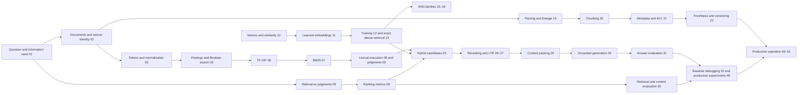
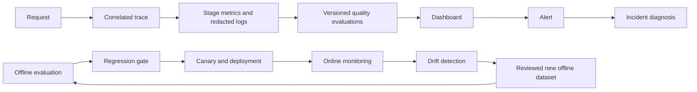
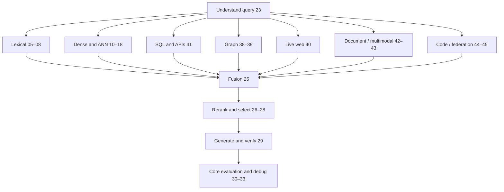

# Knowledge map: prerequisite graph

An arrow means **the left concept is required to understand the right concept**. A dotted conceptual connection is described in text rather than treated as a hard prerequisite. Chapter numbers point into [SYLLABUS.md](SYLLABUS.md). The map describes mechanisms, not brand names.

## Micro-concept chains

| Field | Dependency chain | What breaks if skipped |
|---|---|---|
| Lexical IR | text → Unicode/token rules → vocabulary → postings/positions → Boolean retrieval → TF/DF/IDF → BM25 `k1`,`b` → judged ranking | Scores appear arbitrary; exact identifiers disappear under poor analyzers. |
| Search execution | postings → compressed blocks/skip data → document- or term-at-a-time scoring → safe upper bounds → MaxScore/WAND/Block-Max WAND → top-k heap | A ranking equation is mistaken for an efficient query plan. |
| Dense IR | vector coordinates → dot/cosine/Euclidean and norms → exact KNN oracle → contextual tokens/pooling → query/document embedding contract → contrastive pairs → domain and metric tests | “Semantic” similarity is treated as a magic property, or approximation loss is confused with representation quality. |
| Dense candidate execution | source segment ID/text/scope → pinned encoder and batch build → normalized float32 row → checked index manifest → compatible query vector → eligibility → exact cosine/top-k → candidate/context trace | Vectors from mismatched models or source snapshots are searched together, or top neighbors are treated as verified evidence. |
| Retriever learning | relevance labels → positive/negative pairs → contrastive objective → hard-negative mining → teacher distillation → domain/multilingual adaptation → held-out retriever evaluation | A model is adapted using contaminated or false-negative labels. |
| ANN | exact top-k oracle → recall/latency budget → partitions/LSH → IVF lists/probes → quantization/codebooks → graph frontier → HNSW levels/`M`/`efConstruction`/`efSearch` → disk/caches/shards | Approximation loss is confused with embedding relevance failure. |
| Ingestion | source identity → parsing/reading order → canonical record → dedup/version → boundary choice → metadata/ACL → embedding/index → validation | A retrieved chunk cannot be traced to reliable evidence. |
| Query control | intent/entity/time → route → preserve original query → rewrite/expand/decompose → candidate union → score/rank fusion → rerank/diversify → stop/fallback | Query fan-out grows without preserving user intent. |
| Answer | retrieved span → authorized evidence → token budget → context order/compression → claim → cited source span → support check → abstention | A fluent answer is mistaken for a grounded answer. |
| RAG evaluation | information need → qrels → retrieval metrics → context recall/precision → generation correctness/faithfulness/citation → end-to-end utility → controlled experiments → production monitoring | A single score hides missing, unsafe, or stale answers. |
| Retrieval-augmented models | retriever → reader/generator → passage fusion → learned/joint retrieval → retrieval during pretraining, fine-tuning or inference → repeated retrieval | A research model architecture is conflated with an application pipeline. |
| Iterative/agentic | information gap → choose action → retrieve/tool → inspect observation → update state → budget and stop condition | A tool chain loops without evidence-driven control or auditability. |
| Multimodal | page/image representation → multimodal embedding → multi-vector/late interaction → reranking → grounded visual/temporal generation | OCR-only or image-only search loses necessary structure and provenance. |
| Graph | nodes/edges/properties → BFS/DFS/path → entity resolution → relation provenance → local neighborhood → communities/summaries → global questions | Graph extraction errors become invisible “facts.” |
| Structured | keys/joins/filters → aggregate semantics → schema selection → validated read-only query → row permissions → result provenance | Embeddings are asked to perform exact database operations. |
| Production | stable IDs/versions → idempotent events → queues/workers → dual index migration → shard routing/replicas → observability/cost → recovery | Freshness, deletes, and authorization cannot be guaranteed. |
| Observability | request → correlated trace → stage logs/metrics → versioned quality evaluations → dashboard → alert → incident diagnosis | A failure is visible only as a bad answer or a generic timeout. |
| Improvement loop | offline evaluation → regression gate → canary/deployment → online monitoring → drift detection → reviewed new offline dataset | A frozen benchmark stays green while the real workload deteriorates. |

Chapter 12 makes the retriever-learning branch executable in [V3](projects/V3/README.md): source-disjoint training pairs update a query projection; validation qrels choose its checkpoint; held-out test qrels judge it against the frozen encoder and BM25. The indexed search corpus contains all eligible source documents, while the gradient and checkpoint paths use only their assigned label splits. Falling training loss alongside collapsing validation quality is the concrete dependency warning before Chapter 13's retrieval operations.

Chapter 14 branches from the existing lexical, vector and training foundations: **contextual vocabulary logits → sparse nonzero weights → weighted postings → eligible candidate scores**; and **independent query/document token vectors → token score grid → per-query-token maxima → exact MaxSim → candidates**. A fixed [V3 mechanism fixture](projects/V3/README.md) makes both computations inspectable without implying that its hand-authored representations are trained SPLADE or ColBERT. Chapter 13's judged BM25/frozen-dense comparison remains the V0 baseline for any future model selection.

Chapter 15 makes the ANN branch executable in [V4](projects/V4/README.md): **checked exact cosine oracle → KD box bound/backtracking (exact) versus seeded hyperplane signatures/bucket union (approximate) → candidate IDs → exact-neighbor overlap and judged evidence recall**. The low-dimensional synthetic KD gain, high-dimensional synthetic loss and V0 LSH misses demonstrate why vector comparisons, latency and relevance have different denominators. The static support-team eligibility fixture remains a gate before approximate scoring, never a similarity penalty.

The telemetry branch starts with a single correlated request in Chapter 02 and grows into production operations in Chapters 48–52. An online alert does not itself establish answer quality; reviewed cases feed the offline loop. See the [observability contract](observability/OBSERVABILITY_CONTRACT.md).

## Specialized branches

The source branches are **alternatives or complements**, not a sequence every query must traverse. Graph RAG depends on graph basics; web RAG depends on parsing and provenance; SQL RAG depends on relational semantics and authorization; multimodal RAG depends on extraction and layout; agentic retrieval depends on routing, measured evidence quality, and stopping rules. Research methods such as SPLADE, ColBERT, RAPTOR, HyDE, Self-RAG, and CRAG are introduced only after the baseline whose limitation they address. The core evaluation harness (30–33) precedes those architecture experiments; production evaluation (48, 52) follows them.

## Five maturity transitions

1. **Beginner → competent:** Can show why a document matches and calculate its score, rather than only calling `search()`.
2. **Competent → advanced:** Can separate missing candidates, poor ranking, and poor context construction.
3. **Advanced → production:** Can reason about authorization, versions, latency, cost, and recovery across services.
4. **Production → expert:** Can criticize an architecture using controlled experiments and failure slices.
5. **Expert → researcher:** Can turn a proposed retrieval method into a falsifiable comparison with credible baselines.
