# Reference architecture: the map of the territory

This is a reference design, not a claim that every query needs every component. A deployment chooses the smallest evidence path that satisfies its workload. [SYLLABUS.md](SYLLABUS.md) teaches each box in dependency order.

```mermaid
flowchart LR
  subgraph I[Ingestion and governance]
    Sources[(Docs, DB, code, media, web feeds)] --> Connect[Connectors / CDC / queues]
    Connect --> Parse[Parse, OCR, normalize, dedupe]
    Parse --> Canon[Canonical records: ID, version, ACL, provenance]
    Canon --> Segment[Chunk / enrich / extract entities]
    Segment --> Index[(Lexical, vector, graph, metadata, media indexes)]
    Index --> Validate[Index validation and alias cutover]
  end
  subgraph Q[Authorized query path]
    User(User + identity) --> Understand[Intent, entities, time, conversation state]
    Understand --> Plan[Route / rewrite / decompose with budget]
    Plan --> Gate{Authorization and source policy}
    Gate --> Lex[Lexical / sparse]
    Gate --> Vec[Dense / ANN]
    Gate --> Struct[SQL / API]
    Gate --> Graph[Graph]
    Gate --> Live[Web / media / code]
    Lex --> Merge[Eligible candidate union and fusion]
    Vec --> Merge
    Struct --> Merge
    Graph --> Merge
    Live --> Merge
    Merge --> Rank[Rerank, dedupe, diversify]
    Rank --> Pack[Token budget, evidence spans, citations]
    Pack --> LLM[Generate or abstain]
    LLM --> Verify[Claim and source verification]
    Verify --> Answer(Answer + provenance)
  end
  Validate --> Lex
  Validate --> Vec
  Validate --> Graph
  Canon --> Struct
  subgraph O[Observability and evaluation control plane]
    Telemetry[Structured logs, spans, metrics, lifecycle events]
    CoreEval[Versioned qrels, context and answer judgments]
    Ledger[Stage cost ledger and version manifest]
    Dashboard[Dashboards, SLIs/SLOs, alerts and incidents]
    GateEval[Offline regression gate and online drift review]
    Telemetry --> Dashboard
    CoreEval --> GateEval
    Ledger --> Dashboard
    Dashboard --> GateEval
  end
  Connect -. ingest events and spans .-> Telemetry
  Validate -. visibility and version .-> Telemetry
  Answer -. request trace and claims .-> Telemetry
  Answer -. sampled outputs .-> CoreEval
  Plan -. route and model use .-> Ledger
  Index -. build and storage use .-> Ledger
  GateEval -. reviewed dataset / policy changes .-> Connect
  GateEval -. routing changes .-> Plan
```

## Non-negotiable boundaries

The first implemented lexical path is [V1's Chapter 5–6 index and ranking comparison](projects/V1/README.md): a versioned analyzer prepares term postings and a forward source store, static scope-local statistics support TF-IDF, and query-time eligibility gates candidate scoring and source fetch. Its scope fixture is not an authentication service. Unweighted overlap, raw/sublinear TF-IDF and cosine retain the same deterministic answer stub so their rank changes can be compared before generation is introduced.

[V2's Chapters 7–9 lexical and evaluation stage](projects/V2/README.md) reuses that path and adds scope-local analyzed segment length, average length and saturating BM25 contributions. Chapter 8 builds scope-specific term impacts and upper bounds for the same scorer, then moves eligible posting cursors under a top-*k* heap threshold. Its global-bound WAND plan returns the same ordered BM25 candidates as exhaustive scoring while sometimes scoring fewer segments; on this small Python corpus it takes more query time. Chapter 9 adds a separate offline evaluation plane: source/query/rubric snapshot → eligible segment qrels → candidate-ranking metrics, with selected-context IDs and the two-task stub status recorded separately. Its complete tiny roster rejects mismatched segment versions; private D10 is outside support-team qrels. The judged set is single-author and partly based on known failures, so its negative BM25 NDCG@2 result is a baseline, not a general ranking verdict. Scope fixture is not authentication; compressed postings and block maxima remain conceptual.

[V3's Chapter 10 exact-vector stage](projects/V3/README.md) branches from the same indexed V0 segments after V1 analysis: at index time it fixes a 119-coordinate binary term-presence schema, stores vectors with source IDs/scopes and precomputes unit vectors; at query time it maps the question into that schema, gates scope before scoring, evaluates every eligible vector by a declared metric and tie rule, then passes candidates to the unchanged context/stub path. A full sort and bounded heap agree on exact results. The Chapter 9 qrel plane compares this deliberately lexical cosine baseline with V2 BM25 and retains candidate/context/stub distinctions. Its lower NDCG@2 is a representation/execution finding on a tiny fixture, not an embedding verdict. ANN indexing and live authorization remain future stages.

[Chapter 11's frozen-encoder branch](projects/V3/README.md) reuses the exact-vector scorer with passage vectors produced at index time by one pinned, shared sentence encoder over title plus segment body. At query time the same tokenizer/model/pooling/normalization contract encodes the question, support-team eligibility gates cosine scoring, and ranked candidate IDs pass to the existing context builder. A new complete 17-question qrel plane measures paraphrase, exact-identifier and no-evidence slices, with model load, passage build, query encode and exact scan separated. The encoder improves paraphrase recall on this probe but misses literal metadata IDs and returns candidates for no-evidence needs. No answer generator, trained domain adapter, ANN index or live authentication is introduced by this branch.

[Chapter 12's adaptation branch](projects/V3/README.md) keeps the pinned passage encoder and exact index frozen, then trains a low-rank residual query projection on train-document pairs only. Validation-document qrels select the checkpoint; held-out test-document qrels measure its effect against the frozen encoder and BM25 on the same eligible search roster. The chosen adapter ties frozen top-two recall and preserves a signed-contract miss, while later checkpoints overfit. The split, model/adapter/index versions and score distributions are part of the evaluation plane; adaptation never changes authorization, source status, selected context, or absent generation labels.

1. **Index time vs query time:** source extraction, chunking, embedding, and graph building happen before most questions. Query rewriting, routing, candidate search, reranking, and packing happen for a specific question. Live web retrieval crosses the boundary and must record capture time.
2. **Eligibility vs relevance:** authorization and tenant scope define what may be searched or shown. A relevance score cannot override that constraint. Postfilter-only designs may underfill and leak through logs or caches.
3. **Candidate vs evidence:** a high-ranked candidate is a possibility. Evidence entering the answer must retain source ID, version, span/page/coordinate, trust tier, and retrieval timestamp.
4. **Source vs instruction:** documents, web pages, query results, and tool outputs are untrusted data. They may contain text that tries to redirect the assistant. Tool execution and data access are separately authorized.
5. **Retrieval vs answer:** evaluate stage recall and rank quality separately from claim support, citation accuracy, and end-user success.
6. **Control loop:** an adaptive or agentic path repeats retrieval only when a measured information gap remains and a step/token/monetary/time budget permits it. The trace captures state, observation, action, confidence estimate, and stop reason. A fixed tool chain remains a deterministic pipeline.
7. **Core evaluation before specialization:** the baseline harness measures judged candidate recall/rank, context recall/precision, correctness, faithfulness, citations and abstention. Graph, web, SQL, multimodal and agentic routes inherit those tests plus source-specific checks.

## A representative query trace

For “Which 2025 contract changed the support SLA for product XR-92817, and by how much?” the system authenticates the user, parses the identifier and year, selects an exact lexical and metadata-constrained search, optionally adds dense candidates for a paraphrased SLA clause, filters by document ACL and version, fuses and reranks, retrieves the prior and amended clauses, packs both with page/section anchors, computes or verifies the delta, and cites each claim. A numeric difference should be computed from structured fields or checked arithmetic, not inferred from prose similarity. The trace records each exclusion and the final evidence set.

## Operational overlays

The index service needs idempotent upserts, tombstones, snapshots, backups, source licensing/retention metadata, and model/index version manifests. The query service needs p95 latency and cost budgets, rate limits, circuit breakers, fallbacks, redacted traces, tenant-safe cache keys, and quality dashboards. The control plane correlates request and ingestion traces with versioned judgments, stage histograms, security events, freshness and cost ledgers; it supports a working dashboard, alerts, regression gates and incident review. It must not expose unauthorized candidate content through logs. Semantic caches require false-match and authorization tests. Sharding and replication are introduced only after workload measurements show a single node cannot meet targets. Distributed top-k requires shard oversampling and score-comparability checks; a partial or timed-out source is visible in the answer trace. Product choice follows benchmark results on the actual corpus and filters. The canonical schemas and implementation sequence are in [OBSERVABILITY_CONTRACT.md](observability/OBSERVABILITY_CONTRACT.md).

## Specialized execution paths

- **Lexical execution:** analyzer → compressed postings/immutable segments → BM25 term contributions → safe dynamic pruning → top-k heap. BM25 is the score; MaxScore/WAND/Block-Max WAND are candidate-skipping plans.
- **Retriever learning:** labeled positive/negative pairs → contrastive objective → hard-negative mining/distillation → held-out domain and multilingual evaluation → versioned embedding rollout.
- **Document and multimodal:** born-digital extraction or OCR → layout/coordinate records → text/page/region or multi-vector indexes → modality-aware rerank → page/region/frame citation.
- **Code:** file/commit identity → symbol, lexical, embedding and graph indexes → definition/reference/test expansion → cited file/line/commit.
- **Federation:** per-source policy and quota → parallel heterogeneous engines → timeout/partial flags → rank or calibrated fusion → deduplication with source provenance.
- **Adaptive/agentic:** information-gap estimate → bounded tool/retrieval action → observation → state update → sufficient-evidence stop, abstain, or escalation.

## Two evaluation loops

**Core loop (Chapters 30–33):** freeze queries, relevant evidence and answer labels; diagnose whether the failure occurred in ingestion, retrieval, ranking, context, or generation. Every specialized route must beat an appropriate simpler baseline on its target slice. **Production loop (Chapters 48 and 52):** confidence intervals, ablations, release gates, canaries, A/B tests, drift, latency/cost/availability dashboards and incident diagnosis. The feedback path creates reviewed new offline cases from online failures. The complete quality and experiment record is in [EVALUATION_EXPERIMENT_CONTRACT.md](evaluation/EVALUATION_EXPERIMENT_CONTRACT.md). This separation lets learners test architectures before learning full service operations.

## Source choice guide

| Information need | First route to consider | Why |
|---|---|---|
| Exact SKU, error code, quoted clause | Lexical + metadata | Preserves exact symbols and field constraints. |
| Paraphrased concept | Dense, perhaps hybrid | Retrieves related wording absent exact terms. |
| Counts, sums, joins | SQL/API | Executes exact operations over typed records. |
| Relationship chain | Graph or planned multi-hop | Preserves explicit links and intermediate entities. |
| Fresh public change | Live web | Local indexes may be stale. |
| Figure, chart, or table layout | Multimodal/layout-aware path | Text extraction may discard spatial meaning. |

These are candidate routes. The benchmark and permission model decide the deployed path.
