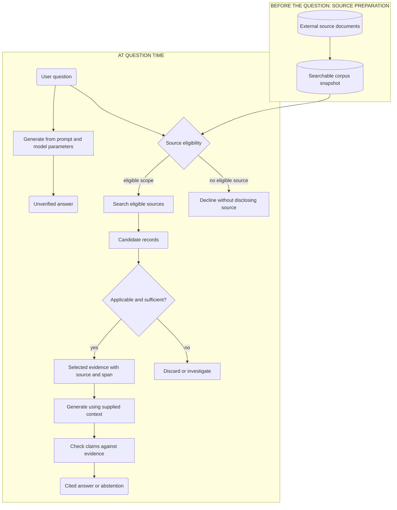

# Chapter 1 — A question, a model, and missing evidence

*Part I: Orientation and prerequisites · Foundational*

> **The question for this chapter:** When a model gives a plausible answer, how can we tell whether it had access to the information that would make the answer defensible?

By the end, you will be able to decide when a task needs external knowledge, trace the simplest path from a question to cited evidence, and explain why retrieval can improve an answer without guaranteeing that it is true. You need no prior knowledge of information retrieval or machine learning. A little programming helps with the optional trace exercise, but the reasoning can be done on paper.

## 1. The amendment the model has never seen

Imagine that an engineer asks an internal assistant:

> As of 20 May 2026, how did the Sev-1 response target for Helios Pro change under our support agreement?

The assistant replies, “It is four hours.” That sentence sounds ordinary. It may even match a paragraph in the original support agreement. But the agreement was amended five days earlier. The correct response requires two records: the former target and the amendment that replaced it. If the assistant has only the original agreement, a fluent answer is easy and a defensible answer is impossible.

This is the problem that motivates retrieval-augmented generation, or **RAG**. A language model can compose a response from its parameters and the text in its current prompt. The organization’s current contract is elsewhere. An application can search that external material, choose the pieces that matter, give them to the model, and then check whether the model’s claims follow from them.

That description leaves the most important questions open. *Which* agreement may this user see? Is the amendment in the searchable collection? Does it apply on the requested date? Did search return it? Did it reach the model’s context? Does the final sentence say what the source actually says? The rest of this book is a systematic answer to those questions.

All Helios Pro records in this chapter are **fictional teaching data**. Their dates and numbers are chosen to make a failure visible; they are not claims about a real contract.

## 2. A question is a message; an information need is a task

The words a user types are a **query**. The underlying task is an **information need**. The distinction is old and central in information retrieval: a record is useful when it addresses the need, even if it does not repeat the query’s words. The *Introduction to Information Retrieval* text explicitly assesses relevance against the information need rather than the literal query. [Manning, Raghavan, and Schütze, *An Example Information Retrieval Problem*](https://nlp.stanford.edu/IR-book/html/htmledition/an-example-information-retrieval-problem-1.html).

Here the query includes “how did ... change?” The need is more precise:

1. Identify the agreement that governs Helios Pro for this user.
2. Find the old Sev-1 response target.
3. Find a valid amendment and its effective date.
4. Compare old and new targets as of 20 May 2026.
5. Give the answer with sources that support each factual claim.

Matching the word *response* in a document is therefore insufficient. The answer also needs the right product, contractual authority, effective time, and arithmetic. Later chapters will teach algorithms for finding and ranking records. For now, the important point is that searching is subordinate to the information need.

The need can be ambiguous. “What is the response target?” might refer to a sales promise, a support contract, a specific customer tier, or a date in the past. An honest system may have to ask for the missing scope or state its assumption. It should not silently choose the easiest document to find.

## 3. Where could an answer come from?

A model’s **parameters** are the numbers learned during training. Some general patterns and facts may be encoded there; the model does not expose a dependable, document-like lookup table of everything it learned. The **prompt context** is the text supplied for this particular request. An **external source** is material outside those parameters and that prompt: a document, database row, web page, code file, or other record that the application can access. Lewis and colleagues’ 2020 RAG paper framed its particular research architecture as combining parametric and non-parametric memory. This book uses *RAG* more broadly for application systems that retrieve external knowledge to inform generation; Chapter 55 returns to the historical model distinctions. [Lewis et al., *Retrieval-Augmented Generation for Knowledge-Intensive NLP Tasks*](https://arxiv.org/abs/2005.11401).

These three locations have different update and accountability properties. A newly amended private contract will not appear in a fixed model’s parameters merely because someone saved it. Supplying its text in a prompt can help for one request, but the application still has to choose the correct text and fit it into a finite context. Searching an external collection gives a path to updated, private, or cited facts; it also introduces new failure points. A model may have other tools or current context in a particular product, so “the model cannot know this” is shorthand for **this request has not established access to an authoritative source**.

**Hallucination** is often used for an unsupported or invented model output. In this book we will usually name the more specific failure: *unsupported claim*, *wrong source*, *stale source*, *missing evidence*, or *incorrect use of good evidence*. A statement can be factually correct by luck yet ungrounded in the supplied evidence. Conversely, a statement can faithfully repeat a source that is itself wrong or obsolete. Grounding and truth must be checked separately.

## 4. The smallest evidence path

At its simplest, a RAG application follows this sequence:

1. Receive the question and the user’s identity or allowed scope.
2. Search external sources that the user is eligible to use.
3. Obtain **candidates**: possible matches, not yet trusted as answer support.
4. Select **evidence**: authorized, applicable source material with enough detail to support a claim.
5. Supply that evidence as context to a generator, or answer directly from it when generation adds no value.
6. Check the answer’s claims and citations; abstain or ask for clarification if support is missing.

**Figure 1.01 — Two paths from the same question.** One branch generates from the current prompt and model parameters. The source-backed branch gates eligibility before search, distinguishes candidates from selected evidence, and checks claims before returning a cited answer or abstaining. The figure is a logical path, not a promise that checking is perfect.



*Alt text:* A question branches to a direct model answer and to a source-backed route. In the source-backed route, the corpus and user scope pass through an eligibility gate before search; search results are candidates; a later applicability check selects evidence; generation and claim checking lead to a cited answer or abstention. *Editable source:* [Mermaid file](../visuals/chapter-01/figure-01-01-evidence-paths.mmd). *Rendered figure:* [SVG](../visuals/chapter-01/figure-01-01-evidence-paths.svg) · [PNG](../visuals/chapter-01/figure-01-01-evidence-paths.png). *Chapter association:* 01.

The left lane is **before question time**: documents must exist, be captured, and be made searchable. We will call the later preparation work **index time**. The right lane is **query time**: the application handles one question. Chapter 2 implements a tiny version of this path; Chapters 5–8 explain lexical indexes and ranking. The diagram deliberately does not name a vector database. Search can use exact words, learned vectors, database operations, graph links, or several methods together. The information need determines which mechanism is useful.

The diagram also has an important limit: a box labeled “check claims” is a responsibility, not an infallible algorithm. Human review, deterministic checks, and automated judges each have blind spots. We will later measure them.

## 5. A vocabulary that prevents three common confusions

An **external corpus** is the collection available to a particular search task, after scope and version are considered. A **document** is a source record with identity and, in a changing system, a version. A **passage** or **chunk** is a smaller span from that record. The user’s query does not become a document merely because it is text.

A **candidate** is something search proposes. Its appearance in a result list does not prove that it is current, authorized, or sufficient. **Evidence** is source content selected for a particular claim after those questions have been addressed. An **answer** is the response presented to the user. It can contain claims beyond its evidence, so it must be examined separately. A **citation** identifies the source and location offered in support of a claim; a citation is useful only if it points to the right version and the cited span actually supports the words around it. **Provenance** is the fuller path from claim to source identity, version and span. **Grounding** is the relationship between the answer’s claims and the supplied evidence. **Abstention** means declining to assert an answer that the available eligible evidence cannot support.

Authorization has a special role. A record that the user may not see is outside the eligible corpus for that request. It does not become acceptable because its relevance score is high. This chapter treats eligibility as a boundary; Chapter 21 develops filtered retrieval and Chapter 49 develops security controls.

The distinction matters in both directions. A useful answer can be assembled from two modest-looking candidates. A top-ranked candidate can be a decoy. A citation can be correctly formatted while pointing at a superseded clause. Keep the identities of **candidate, evidence, and answer** separate whenever you inspect a system.

## 6. Work the Helios Pro question by hand

Assume the user is authorized to read three fictional records. The corpus snapshot is `support-corpus-2026-05-20`. Document IDs and section markers are stable within this example.

**Table 1.1 — Records available to the question.** The amendment’s effective date and authority determine which text governs on 20 May; a newer FAQ would not automatically override a signed amendment.

| ID and location | Record | Relevant text | Status on 20 May 2026 |
|---|---|---|---|
| `D1 §3` | Helios Pro Support Agreement, version 1, effective 1 January 2025 | “For Sev-1 incidents, the initial response target is four hours.” | Governing original clause, subsequently replaced for this target |
| `D2 §2` | Amendment A, signed 12 May 2026, effective 15 May 2026 | “Section 3’s Sev-1 initial response target is replaced with one hour, effective 15 May 2026.” | Governing amendment |
| `D3 FAQ-7` | Support FAQ captured 10 May 2026 | “The Sev-1 initial response target is four hours.” | Stale summary for this question |

Suppose a basic search returns `D3`, `D1`, and `D2` in that order. We have not learned how it ranked them, and the order is not a judgment of authority. All three are **candidates**. The question requires the old and new targets, so the selected **evidence** is `D1 §3` and `D2 §2`. `D3` is not evidence for the current target: its four-hour statement predates the amendment. A system that sees only `D3` should not confidently answer the dated contractual question.

Now calculate the change. The old target is **4 hours**. The new target is **1 hour**. The absolute reduction is `4 − 1 = 3 hours`; the relative reduction against the old target is `(4 − 1) / 4 = 0.75`, or **75%**. The units and denominator matter. “Three times faster” would be a different claim about a response process, and the contract only specifies a target, not observed response speed.

A defensible response is:

> As of 20 May 2026, the Sev-1 initial response target for Helios Pro had fallen from four hours to one hour, a three-hour (75%) reduction. The original agreement set four hours [D1 §3]; Amendment A replaced that target with one hour effective 15 May 2026 [D2 §2].

This answer has two factual source claims and one calculation. A reader can inspect both source spans and recompute the percentage. It does **not** claim that real incidents were answered within an hour; the documents describe a target. It does **not** claim the amendment applies to another product or customer tier.

What if `D2` is absent from the searchable snapshot? The system can establish the old target but cannot establish the current change. A responsible response might say, “I found the four-hour target in the agreement, but I cannot verify whether a later amendment changed it as of 20 May.” What if `D2` exists but this user is not authorized to read it? The application must not quote or hint at its content. It can decline or direct the user to an authorized process. A good retrieval score never cancels that boundary.

## 7. Evidence changes the task; it does not erase risk

There are several distinct places this example can fail:

| First failing boundary | What the user may see | A useful diagnostic question |
|---|---|---|
| Source availability | Confident old answer | Was Amendment A captured in the corpus snapshot? |
| Eligibility | Wrongly disclosed amendment or unexplained refusal | Was the user allowed to access `D2`? Was the filter applied before content exposure? |
| Search | Old FAQ dominates | Did `D2` appear among candidates? |
| Evidence selection | `D2` was found but omitted | Which candidate IDs entered the prompt context? |
| Generation | Answer says two hours | Does each claim match the selected source text? |
| Citation/provenance | Correct number, wrong citation | Does the cited version and section support the nearby claim? |
| Freshness | Old answer after an amendment | What source and index versions were used? |

This is a **failure-localization map**. Editing the prompt cannot recover an amendment that was never captured. Improving search cannot fix a calculation that turns four to one hours into a two-hour change. A citation parser cannot make an unauthorized document safe. Later chapters will make each boundary measurable.

Also consider negative and contradictory evidence. A later addendum might state “the one-hour target does not apply to Helios Pro in Region B.” That exclusion is evidence, not an irrelevant footnote. Two authoritative amendments may conflict. In those cases, an assistant should expose the conflict or seek the governing version rather than silently choosing the sentence it prefers. An older, explicit “no change” statement may be perfectly relevant to a historical question and wrong for a current one. Relevance always includes the user’s requested time and scope.

## 8. When should the application retrieve?

The decision is about **where the answer must come from** and **what operation produces it**. Retrieval is valuable when the source of truth lives in external records that must be selected before an answer can be composed. It is unnecessary when there is no external fact to find, and it may be the wrong first tool when exact computation or a live authoritative API is required.

**Table 1.2 — Choose the smallest evidence path that can satisfy the task.** These are starting routes, not product recipes.

| User task | Likely first path | Why |
|---|---|---|
| “Make this paragraph more polite.” | Direct language transformation | The supplied paragraph is the material; no external fact is requested. |
| “What is 17 + 25?” | Deterministic calculation | Arithmetic is the operation; searching prose adds no authority. |
| “Find the clause about termination.” | Search, perhaps without generation | The user may want the source itself, not a synthesized answer. |
| “What changed in the Helios Pro contract?” | Authorized retrieval, comparison, cited answer | The answer depends on external, versioned documents. |
| “How many open Sev-1 tickets does this customer have?” | Authorized structured query/API | A count over current records is an exact data operation. |
| “What is the live status of shipment 92817?” | Authorized live system/API | A cached document may be stale within minutes. |
| “Explain the three design proposals and their disagreements.” | Retrieval plus synthesis | Several external records must be located and compared. |

A practical decision procedure is:

```text
1. State the information need and requested time/scope.
2. Identify the authoritative source or say that it is unknown.
3. Determine whether this requester may access that source.
4. Choose the operation: direct transformation, calculation, structured lookup,
   document search, live fetch, or a combination.
5. If search is used, distinguish candidates from selected evidence.
6. Choose the output: source list, exact value, cited synthesis, clarification,
   or abstention.
7. Record what was used and what remained unresolved.
```

This procedure makes a useful counterpoint to “retrieve every time.” An unnecessary retrieval call consumes time and may introduce irrelevant text that distracts generation. Yet skipping retrieval for a private, time-sensitive contract invites an unsupported answer. The right choice depends on the task and on measured failure rates, not on an architectural slogan. Chapter 36 will later study policies that make this choice dynamically.

### An important boundary: search without generation

Information retrieval is valuable in its own right. If the user asks for the exact clause, a ranked list with a highlighted section may be the best response. Generation can summarize or compare but can also distort. RAG adds generation to an evidence-access problem when the requested output benefits from it. This is why the book studies search before elaborate RAG architectures.

## 9. Your first audit trail

The running project will eventually produce a trace for every request. In Chapter 1, the trace can be manual. It needs no embedding model or framework:

```text
request_id: r-01
query_id: q-contract-change
corpus_snapshot: support-corpus-2026-05-20
eligible_candidate_ids: [D3, D1, D2]
selected_evidence: [D1 §3, D2 §2]
answer_claims: [old target = 4 h, new target = 1 h, reduction = 3 h / 75%]
status: supported
unresolved: none
```

`eligible_candidate_ids` is not the same as `selected_evidence`. The trace should also record elapsed time once a program executes the path. Do not put confidential source text into a widely accessible log. An ID can itself be sensitive if it reveals a customer or document title, so access to traces must also be controlled. Chapter 2 will emit a structured record from the first program; the production contract later adds stage spans, metrics, version telemetry, cost, and retention policy.

The optional [source trace code](../labs/chapter-01/source_trace.py) makes this audit trail executable. It starts with **manually chosen** candidates and evidence. Its exact-quote check can catch a broken source locator; it cannot decide whether a clause is legally governing or whether a generated paraphrase is faithful. Read that limit before treating a green program output as a quality result. This code is a small data-boundary demonstration, not the Chapter 2 search engine.

## 10. An experiment before an algorithm

We can test one narrow hypothesis without pretending to evaluate a full model.

**Question.** Does adding the effective amendment to the available corpus make the dated change answerable under our explicit evidence rule?

**Hypothesis.** The original agreement alone supports the old target but not the new target; adding the amendment supplies both facts.

**Baseline and change.** In both conditions the query, date, manual evidence-selection rule, and expected facts are fixed. The only changed variable is whether `D2` is available. Baseline corpus: `{D1}`. Revised corpus: `{D1, D2}`. The tiny query set contains this one fictional question; the “ground truth” is the two quoted clauses above. Define **fact coverage** for this exercise as `supported required facts / 2`, where the required facts are the old and new targets. This is a hand-audit quantity, not a general benchmark score.

| Condition | Old target supported? | New target supported? | Fact coverage | Permitted outcome |
|---|---|---|---:|---|
| `D1` only | Yes | No | 1/2 | State what is known and abstain on the change |
| `D1` and `D2` | Yes | Yes | 2/2 | Calculate and cite the change |

The result supports the limited conclusion that **access to the amendment is necessary for this source-based answer under these assumptions**. It does not show that a language model will use the amendment correctly, that retrieval will find it, or that the documents are true. The error analysis is immediate: if an answer in the baseline condition asserts a new target, it imported knowledge from somewhere outside the allowed evidence; if the revised condition still answers from `D1` alone, selection or generation failed. One question and manually complete labels cannot estimate production quality. Later chapters build realistic query sets and judged metrics.

This small experiment establishes a habit: record the baseline, change one thing, define what success means, and inspect failures. “The answer feels better” is not a reproducible result.

## 11. What changes in a real organization?

The conceptual path survives, but the engineering burden grows. A collection of millions of pages must be searchable without scanning every page for every question. Records have versions, owners, access rules, retention limits, and sometimes licensing constraints. Search and generation incur latency and cost. A model may quote a document that has been deleted unless the application propagates the deletion through its indexes and caches. A user may be authorized for one clause and not another. These are reasons to design source identity and eligibility early, even in a ten-document teaching engine.

The first production-minded questions are concrete: How long after a source changes does the searchable copy change? Which source version was used for this answer? Can the system show which candidates were found and which entered context? Can it separate “the amendment was missing” from “the model ignored the amendment”? Does the log reveal a private source to someone who should not see it? We will implement the simple version of this record in Chapter 2, then develop the indexing, evaluation, security and operational mechanisms in dependency order.

Retrieval adds work. If a direct response takes one operation, a source-backed answer may require source preparation, search, filtering, selection, generation and checking. Some stages can run in parallel; others cannot. More context may increase token cost and still bury the decisive clause. There is no universal “RAG is more accurate” guarantee: it can provide access to evidence, while system design and evaluation determine whether that access improves the task.

## 12. Common misconceptions

**“RAG means a vector database plus an LLM.”** A vector index is one possible search mechanism. Exact terms, structured records, live APIs and graph relationships can be more appropriate for particular needs. The common pattern is external knowledge access informing an answer.

**“If the retrieved text is relevant, the answer is grounded.”** Relevance concerns the information need. Grounding concerns whether each answer claim is supported by the evidence actually supplied. The model can ignore or misread a relevant passage.

**“A citation proves the answer.”** A citation is a pointer. It may point to the wrong version, an irrelevant line, an unauthorized record, or a source that is itself incorrect. Inspect the cited span and the claim.

**“The newest document always wins.”** Authority, effective time, scope and revocation matter. A newer FAQ does not necessarily override a signed agreement. Conversely, a newer amendment may supersede an older clause.

**“The model has a single fixed knowledge cutoff.”** Model weights are fixed between updates, but a deployed assistant may also receive current context or tools. Ask which information path was available in the *particular request*.

**“Abstaining is failure.”** An unsupported confident claim can be worse. A well-formed abstention says which part is known, which is missing, and what source or clarification would resolve it, without leaking inaccessible material.

## 13. Practice

Complete the [Chapter 1 lab](../labs/chapter-01/LAB.md): classify 15 requests by information source, operation and suitable response form. For each case, identify at least one failure of a tempting alternative. Then hand-trace the Helios Pro question with `D2` removed and with `D2` inaccessible. Compare your work with the [separate solutions](../solutions/chapter-01-solutions.md) only after attempting the cases.

Two design questions deserve discussion with another engineer:

1. Why is “search found `D2`” weaker evidence of success than “the final claim is supported by `D2 §2`”? State the intervening boundaries.
2. A team proposes to replace every exact database query with embedding search over table rows. Which tasks from Table 1.2 would this make less reliable, and why?

For an interview-style oral defense, explain in two minutes why an assistant with a larger context window still needs a policy for choosing, authorizing and verifying source material. Draw Figure 1.01 from memory, then point to the first place a stale answer could arise.

## 14. Build Your Own RAG Engine: the V0 contract

Create the [V0 project brief](../projects/V0/README.md) before writing a retriever. Name a tiny corpus and its snapshot, two representative questions, the required source IDs and spans, the permitted answer/abstention behavior, and the minimal request trace. The first program in Chapter 2 will search this corpus. For now, the deliverable is a **reviewable evidence contract**, not a chatbot. Preserve the Helios Pro case as the initial failure probe: a system that returns only the original agreement must not claim it knows the current amendment.

## 15. Summary and active recall

RAG addresses a knowledge-access problem: relevant, eligible external information must become evidence for a particular answer. The query is an expression of a deeper information need. Model parameters, current prompt context and external sources have different update and provenance properties. Search returns candidates; selection yields evidence; generation produces claims; citations connect claims back to source spans. Each boundary can fail independently. Retrieval is useful when external facts must be found and synthesized, while direct transformation, calculation, exact structured lookup or source-only search may be better for other tasks.

Close the page and answer these from memory; revisit them after one, three, seven and twenty-one days:

- What is the difference between a query and an information need?
- What did `D2` contribute that `D1` could not?
- Why is a retrieved candidate not automatically evidence?
- What does a citation need to identify to be useful?
- Give one answer that is grounded but possibly false, and one that is true by chance but ungrounded.
- When would you search without asking a model to generate anything?
- What should the assistant do if the decisive document is inaccessible to the user?

### You understand this chapter if you can…

- Explain the Helios Pro failure without using the words *embedding*, *vector database*, or *framework*.
- Draw the two paths in Figure 1.01 and locate source preparation, candidates, selected evidence, generation and checking.
- Compute the three-hour and 75% target reduction from `D1` and `D2`, with correct units and citations.
- Choose an appropriate first path for a direct transformation, exact count, live status request and document synthesis.
- Diagnose separately a missing amendment, a search miss, an evidence-selection miss, a wrong calculation and a misleading citation.
- State what remains unknown and abstain without exposing a document the user cannot access.

## Further reading

- Christopher D. Manning, Prabhakar Raghavan, and Hinrich Schütze, [*Introduction to Information Retrieval*: An Example Information Retrieval Problem](https://nlp.stanford.edu/IR-book/html/htmledition/an-example-information-retrieval-problem-1.html) and [Information Retrieval System Evaluation](https://nlp.stanford.edu/IR-book/html/htmledition/information-retrieval-system-evaluation-1.html), 2008. Read for the distinction between query, information need and relevance; Chapters 5–9 will develop the algorithms and metrics.
- Patrick Lewis and colleagues, [*Retrieval-Augmented Generation for Knowledge-Intensive NLP Tasks*](https://arxiv.org/abs/2005.11401), 2020. Read the abstract for the historical parametric/non-parametric distinction. Its trained architecture has prerequisites taught much later; Chapter 55 revisits it in detail.
- NIST TREC, [English relevance judgments](https://trec.nist.gov/data/reljudge_eng.html). This primary source shows why a judged search collection must tie questions, documents and relevance labels together; the evaluation method is taught in Chapter 9.
