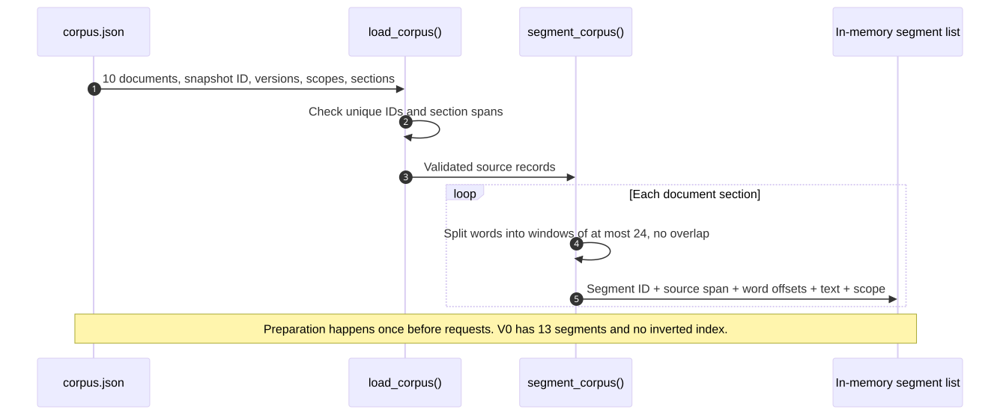
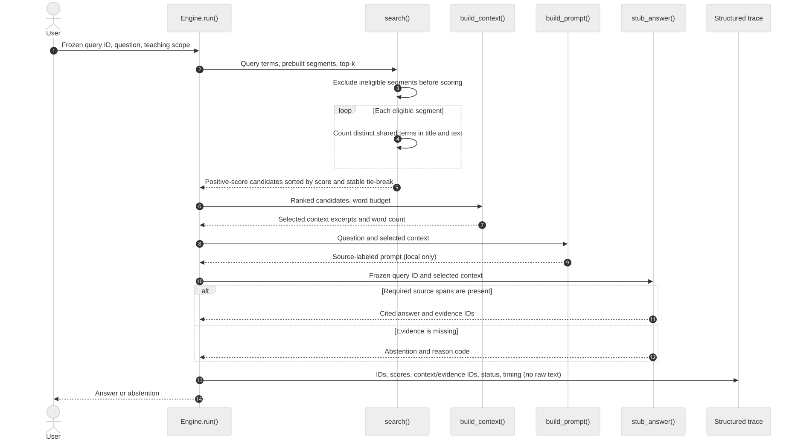

# Chapter 2 — Build the first RAG loop without a framework

*Part I: Orientation and prerequisites · Foundational*

> **The question for this chapter:** Can we account for every step between a source document and an answer, using a program small enough to inspect in one sitting?

Chapter 1 established an evidence contract: a question expresses an information need; search produces candidates; selected, eligible source spans can support answer claims; a missing amendment requires abstention. This chapter turns that contract into a running program. The program searches ten fictional records, constructs a source-labeled prompt, applies a deliberately narrow answer stub, and emits one structured trace per request. You can run it with the Python standard library alone.

The artifact is [V0 of Build Your Own RAG Engine](../projects/V0/README.md). Its source snapshot and two frozen questions are binding. You will see exactly where V0 succeeds and where it fails. Those failures motivate the data structures and ranking methods taught later; we will not hide them behind a framework.

## 1. From the manual trace to an executable path

Recall the Helios Pro question: “As of 20 May 2026, how did the Sev-1 response target change?” Chapter 1’s fictional agreement `D1 §3` says four hours; Amendment A `D2 §2` replaces it with one hour effective 15 May. A FAQ `D3 FAQ-7` repeats the old four-hour target. The V0 program must find `D1` and `D2`, retain their locations, and decline to assert the dated change if either required source span is unavailable. A second frozen query asks to **show** the termination clause `D1 §8`; returning the source itself is enough.

The running program has five visible stages:

```text
prepare records → split into segments → search eligible segments
→ assemble source-labeled context → answer or abstain → emit request trace
```

Source preparation happens **before** a user question; the other stages happen **for** a question. This separation will matter when indexes, embeddings, updates and distributed services arrive. In V0 the prepared data is only a Python list in memory. There is no inverted index, vector index, database server or LLM call.

### A short Python primer

The code uses four ordinary structures. A **dictionary** associates named keys with values, such as `{"id": "D2", "version": "signed-2026-05-12"}`. A **list** preserves an order, such as the documents loaded from a JSON file. A `for` loop visits each list item. A **set** holds distinct items; intersecting two sets finds items they share. `text.split()` separates text on whitespace for our crude source windows, while a small regular expression produces lowercase search terms. The full [engine source](../projects/V0/engine.py) is written so that these operations remain visible. Chapter 3 will revisit data structures, complexity and measurement more formally.

## 2. Give every source a stable identity

Open the [ten-document teaching corpus](../projects/V0/corpus.json). Its snapshot ID is `support-corpus-2026-05-20`. Each document has an ID, title, version, effective date, allowed scope, status and named sections. The original agreement `D1` has both `§3` (the response target) and `§8` (termination). These are two **spans in one document**, not two documents. `D2` is the signed amendment; `D3` is a stale FAQ. Other records include a runbook, a different product’s agreement, a price sheet, a historical incident report, an unsigned proposal, and a restricted teaching decoy `D10`.

One source record has this shape:

```json
{
  "id": "D2",
  "title": "Helios Pro Amendment A",
  "version": "signed-2026-05-12",
  "effective_on": "2026-05-15",
  "allowed_scopes": ["support-team"],
  "status": "signed amendment",
  "sections": [
    {
      "span": "§2",
      "text": "Section 3’s Sev-1 initial response target is replaced with one hour, effective 15 May 2026."
    }
  ]
}
```

The program checks that document IDs are unique and that section labels do not repeat within a document. This is a small but useful invariant: if `D2 §2` could refer to two different strings in the same snapshot, a citation would be ambiguous. A different snapshot may contain a new version. The snapshot string is part of every request trace so that a later reader knows which source collection the program actually searched.

`allowed_scopes` is a teaching fixture, not an authentication system. In this local program the caller supplies `--scope`. A real service must establish identity and permissions outside the search request and enforce them across every path. The important V0 rule is already visible: **ineligible segments are removed before scoring, prompt construction or ordinary trace output**. A high overlap score cannot make `D10` eligible for a `support-team` request.

Metadata alone is not a complete temporal policy. V0 stores effective dates and status but does not implement a general “which amendment governs?” resolver. Its answer stub recognizes the two exact clauses of the frozen teaching case. This limit is intentional and testable; it must not be mistaken for a production contract engine.

## 3. Prepare the corpus before question time

At preparation time, `load_corpus()` reads JSON and validates identity fields. `segment_corpus()` then visits each section and cuts its words into windows of at most **24**, with **no overlap**. A segment retains the document ID, version, section label, word offsets, text and allowed scope. Its ID has the form `document:section:window`; `D2:§2:0` denotes the first window of the amendment’s second section. There are 13 segments from the ten documents: `D1` has two sections and the longer `D4` runbook becomes three windows.

**Figure 2.01 — V0 preparation before any query.** The source snapshot is validated, then each section is split into fixed word windows with source identity attached. The resulting list is searchable but is not an inverted index.



*Alt text:* A sequence diagram shows `corpus.json` sending ten versioned documents to `load_corpus()`, which checks IDs, then to `segment_corpus()`, which produces 13 windows in an in-memory list. *Editable source:* [Mermaid](../visuals/chapter-02/figure-02-01-preparation.mmd). *Rendered alternatives:* [SVG](../visuals/chapter-02/figure-02-01-preparation.svg) · [PNG](../visuals/chapter-02/figure-02-01-preparation.png). *Chapter association:* 02.

The runbook exposes why “split every 24 words” is only a baseline. Its first window ends with “Before changing service”; the next starts with “configuration, identify the affected region...” A person reconstructs *service configuration* from the adjacent windows. A search result containing just one window may not. Worse, an answer stub that requires a complete quote will refuse a quote split across windows. There is no overlap or sentence awareness to repair the boundary. Chapter 20 will study chunking as an engineering choice; here we need the failure to be visible.

The preparation phase is separate from request latency. The CLI reports how many segments were prepared and how long that local work took. The request trace measures only work done after a question arrives. In a production system, many requests may reuse one index version; adding index-build time to every query would misstate the latency the user experiences.

## 4. Search by literal term overlap

V0 converts a question and each segment’s title-plus-text into lowercase terms with a deliberately small expression: `[a-z0-9]+(?:-[a-z0-9]+)*`. Thus `Sev-1` remains one term, while punctuation is mostly discarded. This is an **ASCII-oriented tokenizer**; its behavior on other languages, accents, symbols and source code is limited. Chapter 5 will make text normalization a first-class subject. Python’s official [`re` documentation](https://docs.python.org/3/library/re.html) defines the regular-expression operations used in the reference implementation.

Let `T(x)` be the **set of distinct** terms produced from text `x`. For a question `q` and segment `p`, V0 scores:

\[
s(q,p)=\left|T(q)\cap T(\operatorname{title}(p)+\operatorname{text}(p))\right|.
\]

Each shared term contributes one point. Repeating a term does not add points. There is no notion yet of term rarity, document length, field weight or semantic similarity. The title is included for every segment, so a title match can make an otherwise unrelated section look promising. A score of zero means no shared terms under this tokenizer; it does **not** prove the source is irrelevant to the information need.

Work a small query by hand: `Helios Pro Sev-1 target` produces `{helios, pro, sev-1, target}`. The title and text of each of `D1 §3`, `D2 §2` and `D3 FAQ-7` contain all four terms, so each scores **4**. The historical incident report `D7` and unsigned proposal `D9` also score **4**. `D5 §3`, about *Helios Basic*, shares three of the four terms and scores **3**. That equal score of 4 is the point: the algorithm cannot tell a signed amendment from an old FAQ, a single incident, or an unsigned draft. It measures a narrow kind of word overlap, not authority or answer support.

**Table 2.1 — An exact V0 score calculation for one four-term query.** The count is distinct shared terms after the V0 tokenizer; the record’s authority is a separate question.

| Segment | Shared terms | Score | Why the score can mislead |
|---|---|---:|---|
| `D1:§3:0` | `helios`, `pro`, `sev-1`, `target` | 4 | Gives the old value only. |
| `D2:§2:0` | Same four | 4 | Gives the amendment, but score alone does not establish its legal effect. |
| `D3:FAQ-7:0` | Same four | 4 | Stale summary. |
| `D7:timeline:0` | Same four | 4 | Observed incident response, not contractual target. |
| `D9:proposal-2:0` | Same four | 4 | Unsigned draft. |
| `D5:§3:0` | `helios`, `sev-1`, `target` | 3 | Wrong product tier. |

At query time, `search()` first keeps only segments whose scope allows the request. It then scores **every eligible segment**, retains positive scores, sorts by descending score, and uses numeric document ID, section order and window number to break ties. The top `k` become candidates. Tie-breaking makes the output reproducible; it does not make tied sources equally good evidence. The first textbook search is a **full scan**. Stanford’s *Introduction to Information Retrieval* explicitly uses a linear scan as the simplest retrieval starting point before introducing indexes. [Manning, Raghavan and Schütze, *An Example Information Retrieval Problem*](https://nlp.stanford.edu/IR-book/html/htmledition/an-example-information-retrieval-problem-1.html).

The code path is short enough to read:

```python
query_terms = set(tokenize(question))
eligible = [part for part in segments if scope in part["allowed_scopes"]]
for part in eligible:
    part_terms = set(tokenize(part["title"] + " " + part["text"]))
    score = len(query_terms & part_terms)
    if score > 0:
        candidates.append({**part, "score": score})
```

`eligible` is formed **before** the scoring loop. A later system may use a more efficient permission-aware index, but the boundary cannot move after prompt construction. The code is intentionally direct; inspect [the complete implementation](../projects/V0/engine.py) for validation, deterministic sorting and the request trace.

## 5. Put source-labeled excerpts in context

Search returns candidates. `build_context()` walks them in rank order and greedily includes an excerpt if its text fits within a **120-word source-text budget**. It skips an excerpt that does not fit and continues to the next. Each selected excerpt is labeled with document ID, version and source span in a prompt. The prompt also tells a generator to answer only what the excerpts support, cite locations and acknowledge missing evidence.

Those instructions are useful, but they do not verify the source. The default context for the contract question can include `D3`’s stale FAQ and `D9`’s unsigned proposal alongside `D1` and `D2`. **Context membership is not evidence status.** The later answer stub names only the two source spans it actually relies on. The trace preserves three distinct lists: scored candidates, context segments, and answer-supporting evidence IDs.

The budget is counted with `split()` words from source text. It does not include labels, the question or prompt instructions. The program also prints a rough `len(prompt)/4` **token estimate** so that the learner notices prompt size, but this is not the count from any model tokenizer and will be especially poor for some languages and formats. Real context limits require the tokenizer and overhead of the chosen model. In this chapter, a small budget is an experiment: it can cause required evidence to be dropped even when search found it.

The prompt is available with `--show-prompt` for local inspection. It is **not** included in the ordinary JSON trace because it contains source text. Even a document ID may be sensitive in a real deployment, so trace access and retention require the same care as source access.

## 6. Answer with a deliberately narrow stub

An actual LLM could paraphrase, infer, ignore, misread or invent information. We do not need those variables to inspect the first retrieval loop. V0 uses `stub_answer()`, a deterministic function for the two frozen tasks:

- For `q-contract-change`, it requires the exact `D1 §3` four-hour clause **and** the exact `D2 §2` one-hour amendment inside the selected context. If both appear, it emits the Chapter 1 comparison with two citations and the three-hour/75% calculation. Otherwise it says it cannot verify the dated change.
- For `q-termination`, it requires `D1 §8` in context and returns the clause itself with a locator. It does not need to synthesize a new factual answer.

The source quotes are checked against the **context**, not merely against the corpus file. That distinction matters. A document may exist and even be a candidate yet be excluded by `top_k` or the word budget. A stub that looked directly in the whole corpus would make the retrieval stage appear successful even when the answer path never supplied the evidence.

This stub is not a general semantic verifier, legal interpreter or language model. It knows the expected wording, IDs and date of two fictional cases. If a clause changes wording while retaining the same meaning, it may abstain. If an excerpt is malicious or an effective date is wrong, its exact-string checks do not resolve the underlying problem. Those limits are more honest than silently returning a canned answer regardless of retrieved context.

When the full snapshot is searched with the default settings, the contract question returns the four-to-one-hour change. Removing `D2` yields: “I cannot verify the dated change from the eligible excerpts.” That is the same behavior required by Chapter 1’s V0 contract. Asking for the termination clause returns `D1 §8`; with `top_k=2`, the simple lexical ranker misses it, so the stub abstains. At `top_k=3`, the clause reaches context and the stub answers. A system can have the right document in the corpus yet fail to answer because its *particular span* was ranked too low.

## 7. One request, one inspectable trace

**Figure 2.02 — V0 question-time sequence.** Eligibility precedes scoring. Search produces candidate IDs and scores; context packing may remove candidates; the answer stub either cites required spans or abstains. A structured record reports the path without copying the raw question or source text into an ordinary log.



*Alt text:* A user sends a frozen query ID and question to the engine. Search excludes ineligible segments before scoring, returns ranked candidates, context construction selects excerpts, the stub answers or abstains, and the engine writes IDs, scores, status and timing to a trace. *Editable source:* [Mermaid](../visuals/chapter-02/figure-02-02-query.mmd). *Rendered alternatives:* [SVG](../visuals/chapter-02/figure-02-02-query.svg) · [PNG](../visuals/chapter-02/figure-02-02-query.png). *Chapter association:* 02.

The default contract query’s first candidate is `D2:§2:0` with overlap score **7**. `D1:§3:0` follows at **6**. These numbers come from this question, tokenizer and corpus snapshot, not from a calibrated probability of correctness. The trace also records a UTC timestamp, `context_ids`, `evidence_ids`, `eligible_segments_scanned`, status, reason and stage and wall-clock milliseconds. It records an estimated prompt-token count, with the proxy limitation already stated. It does not claim that the source text is true.

For example, the stable portion of one trace is:

```json
{
  "query_id": "q-contract-change",
  "corpus_snapshot": "support-corpus-2026-05-20",
  "candidate_scores": [
    {"segment_id": "D2:§2:0", "score": 7},
    {"segment_id": "D1:§3:0", "score": 6}
  ],
  "context_ids": ["D2:§2:0", "D1:§3:0"],
  "evidence_ids": ["D1:§3:0", "D2:§2:0"],
  "status": "answered",
  "reason": null
}
```

This excerpt shows `top_k=2`; the full program prints timing values measured on *your* run. V0 uses Python’s `perf_counter()` differences for elapsed durations, following the [official Python documentation](https://docs.python.org/3/library/time.html#time.perf_counter). On this tiny corpus, sub-millisecond results vary with machine and scheduling; they are diagnostic fields, not a performance benchmark. More rigorous latency experiments appear later. The preparation time printed before the trace is explicitly outside request wall time.

The request ID in the CLI is a fixed teaching value so two sample runs are easy to compare. A real service must generate unique correlation IDs and protect its logs. The caller-provided `--scope` is a toy way to exercise the eligibility gate; it is not identity verification. Neither a printed JSON record nor a prompt instruction enforces authorization by itself.

## 8. Run, inspect, then change one variable

From the repository root, use Python 3.10 or later:

```powershell
python -X utf8 projects/V0/engine.py --top-k 2
python -X utf8 projects/V0/engine.py --query-id q-termination --top-k 3
python -X utf8 projects/V0/engine.py --drop-document D2
python -X utf8 projects/V0/engine.py --window-words 8 --top-k 20
```

`-X utf8` makes the section sign in the fictional locators display consistently in Windows terminals. The third command creates a **new labeled lab snapshot** without `D2`; it does not pretend to be the original source snapshot. The fourth deliberately fragments clauses and should abstain even when pieces of the right documents appear among candidates. Run `--show-prompt` only in this local fictional exercise, since it prints source text.

You can reconstruct the engine’s logic without copying its exact Python:

```text
PREPARE(snapshot):
  validate document IDs, versions, section labels and scopes
  split each section into source-labeled fixed word windows

ANSWER(request):
  retain only windows eligible for the request's scope
  for each eligible window, count distinct shared query terms
  sort positive-score windows deterministically; keep top k
  pack those candidates under a context word budget
  create a prompt with source IDs, versions and spans
  apply the two-task stub to the supplied context
  emit an answer/abstention and a redacted request record
```

The [Chapter 2 lab](../labs/chapter-02/LAB.md) asks you to implement this sequence independently on the same ten documents, compare its output with the reference implementation, and diagnose deliberate failures. The [solutions](../solutions/chapter-02-solutions.md) remain separate so the code and reasoning can be attempted first.

## 9. A controlled candidate-depth experiment

The simplest useful experiment changes only `top_k`, the number of candidates retained after scoring.

**Question and hypothesis.** Does a depth of one omit source material required for the dated comparison? We expect `top_k=1` to pass only `D2 §2` and cause abstention; a depth of two should supply both `D2 §2` and `D1 §3`.

**Baseline, variable and controls.** Baseline `top_k=1`; changed setting `top_k=2`, with `top_k=8` as a noise inspection. Hold the corpus snapshot, `q-contract-change` text, `support-team` scope, 24-word windows, 120-word context budget and exact stub fixed. The hand-labeled required evidence is `{D1 §3, D2 §2}`. Measure **required-evidence coverage in context** as `number of those two spans present / 2`, plus answer/abstain status. This is a one-query hand audit, not the general retrieval Recall@K metric taught in Chapter 9.

**Table 2.2 — Reproducible V0 result for the frozen contract question.** These outcomes follow from the supplied code and corpus; elapsed times should be measured afresh on the learner’s machine.

| `top_k` | Candidate IDs at the front | Required-evidence coverage in context | Stub outcome |
|---:|---|---:|---|
| 1 | `D2 §2` | 1/2 | Abstains: old target missing from context |
| 2 | `D2 §2`, `D1 §3` | 2/2 | Answers with both citations |
| 8 | The above plus FAQ, incident, draft and other matches | 2/2 | Answers under this narrow stub; context contains more distractions |

The conclusion is narrow: for this frozen question and simple scoring rule, a candidate depth of two is enough to expose both required spans to the stub. `top_k=8` adds irrelevant or stale passages without adding required facts. This does **not** establish that two is a universal best depth. A different question, a different tie, a new corpus version or a real generator can change the outcome. On the termination query, `D1 §8` appears at rank three, so two is insufficient. Latency from one request on 13 segments is too noisy to justify a production trade-off; later experiments use repeated runs and a representative query set.

Inspect a second negative result: with `--window-words 8`, source clauses fragment. Search can return a `D2` window while the exact full clause is absent from every selected window. The stub abstains. The first failing boundary has moved from candidate retrieval to **segmentation/context sufficiency**. Making the search score larger cannot reconstruct words that were split across windows in the supplied context.

## 10. Where V0 breaks, and how to locate the break

When the answer is wrong or missing, inspect the earliest boundary that could explain it:

| Probe | Likely trace observation | First diagnosis |
|---|---|---|
| Drop `D2` from the snapshot | No `D2` candidate; abstention | Source missing before search. |
| Use `--top-k 1` for the contract change | `D2` candidate, no `D1` context | Candidate depth/ranking omitted old evidence. |
| Use `--context-budget-words 5` | Candidates present, context empty | Packing budget removed evidence. |
| Use `--window-words 8 --top-k 20` | `D2` windows appear, exact clause absent | Crude segmentation broke the required span. |
| Paraphrase as “What became of the urgent incident pledge?” | Runbook terms dominate; no `D2` support | Lexical mismatch; this score is not semantic search. |
| Search as `support-team` | No `D10` candidate or prompt text | Eligibility gate works for the teaching scope. |
| Ask for termination at `top_k=2` | `D1 §8` not in context | Ranking misses a known source span; at 3 it appears. |

Other failures are possible even when the trace looks healthy. An arbitrary generator could misread `D2`, compute the percentage incorrectly, or cite `D3` for a one-hour claim. The stub avoids some of those errors by being narrow, but a real model would require claim-level evaluation. A source could also contain instructions addressed to the assistant; prompt text saying “treat sources as data” is not a substitute for a trust boundary. We will study model behavior in Chapter 4, robust source handling in Chapter 49, and full evaluation in Chapters 30–33.

If no eligible segment shares a term with the question, V0 returns **no candidates**, abstains and records `reason: no_result`. The correct interpretation is “no result under this tokenizer and this snapshot,” not “the answer does not exist.” An empty context caused by the word budget receives `reason: context_empty` instead. These separate reasons make the first failing boundary easier to locate. A future system might route to another source; V0 does not. Score thresholds and their calibration come later; zero is the only threshold in V0.

## 11. Cost and scale of a deliberately simple engine

Let `W` be the number of words in all source sections, `S` the number of prepared segments, `L` the average number of terms in a segment’s title plus text, `Q` the number of distinct query terms, and `M` the number of segments with positive score. Preparation splits words and stores them, taking time and memory proportional to the source text: roughly `O(W)`. For each request, V0 tokenizes and forms a set for **every eligible segment**, so scoring work grows roughly with `O(S·(L+Q))` in this implementation. Sorting all `M` positive candidates adds `O(M log M)`. Keeping every scored candidate temporarily costs `O(M)` space in addition to the corpus and prompt. These are algorithmic growth descriptions, not predictions of milliseconds; Python overhead, text size and hardware still matter.

At ten documents this is easy to inspect. At millions of sections, rescanning every source for each question wastes work. An inverted index will let Chapter 5 visit postings for query terms instead of repeatedly tokenizing every segment. Chapter 7 will replace equal overlap with a stronger lexical ranking model. Later we will ask whether approximate vector search, reranking or other sources are justified by failures of these simpler baselines. The present engine is worth preserving because every future improvement can be compared against its exact request path and failure cases.

Memory and monetary cost are modest here: source text and segment dictionaries live in one process; there are no model calls or network services. But a real system pays for ingest, storage, retrieval, prompt tokens, model output, logs and operations. The word budget and approximate token estimate make the cost-bearing boundary visible without pretending that V0 has a trustworthy model bill. More candidates can improve evidence coverage and enlarge context; a larger context can add latency or distract a generator. The decision requires workload measurements.

The same caution applies to security and lifecycle. The teaching `--scope` flag is caller-controlled, and `effective_on` is stored but not resolved generically. A production application must authenticate the caller, enforce per-source policies, propagate updates and deletes, protect traces and caches, and know which index version served the request. Chapters 21–22 and 49–52 implement those obligations after the local mechanics are understood.

## 12. Common misconceptions and design questions

**“The highest score is the best evidence.”** `D1`, `D2`, `D3`, `D7` and `D9` all score four for the short worked query. The number counts shared terms, not contractual authority, effective time or support for a claim.

**“A cited document was necessarily in the prompt.”** Check `context_ids` and `evidence_ids`. A code path that searches the entire corpus while writing the answer would bypass the retrieval test; V0’s stub checks context only.

**“A token estimate is a token count.”** `len(prompt)/4` is a rough teaching proxy. It does not enforce a real model’s token limit. The source-word budget omits prompt labels and instructions.

**“The stub proves RAG works.”** It proves two exact fictional tasks can be made traceable. It cannot paraphrase generally, decide legal authority, verify a changed source or estimate production quality.

**“A scope string is authorization.”** Here it is only an input to a local simulation. A deployed service must derive scope from verified identity and apply it before content exposure.

For an interview-style explanation, describe why `q-termination` can fail at depth two despite `D1` being in the corpus, and why `D10` must never be rescued by a high lexical score. Then draw both sequence diagrams from memory and point to the first stage you would inspect for a stale answer.

## 13. Practice, project continuity and active recall

Complete the [Chapter 2 lab](../labs/chapter-02/LAB.md), including the ten-document implementation, a hand-worked score, the candidate-depth comparison, and three failure probes. Keep your own trace for the frozen V0 queries. The [V0 project brief](../projects/V0/README.md) records the expected evidence and commands. Keep the failed paraphrase, small-window and low-depth cases when advancing the engine; deleting inconvenient failures would remove the reason to improve it.

Close the chapter and answer these without looking at the code. Revisit after one, three, seven and twenty-one days:

- What work occurs before a query, and what work repeats for every query?
- What does the overlap score count, and what does it ignore?
- Why can a title match raise the score of an unrelated section?
- Which IDs identify candidates, supplied context and answer evidence?
- What happens when `D2` is present in the corpus but absent from context?
- Why can a small word window or context budget cause abstention?
- Why is `--scope support-team` not authentication?
- What does the trace reveal without storing the raw prompt?

### You understand this chapter if you can…

- Build or explain the 10-document, 13-segment V0 engine using lists, dictionaries, sets and a full scan.
- Separate preparation from question time and draw both sequence diagrams with accurate arrow order.
- Calculate the four-term overlap scores in Table 2.1 and reproduce the deterministic tie rule.
- Show why `top_k=1` abstains and `top_k=2` answers the contract question, while the termination query needs depth three.
- Explain why candidate, context and evidence IDs can differ, and why a source label alone is not a verified citation.
- Produce a minimal request trace with snapshot, IDs, scores, latency, status and reason without logging raw source text.
- Diagnose a missing source, access exclusion, search miss, broken segment, packed-out passage and unsupported generated claim at different boundaries.
- State exactly what the deterministic stub does and what a future language model integration would still have to prove.

## Further reading

- Manning, Raghavan and Schütze, [*Introduction to Information Retrieval*: An Example Information Retrieval Problem](https://nlp.stanford.edu/IR-book/html/htmledition/an-example-information-retrieval-problem-1.html), 2008. The linear-scan starting point is useful here; the same book develops inverted indexes after it.
- Python Software Foundation, [regular-expression operations](https://docs.python.org/3/library/re.html) and [`time.perf_counter()`](https://docs.python.org/3/library/time.html#time.perf_counter). These are the standard-library mechanisms used for the toy tokenizer and elapsed-time fields; they do not define retrieval quality.
- [Chapter 1](chapter-01-a-question-a-model-and-missing-evidence.md) and the [V0 evidence contract](../projects/V0/README.md) remain the semantic tests against which this code is judged.
