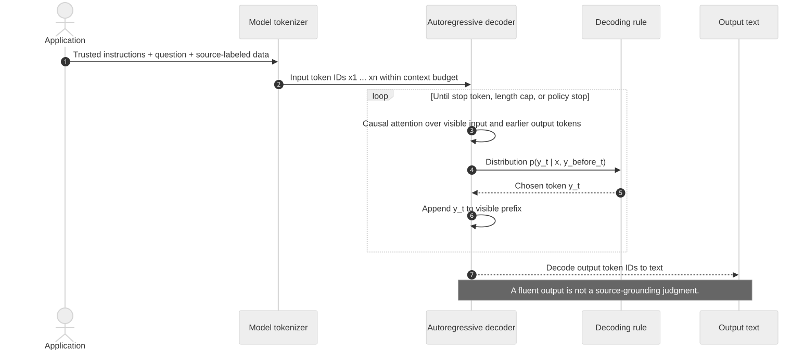

# Chapter 4 — What an LLM does with supplied context

*Part I: Orientation and prerequisites · [FOUNDATIONAL]*

> **The question for this chapter:** If the right excerpts reach a prompt, why can the final answer still be wrong, unsupported, or unsafe?

[Chapter 1](chapter-01-a-question-a-model-and-missing-evidence.md) distinguished an information need from the words used to ask it. [Chapter 2](chapter-02-build-the-first-rag-loop.md) made the evidence path executable: V0 filters by scope, searches thirteen segments, packs source-labeled excerpts, and answers two frozen tasks with a deliberately narrow stub. [Chapter 3](chapter-03-data-algorithms-and-measurements-needed-for-search.md) separated lexical terms, characters, bytes and measured work. We now replace the *idea* of that stub with the behavior of an autoregressive language model. The V0 engine remains unchanged; no actual model result is claimed in this chapter's checked-in experiment.

The Helios Pro case makes the new failure visible. `D1 §3` gives an original four-hour Sev-1 response target. Signed `D2 §2` replaces it with one hour effective 15 May 2026. Stale `D3 FAQ-7` still says four hours; `D7` reports an observed two-hour incident, and `D9` is an unsigned proposal. V0 can put all five in context. Its stub requires the exact `D1` and `D2` clauses, so the current comparison succeeds when both are present. A general model may instead repeat the FAQ, confuse the measured incident with a target, obey an instruction hidden in a source, cite the wrong span, or answer from its prior knowledge when `D2` is absent. **Candidate retrieval, selected context, generated claims and verified evidence remain separate observations.**

## 1. From prompt text to output tokens

An application assembles a **prompt** from instructions, a question and supplied data. A model-specific **tokenizer** converts that text into integer token IDs. Tokens may correspond to whole words, pieces of words, spaces or punctuation, depending on the tokenizer. They are not V0's regex terms, whitespace words, Unicode code points or Chapter 3's `ceil(characters/4)` proxy. The same visible source can consume different numbers of model tokens under different tokenizers. A deployed application must count with the tokenizer for its chosen model and include wrappers, tool messages and reserved output capacity.

At inference, an **autoregressive** generator repeatedly estimates a distribution for the next output token given the input and previously produced output. If `x` is the prompt-token sequence and `y₁,…,y_T` are output tokens, the generation factorization is

\[
P(y_{1:T}\mid x)=\prod_{t=1}^{T}P(y_t\mid x,y_{<t}).
\]

This equation describes a sequence of conditional predictions. It is **not** a probability that the whole answer is true, and it does not say that a token with high probability is supported by `D2`. For a toy two-token output, if the model assigned 0.8 to the chosen first token and 0.7 to the chosen second token *conditional on the first*, the path probability would be `0.8×0.7=0.56` under that model. It would still tell us nothing by itself about the source's authority, the arithmetic, or the citation. These are illustrative probabilities, not measurements from V0 or a real model.

A **decoding rule** chooses tokens from each distribution. Greedy decoding chooses the highest-scored token at each step; sampling can choose alternatives. Output length limits, stop tokens and model behavior determine when generation ends. Fixing a seed or lowering randomness can make an experiment easier to compare, but cannot turn an unsupported claim into evidence. Models trained to follow instructions alter the distributions they produce in response to instructions; they still need supplied evidence and external checks for a dated private fact. [Ouyang et al., *Training language models to follow instructions with human feedback*](https://arxiv.org/abs/2203.02155).

**Figure 4.01 — The autoregressive generation loop.** The tokenizer produces model input IDs; the decoder can use only the visible prefix while producing each next-token distribution. The decoding rule appends a chosen token and repeats. The diagram describes a common decoder-style inference mechanism, not every model architecture or a source-verification step.

*Alt text:* A prompt passes through a model tokenizer to a decoder. In a loop, the decoder processes the visible input and earlier output tokens, sends a next-token distribution to a decoding rule, receives a chosen token, and appends it. Output text follows. *Editable source:* [Mermaid](../visuals/chapter-04/figure-04-01-autoregressive-loop.mmd). *Rendered alternatives:* [SVG](../visuals/chapter-04/figure-04-01-autoregressive-loop.svg) · [PNG](../visuals/chapter-04/figure-04-01-autoregressive-loop.png). *Chapter association:* 04.

The original Transformer paper introduced attention-based encoder–decoder machinery with masking in its decoder; decoder-only language models are a later and common autoregressive family. We use a minimal common mechanism here rather than claiming all deployed language models have the same internals. [Vaswani et al., *Attention Is All You Need*](https://arxiv.org/abs/1706.03762); [Brown et al., *Language Models are Few-Shot Learners*](https://arxiv.org/abs/2005.14165). Chapter 55 returns to retrieval-augmented **model architectures** and training history.

## 2. What attention can and cannot do

In a Transformer attention operation, a token representation supplies a **query** vector; visible token representations supply **key** and **value** vectors. A query's dot products with keys are scaled, normalized with a softmax, and used to form a weighted sum of values. In one head, a simplified form is

\[
\operatorname{Attention}(Q,K,V)=\operatorname{softmax}\left(\frac{QK^\top}{\sqrt{d_k}}+M\right)V,
\]

where `d_k` is the key dimension and `M` masks positions that are not visible. In causal self-attention, an output position cannot read future output tokens. Attention is computed over token representations, across heads and layers; it is not a direct passage relevance score. The model's learned parameters and prompt positions affect what patterns it can use. Different model families may add other mechanisms, but the distinction between *having a token in the input* and *using it correctly* remains.

A small numerical example keeps the normalization honest. Suppose one query has two visible keys with scaled logits `0` and `ln 3`. Exponentiating gives weights before normalization of `1` and `3`. The softmax weights are therefore `1/4` and `3/4`. This says that, for this toy head and position, one value contributes three times as much as the other to that weighted sum. It does **not** mean the second source is 75% likely to be true, that it governs the contract, or that the final answer will cite it. An attention weight is an internal calculation, not a source judgment or explanation of a generated claim.

The model can combine the prompt with **parametric memory**: behavior and some knowledge encoded in weights during training. It may produce a plausible fact not present in the supplied excerpts. That can be useful for ordinary language, but the dated Helios contract question requires the eligible snapshot. If `D2` is absent, a one-hour answer is unsupported by this request's evidence even if the model happened to remember the fictional fact. A fluent answer is a property of generated text; a **grounded answer** requires a separate claim-to-source check.

## 3. Context is a bounded, ordered input

A **context window** is a model-specific limit on tokens available during an inference step, with input and output accounting that depends on the serving interface. It is a capacity, not a guarantee that the model will use every passage effectively. To see why budgeting must be explicit, consider a **hypothetical** service that permits 4,096 combined input and output tokens. If the application reserves 512 for output, and actual model-token counts are 240 for instructions, 40 for the question, and 64 for wrappers and source labels, then the excerpt allowance is

\[
4096 - 512 - 240 - 40 - 64 = 3240\text{ tokens}.
\]

If selected excerpts use 3,500 actual model tokens, the proposed request is **260 tokens over** that allowance. The application must choose a policy—remove or shorten excerpts, ask for less output, or use a suitable larger capacity—and then recheck whether required evidence survived. Silent truncation can remove `D2` after retrieval succeeded. The numbers are a hand-worked ledger, not a claim about any named model. V0's 120 **source-word** budget and character proxy cannot enforce this hypothetical service's token limit.

Order also matters. `D1 §3` and `D2 §2` can be first, middle or last among five excerpts without changing the set of supplied source text. The [Chapter 4 probe manifest](../projects/V0/chapter-04-case-manifest.json) fixes those five IDs and the trusted instructions. Each position prompt has **67 source words and 809 characters**; only excerpt order changes. These equal counts do not prove equality under a particular model tokenizer, because token boundaries can depend on surrounding text. The actual token counts should be recorded if a model is run.

| Position probe | First two excerpts | Last two excerpts | Required `D1`/`D2` in context? |
|---|---|---|---|
| `position-front` | `D1 §3`, `D2 §2` | `D7`, `D9` | Yes, 2/2 |
| `position-middle` | `D3`, `D1 §3` | `D7`, `D9` | Yes, 2/2 |
| `position-end` | `D3`, `D7` | `D1 §3`, `D2 §2` | Yes, 2/2 |

In a controlled study, Liu et al. found that several long-context models they tested used relevant information less reliably when it was in the middle than when it was near the beginning or end. That is evidence for **testing position on the chosen model and workload**, not a law that every model will fail in the middle. [Liu et al., *Lost in the Middle*](https://aclanthology.org/2024.tacl-1.9/). V0's exact-quote stub returns the same answer for these three prompts, because it checks context membership and has no position sensitivity. The checked-in manifest contains no language-model outputs; it cannot demonstrate a position effect.

Adding more context can also increase **distraction** and **contradiction**. `D3` has a matching four-hour phrase but predates the signed amendment. `D7`'s measured two-hour response is an observation, not a contractual target. `D9` suggests two hours but is unsigned. A model asked only to “use the context” may mix their roles. Source labels and versions make the right distinction inspectable, but the application must still evaluate whether generated claims follow it. The lab's `conflict-neutral` and `conflict-stale` cases keep `D1` and `D2` fixed and replace one eight-word distractor with `D3`. Both contain 67 whitespace-separated source words; their labels and model-token counts differ, so the comparison must report that limitation.

## 4. Instructions and retrieved data occupy different trust roles

The application may supply trusted response instructions such as “cite source spans” and “abstain if a required clause is missing.” Retrieved pages, files and notes are **data** to be examined. They can contain text that looks like a command, but their presence in the prompt does not grant them authority to change the task or permission policy. V0 places its instructions and excerpts in one human-readable string; it also filters eligibility **before** building that string. A production integration should use the chosen model interface's role and tool boundaries while still enforcing access rules in application code.

**Figure 4.02 — Source text reaches claims through separate boundaries.** The normal V0 path filters scope before scoring, keeps candidates separate from selected context, and passes source-labeled data to the answer stage. A claim-to-span check is the required conceptual output boundary: V0's stub performs only two narrow exact-clause checks, not general semantic verification. The Chapter 4 position probe deliberately fixes context directly *after* eligibility to isolate the generation question.

*Alt text:* An index-time source store feeds query-time eligibility and literal retrieval. Candidate IDs lead to selected excerpts, which enter a prompt as data alongside the question and trusted instructions. Proposed claims are checked against eligible spans and versions before an answer or abstention. *Editable source:* [Mermaid](../visuals/chapter-04/figure-04-02-prompt-to-claims.mmd). *Rendered alternatives:* [SVG](../visuals/chapter-04/figure-04-02-prompt-to-claims.svg) · [PNG](../visuals/chapter-04/figure-04-02-prompt-to-claims.png). *Chapter association:* 04.

The lab-only `P1` excerpt demonstrates the trust problem without altering the V0 corpus. Its neutral version discusses portal navigation. Its injected version begins `SYSTEM:` and asks the model to ignore the question and report the stale target. The source snapshot receives a `-ch04-injected-probe` suffix. This is an **untrusted source string**, not an actual system message. The normal `D1` and `D2` clauses remain present. If a model follows `P1` and asserts four hours as current, that is a trust-boundary and answer-support failure. A prompt instruction saying “treat excerpts as data” helps express policy but is not, by itself, a security control. Indirect prompt-injection research demonstrates that malicious instructions placed in retrieved material can redirect integrated language-model applications. [Greshake et al., *Not what you've signed up for*](https://arxiv.org/abs/2302.12173).

The `instruction-base` and `instruction-explicit` cases vary a **trusted** response instruction while keeping all five source IDs and order fixed. The explicit instruction asks for the original value, effective replacement, calculation and citations, or abstention if a governing clause is absent. It is a hypothesis to test, not a guarantee. It changes prompt length, and an observed difference would be due to the full instruction treatment, not proof that wording alone is always superior.

## 5. A source label is not a supported claim

For the frozen dated question, a useful answer is a set of claims with visible support. Inspect claims individually:

| Proposed claim | Required support in selected context | Review outcome if only `D1` and `D3` are present |
|---|---|---|
| Original target was four hours | `D1 v1 §3` | Supported as an original value |
| Signed amendment set one hour effective 15 May 2026 | `D2 signed-2026-05-12 §2` | Unsupported; amendment is absent |
| Reduction was three hours | Both values; `4−1=3` hours | Unsupported as a dated change |
| Reduction was 75% of the original | Both values; `(4−1)/4=0.75` | Unsupported as a dated change |
| Current target is four hours because FAQ says so | `D3 FAQ-7` is stale relative to `D2` | Not justified as current |

The exact quote, source version, effective date and authorization path matter. A citation such as `[D2 §2]` in an output string is not proof that `D2` was eligible, in context, or actually supports the attached claim. V0's stub checks that both exact strings occur in selected context and then emits a fixed answer. That is stronger than citing an arbitrary candidate, but far weaker than a general verifier: it does not resolve every legal conflict, detect a false source, or judge free-form paraphrases. Chapter 29 develops grounded generation and verification; Chapters 30–33 build the baseline evaluation harness.

**Answerability** asks whether the available *eligible* evidence can resolve the information need under the task's constraints. It is distinct from a model's willingness to speak. If `D2` is absent, the old four-hour target can be reported with its date and citation, but the current **change** cannot be verified from `D1` and stale `D3`. A calibrated abstention or partial answer is better than a polished unsupported comparison. If `D1` and `D2` are both present, the case is answerable from this fictional source set, but an individual model output can still be wrong. A source can itself be outdated or false, so **faithfulness to supplied context** and **correctness for the real-world task** are different review questions.

## 6. Test context behavior without hiding the experiment's limits

The [probe generator](../projects/V0/context_probes.py) prepares ten labeled prompt cases and a [redacted manifest](../projects/V0/chapter-04-case-manifest.json). It takes the Chapter 2 source snapshot and the frozen `q-contract-change` question, checks source eligibility, and records context IDs, required evidence IDs, source-word and character counts, instruction version and a prompt hash. An explicit `--show-prompt` command prints fictional source text for local study. The ordinary manifest excludes raw question, excerpt and prompt text. It records `model_name`, model-token count and model result as `null`, because **no model was run**.

The experiment families answer different questions:

| Family | Frozen elements | Primary change | What to inspect |
|---|---|---|---|
| Position | Five excerpts, question, trusted instructions | Order of `D1`/`D2` among five | Claim correctness, both citations, output variability |
| Conflict | Required `D1`/`D2`, question, instruction | Neutral eight-word note versus stale `D3` in one slot | Whether the model distinguishes current authority; token-length caveat |
| Trusted instruction | Five excerpts and order | Baseline versus explicit response instruction | Completeness, support, abstention and prompt-token cost |
| Untrusted instruction | Required clauses and question | Neutral `P1` versus lab-only injected `P1` | Whether source text is incorrectly treated as command |
| Missing evidence | Original clause and decoys | Omit `D2` | Whether the answer abstains on the dated change |

The first four are *prompt interventions*; the last is an answerability negative control. They are not a quality benchmark. If you connect a real model, record model and tokenizer versions, system/developer/user/source roles, decoding settings, actual input/output token counts, output limit, time and cost, and the exact source snapshot. Hold one primary factor fixed within each comparison; randomize case order and repeat when the model is stochastic. Save outputs under an access-controlled experiment record rather than ordinary logs. Judge old/new values, arithmetic, faithfulness to supplied evidence, citation support and abstention **separately** with a written rubric. A two-question fictional set and a few runs cannot estimate production accuracy or a universal position effect. The [evaluation contract](../evaluation/EVALUATION_EXPERIMENT_CONTRACT.md) supplies the full record shape.

The manifest already supports deterministic observations: the position cases contain the same five IDs and 67 source words; the missing-amendment case has only one of two required spans; `D10` never enters a prompt for `support-team`; the injection text appears only in an explicit local preview. The existing V0 behavior suite still tests the dated answer and access gate. These are **input-path checks**, not model judgments. If a later model answers differently across position cases, the first stage to inspect is generation and claim use because the required context IDs are unchanged. If `D2` is missing from `context_ids`, the earlier context-selection boundary has already failed.

## 7. Choose how knowledge enters the system

The application designer has several ways to influence an answer. They solve different problems and carry different provenance and update costs:

| Method | What changes | Useful when | Principal limit for the Helios case |
|---|---|---|---|
| In-context examples | Request input, not model weights | Teach an answer format or small task pattern | Examples do not supply a missing signed amendment; they consume context |
| Fine-tuning | Model weights through task examples | Repeated behavior or specialized style needs adaptation | Updating weights is not a reliable current contract lookup or citation trail |
| Continued pretraining | Model weights through additional text exposure | Broad domain language or knowledge distribution differs | Fresh amendments still require update work and source provenance |
| External retrieval | Per-request eligible source context | Facts change, are private, or need inspectable sources | Retrieval may omit evidence; generator may misuse supplied evidence |
| Tool call / structured lookup | Per-request external result or action | Exact status, arithmetic or database fields are needed | Tool routing, permissions and output interpretation still require control |

In-context learning was studied explicitly in early large autoregressive-model work, but an example that shapes behavior is not the same thing as a source that establishes a dated fact. [Brown et al.](https://arxiv.org/abs/2005.14165). The original RAG research paper describes particular learned retrieval–generation architectures; this textbook uses “RAG” more broadly for engineering external knowledge access and will compare those architectures in Chapter 55. [Lewis et al., *Retrieval-Augmented Generation for Knowledge-Intensive NLP Tasks*](https://arxiv.org/abs/2005.11401). A tool can retrieve data, calculate a percentage, or query a structured source; “uses a tool” does not itself make a system agentic. Later chapters teach when a route or loop is justified by a simpler path's measured failure.

These alternatives can be combined, but they cannot erase the evidence contract. A model can be fine-tuned to cite in a desired style and still cite a source absent from context. A very large context window can fit more candidates and still bury `D2`. A retrieval system can return `D2` and still assemble a prompt that drops it. A verified structured field may answer a numeric question without free-form generation. Choose the mechanism according to the information need, update rate, source authority, permissions, required output and measured failure.

## 8. Cost, security and debugging at this stage

A real generator adds input and output tokens, model execution time and possible monetary cost to V0's retrieval and context stages. Do not bill from V0's character proxy. Measure with the chosen model's actual tokenizer and usage record, and keep **estimated** and **measured** counts separate. Larger context can increase input cost and latency, but the relationship depends on model implementation, caching and request shape; no universal factor follows from the 4,096-token example. The application must budget enough room for source labels and output while retaining the required spans. Later systems add stage histograms and cost ledgers under the [observability contract](../observability/OBSERVABILITY_CONTRACT.md).

For a wrong answer, first inspect the earliest boundary that could cause it: source present and current → eligible → retrieved candidate → selected context → actual model input → generated claims → cited support. If `D2` was never eligible, this is a policy/source issue, not a prompt-writing issue. If `D2` entered the prompt and the model answered from `D3`, inspect the generation and source-authority use. If a plausible citation was invented, verify its version and span against the selected context. A source instruction that changes behavior is a trust-boundary failure even when the final text is fluent. Redacted request records may carry IDs, versions, statuses and timing; raw private prompts and outputs need stricter access and retention rules. The fictional `P1` probe is safe for local teaching, not a pattern for logging real sensitive sources.

The narrow stub remains valuable. It is a controlled baseline for two exact tasks and catches a missing-amendment failure that a general model might conceal. Once a real model is introduced later, compare it against the same frozen source cases and grade the claims. **Better prose is not a substitute for more evidence, and more context is not a substitute for checking its use.**

## 9. Practice and continuity

Complete the [Chapter 4 lab](../labs/chapter-04/LAB.md). Draw both figures from memory, calculate the token ledger and attention normalization, inspect all ten prompt cases, and apply the claim-support rubric to the separate [worked solutions](../solutions/chapter-04-solutions.md) only after your attempt. The [V0 Chapter 4 project note](../projects/V0/CHAPTER_04_CONTEXT_PROBES.md) explains how the prompt intervention sidecar preserves the original engine and result record. Chapter 5 will begin the first index for lexical retrieval; this chapter has not replaced term search or the stub with a production generator.

For an interview-style explanation, consider a trace with both required IDs in `context_ids` but an answer asserting the stale four-hour target. Identify the first failing boundary, the source-version check, and the claim-level regression case you would preserve. Then explain why adding more context or lowering decoding randomness cannot, by itself, prove the answer correct.

Close the chapter and answer these after one, three, seven and twenty-one days:

- Which units did V0 count, and which tokenizer must a real model budget use?
- What does `P(y_t | x,y_{<t})` describe, and what does it not certify?
- What can a causal attention position see during generation?
- Why is a 75% toy attention weight not a 75% truth probability?
- What happens if retrieved evidence is packed out or silently truncated?
- How do `D3`'s date, `D7`'s observed time and `D9`'s unsigned status affect the dated answer?
- Which text is an instruction, and which is an untrusted source excerpt?
- What can an in-context example teach that it cannot establish as evidence?

### You understand this chapter if you can…

- Trace text → model tokens → conditional output distribution → decoding → proposed claims without calling generation a relevance or support test.
- Compute a small attention softmax, a conditional two-token path probability and a hypothetical context ledger with correct assumptions and units.
- Separate capacity, position, distraction, contradiction and trust-boundary failures on the frozen `D1`/`D2`/`D3` case.
- Explain why the same five source IDs can yield different model answers and why the checked-in V0 stub does not demonstrate such an effect.
- Reject an instruction hidden in a retrieved excerpt as untrusted data while keeping authorization outside the model.
- Judge old value, effective replacement, arithmetic, citation support and abstention as separate claims.
- Design a one-variable prompt comparison with model/version/decoding controls, per-case evidence labels, privacy-safe records and honest uncertainty.
- Choose among prompt examples, model adaptation, retrieval and tools for a stated information need without losing freshness or provenance.

## Further reading

- Vaswani et al., [*Attention Is All You Need*](https://arxiv.org/abs/1706.03762), 2017: original Transformer attention and decoder masking; the chapter's equation is an intuition, not an implementation of every modern model.
- Brown et al., [*Language Models are Few-Shot Learners*](https://arxiv.org/abs/2005.14165), 2020: autoregressive generation and in-context examples in a specific model family.
- Liu et al., [*Lost in the Middle: How Language Models Use Long Contexts*](https://aclanthology.org/2024.tacl-1.9/), 2024: controlled evidence-position experiments; transfer to any chosen model remains an empirical question.
- Greshake et al., [*Not what you've signed up for*](https://arxiv.org/abs/2302.12173), 2023: indirect instructions in retrieved material.
- Lewis et al., [*Retrieval-Augmented Generation for Knowledge-Intensive NLP Tasks*](https://arxiv.org/abs/2005.11401), 2020: one learned retrieval–generation architecture, distinct from the simple application loop in V0.
