# Chapter 5 — Text normalization and inverted indexes

*Part II: Information retrieval foundations · [FOUNDATIONAL]*

> **The question for this chapter:** How can a searcher find the few segments containing a term without rereading every segment, while preserving exact identifiers, source identity, and access eligibility?

Chapters [2](chapter-02-build-the-first-rag-loop.md) and [3](chapter-03-data-algorithms-and-measurements-needed-for-search.md) gave us an honest but expensive baseline. For every question, V0 tokenizes the question, visits every *eligible* segment, tokenizes its title and body, counts distinct shared terms, and sorts the matches. Chapter [4](chapter-04-what-an-llm-does-with-supplied-context.md) showed why even a good candidate list does not guarantee a grounded answer. We now change only **how candidate text matches are found**. V0's frozen questions, scope rule, overlap score, context packing, and deterministic answer stub remain the control. Weighted ranking arrives in Chapter 6; production pruning and compressed postings arrive in Chapter 8.

Suppose the support corpus grew from 13 segments to a million. A request for a rare product code such as `HX-7A` should not need to tokenize a million bodies again. We could prepare a map from each searchable term to the segments that contain it. That map is an **inverted index**. It trades preparation and storage for fewer query-time visits. The trade is worthwhile only if its analyzer preserves the distinctions our users need and its returned IDs still pass eligibility before scoring or source-text fetch.

**Workload identity:** `v0-frozen-tasks-v1`; see the [comparison registry](../evaluation/WORKLOAD_REGISTRY.md). Metrics across different workloads do not form an improvement sequence.

**Independent construction gate:** Read the mechanism explanations first. Before inspecting supplied Python reference code, attempt [lab A0](../labs/chapter-05/LAB.md#a0-independent-bounded-mechanism) on your own tiny fixture. Open the separate worked answer afterward; existing calculation, debugging and project-comparison tasks still apply.

## 1. What exactly enters the index?

A **corpus** is the chosen source snapshot. A **document** is a versioned source record; a **segment** is a searchable unit derived from one document and source span. Our V1 preview indexes the same 13 V0 segments, including the restricted `D10` segment in its internal store. Indexing a record does not make it eligible for every request. The source locator remains document ID, version, section and segment ID. Chapter 19 will make parsing and lineage much richer; Chapter 20 will revisit segmentation. Here we hold those choices fixed so the indexing mechanism is visible.

An **analyzer** converts field text into ordered **terms**. The raw character sequence is not yet a term. The operations can include Unicode normalization, case mapping, token boundary selection, stop-word removal, and stemming. The same analyzer contract must be used for indexed fields and queries; a change to it requires an index rebuild or a separately versioned compatible path. [Manning, Raghavan and Schütze, *Tokenization*](https://nlp.stanford.edu/IR-book/html/htmledition/tokenization-1.html) emphasize this query/document symmetry.

V1 offers two deliberate modes:

| Analyzer mode | Operations | Intended use and limit |
|---|---|---|
| `v0` | V0's lowercase ASCII regex; keeps an internal hyphen | Exact comparison with V0's candidate order and scores. It breaks or drops some non-ASCII letters. |
| `unicode_nfc` | Unicode NFC, case folding, NFC again, Unicode letter/number runs with internal hyphens | Canonically equivalent accents can match; it still is not a language-aware word segmenter or exact-identifier parser. |

For example, `HX-7A` becomes the one term `hx-7a` in either mode. A query for `HX-7C` is a different product code and correctly returns no match in the five-record lab fixture; `resett` is a misspelling that also returns no match. In `unicode_nfc`, precomposed `café` and decomposed `cafe` + combining acute normalize to the same term. In V0's ASCII analyzer they can become different fragments. Unicode **NFC** composes canonically equivalent sequences; **NFKC** also folds compatibility distinctions and can erase distinctions a domain may care about. This code does not apply NFKC. [Unicode Standard Annex #15](https://www.unicode.org/reports/tr15/) defines those forms. Case folding can also merge surface forms, for example `ß` and `ss` in some contexts. Keep original bytes or text and source offsets if exact quotation or identifier auditing matters.

There is no universally safe “clean text” setting. Removing `the` may reduce postings but can break a quotation or an exact title. Removing `not` can invert the meaning of a query. A stemmer may map related inflections to a common root, but can merge words that a domain distinguishes; a lemmatizer needs linguistic context and language-specific resources. Word and character **n-grams** can recover substrings or misspellings at a storage and false-match cost. **Fuzzy matching** usually searches a bounded edit neighborhood; it is a separate query operation, not a promise that the exact index will correct `HX-7C` to `HX-7A`. For product codes, model numbers, legal section IDs, and multilingual text, test several analyzers on *real query slices* before choosing one. Preserve an exact field or route when normalization would erase a required distinction.

## 2. Build the term-to-postings map

Consider the [five fictional records](../projects/V1/toy_corpus.json). Each is one body segment; `S5` is visible only to `legal-team`.

| Segment | Scope | Body text |
|---|---|---|
| `S1` | support | `Helios Pro HX-7A reset guide.` |
| `S2` | support | `Helios Pro HX-7A reset checklist.` |
| `S3` | support | `Legacy HX-7A reset guide.` |
| `S4` | support | `Helios Pro HX-7B café reset guide.` |
| `S5` | legal | `HX-7A reset key.` |

The short `S1`–`S5` labels stand for full segment IDs such as `S1:body:0`; the forward store retains that locator and source version.

The analyzer emits a sequence of `(term, field, position)` records for each segment. Positions start at zero in **each field**. `S1`'s body becomes `helios@0, pro@1, hx-7a@2, reset@3, guide@4`. Its title `Manual` yields `manual@0` in the title field. The **vocabulary** is the set of distinct emitted terms. A **posting** is a term's entry for one segment, carrying that segment ID and whatever per-field information is needed. Our Python posting stores title and body position tuples. Its **term frequency** is the number of occurrences across those fields; the title and body positions remain separate so phrase matching cannot cross their boundary.

| Term | Ordered body postings in the toy index | Why it matters |
|---|---|---|
| `hx-7a` | `S1:[2]`, `S2:[2]`, `S3:[1]`, `S5:[0]` | Exact identifier; restricted `S5` is still present in the internal index. |
| `guide` | `S1:[4]`, `S3:[3]`, `S4:[5]` | Intersect with `hx-7a` to get `S1,S3` for support. |
| `reset` | `S1:[3]`, `S2:[3]`, `S3:[2]`, `S4:[4]`, `S5:[1]` | Common term; its long list saves less work. |

`df(hx-7a)=4` **segment postings** in this five-segment fixture, even though a support-team request may use only three. This is a document-frequency-like count at the indexed-unit level; Chapter 6 will define the precise corpus unit and use frequency statistics in ranking. It is not four independent verified answers. A real contract claim still depends on authority, date and the right source span.

**Figure 5.01 — Preparation produces three distinct stores.** The inverted store supports term lookup; the forward store retains source text and locators; scope membership supports eligibility. Positions are field-local. A posting points to a segment, not to a claim or answer.



*Alt text:* Five source records feed a title/body separation step. Field analysis emits term positions to an inverted store; original text and locators go to a forward store; source scopes go to a separate membership store. *Editable source:* [Mermaid](../visuals/chapter-05/figure-05-01-from-documents-to-postings.mmd). *Rendered alternatives:* [SVG](../visuals/chapter-05/figure-05-01-from-documents-to-postings.svg) · [PNG](../visuals/chapter-05/figure-05-01-from-documents-to-postings.png). *Chapter association:* 05.

The **forward index** is keyed by segment ID and can return the original title, body, version, span and eligibility metadata. V1 also stores each field's **analyzed length**: `S1` has one title term and five body terms. Length is not raw bytes or a model-token count; Chapter 6 will need an explicit unit for ranking. Posting terms cannot reconstruct punctuation, casing, spacing or a faithful quote. V1 stores the original segment dictionary for this reason. It does **not** store character offsets for highlighting; its position numbers count analyzed terms. A highlighter that must identify exact substrings needs offsets or a verified mapping back to source bytes. A repeated title term is indexed for every segment of that document, just as V0 scored each segment using title plus body. That convention matters when comparing the engines.

The construction algorithm is small enough to inspect:

```text
for each source segment with stable ordinal and scope:
    add ordinal to each allowed-scope membership set
    keep original fields and source locator in forward store
    for each field in [title, body]:
        for position, term in analyze(field text):
            append position to postings[term][ordinal][field]
sort each term's postings by ordinal; freeze analyzer and snapshot version
```

If `T` is the number of emitted term occurrences, an in-memory builder performs roughly `O(T)` average-case map updates and then sorts posting keys or lists as needed. This implementation iterates segments in order and materializes ordered posting tuples; its memory is proportional to term occurrences plus forward text and metadata, with substantial Python-object overhead. The checked-in one-snapshot experiment reports **119 vocabulary terms, 222 term–segment pairs and 247 stored positions** for the 13 V0 segments under the V0 analyzer. Those counts are workload facts, not compressed-index byte sizes. Gap coding, compression, immutable segments and merges belong to Chapter 8 and the production lifecycle chapters.

## 3. Query the lists: Boolean matches and phrase order

An inverted index reverses the access path. Given a term, fetch its posting list rather than analyzing each segment anew. For a Boolean **AND**, intersect posting IDs. For **OR**, take their union. **NOT** subtracts IDs from an already positive, eligible result; V1 rejects a pure negative query. It is easy to return a huge or sensitive set by defining an unrestricted complement, and it is seldom a useful information need.

For the support-team query `hx-7a AND guide`, the lists are `[S1,S2,S3,S5]` and `[S1,S3,S4]`. The scope membership set is `{S1,S2,S3,S4}`. Filtering each list by eligibility removes `S5`; their intersection is `{S1,S3}`. The exact sequence in [`boolean_ids()`](../projects/V1/lexical_index.py) uses set operations for clarity. A sorted two-cursor merge can intersect two lists in `O(p+q)` comparisons for list lengths `p` and `q`: compare current IDs, emit and advance both on equality, otherwise advance the smaller ID. Intersect short lists first for many-term AND queries. Skip data can jump over ranges; Chapter 8 develops that execution layer. A term dictionary lookup is fast on average, but **the query is not O(1)**: it must process postings, filters, positions, ranking and eventually source fetch.

**Figure 5.02 — Scope filters posting IDs before match output and source fetch.** `S5` is in the internal `hx-7a` list but cannot become a support-team candidate. The diagram shows the Boolean AND example, while V1's ordinary unweighted search uses OR followed by overlap ranking.



*Alt text:* A support-team query produces two term lists. A membership gate removes the legal-only `S5`; intersection yields `S1,S3`, which are then fetched from the forward store. *Editable source:* [Mermaid](../visuals/chapter-05/figure-05-02-scoped-posting-intersection.mmd). *Rendered alternatives:* [SVG](../visuals/chapter-05/figure-05-02-scoped-posting-intersection.svg) · [PNG](../visuals/chapter-05/figure-05-02-scoped-posting-intersection.png). *Chapter association:* 05.

A bag of terms loses order. Both `reset guide` and `guide reset` share two words with `S1`, but only the first phrase occurs there. A **positional index** allows a phrase query: intersect the segments containing all phrase terms, then look for a start position `p` such that term `i` occurs at `p+i` in the *same field*. In `S1`, `reset@3` followed by `guide@4` succeeds. `guide reset` fails. The phrase `manual helios` must fail even though `manual` occurs in the title and `helios` at body position zero; there is no single-field adjacent span. Phrase matching here is over **analyzed terms**, not raw characters: punctuation, case and any omitted terms affect its meaning. A phrase with repeated words must test each required offset, not merely set membership. A phrase split across two V0 segments also fails at this index level even if the original source sentence is contiguous; Chapter 20 revisits boundary design. See the [Stanford IR positional-index account](https://nlp.stanford.edu/IR-book/html/htmledition/positional-indexes-1.html).

Ordinary V1 `search()` uses **OR candidate generation** to preserve V0's behavior. It visits postings for distinct query terms, filters ordinal eligibility, counts distinct matched terms per segment, then sorts by descending count and V0's numeric document ID, section order and segment number tie break. The query may return no candidates if no analyzed term occurs; that is **no result under this analyzer, scope and snapshot**, not proof that no answer exists. The V0 answer stub still decides whether the two frozen questions have the required evidence in selected context. A candidate is not yet evidence, and a matching term is not proof of a claim.

For a hand-worked OR query `HX-7A reset guide`, the analyzed query set is `{hx-7a, reset, guide}`. Among support-eligible segments, `S1` and `S3` each match three distinct terms, while `S2` and `S4` match two. The ranked list is therefore `S1:3, S3:3, S2:2, S4:2` under the numeric ID tie rule. Restricted `S5` matches two terms internally but is absent from the eligible ranking. Repeating `reset` in a query would not add a fourth point because this particular baseline uses a **set** of query terms; term-frequency weighting is a Chapter 6 decision. The score is an integer match count, not a probability of relevance or authority.

## 4. The cost and failure boundary

Let `N` be eligible segments, `L` their average analyzed field length, `m` distinct query terms and `P` the sum of the fetched posting-list lengths. V0 retokenizes roughly `N·L` field terms per query, plus candidate sorting. V1 pays approximately `P` posting visits, `U` matched-segment score updates, and `O(U log U)` for this simple full sort; it still pays source fetch and context work after ranking. The scope set is prepared at index time in this static fixture. A selective term gives small `P` and `U`; common terms can make both approach the corpus size or worse across multiple lists. V1 stores positions even for ordinary OR search, paying extra memory to support phrase queries. An analyzer or source update requires a coordinated rebuild or update path; this teaching index does not implement incremental mutation, deletion, persistence or distributed serving.

Static scope membership is **an optimization, not authentication**. A production request must receive an authenticated, authorized scope from outside user-controlled query text. If permissions change, stale scope membership could leak results; the index or policy view must be updated before serving under the new rules, and caches must obey the same boundary. V1 checks membership before candidate scoring and forward-text fetch, and its ordinary trace contains IDs and aggregate work counts rather than raw source or question text. Restricted IDs remain inside the service's index; keep index files and diagnostic tooling access-controlled. Later chapters handle dynamic ACLs and tenant-safe caches.

The most important correctness failures are analyzers that erase a rare code, split a language incorrectly, change the meaning of negation, or apply different rules to documents and queries. A missing result could instead come from an unindexed source, a stale snapshot, the wrong scope, or an over-narrow field route. Debug in that order before adding fuzzy matching. A fuzzy fallback can increase recall but also confuse `HX-7A` with `HX-7B`, a dangerous substitution if these identify different products.

**Production analogue.** Apache Lucene exposes analysis as a `TokenStream`, terms and posting iterators through index APIs, and separate field choices for indexing and storage. Its [TokenStream API](https://lucene.apache.org/core/10_3_1/core/org/apache/lucene/analysis/TokenStream.html), [PostingsEnum API](https://lucene.apache.org/core/10_4_0/core/org/apache/lucene/index/PostingsEnum.html) and [TextField API](https://lucene.apache.org/core/10_3_1/core/org/apache/lucene/document/TextField.html) are useful maps from our `Analyzer`, posting tuple and forward store to a real engine. They do not mean a Lucene index uses our Python objects, stores every original field automatically, or enforces our scope rule. A production library hides disk formats, segment maintenance and query execution choices that Chapters 8 and 50 unpack. Record the exact library and analyzer configuration before comparing results; the cited API pages are examples from their named versions, not a promise about a future release.

## 5. A controlled comparison with V0

The [experiment program](../projects/V1/experiment.py) fixes the V0 analyzer, top eight, `support-team` scope and four query IDs: the two frozen V0 questions, a rare numeric query, and a no-result query. It compares V0's full-scan `search()` with V1's posting search on the original 13 segments and on deterministic **synthetic copies** of the same ten documents (130 and 1,300 segments). Copies preserve words and scope patterns but are not new real agreements or new relevance judgments. The script checks every top-eight `(segment ID, score)` pair for exact agreement before timing. It warms both paths, randomizes their order with a fixed seed, retains nine raw microsecond samples per method/query, and reports medians and nearest-rank p95. Index build time is outside query timing. The [raw result](../projects/V1/chapter-05-experiment.json) records snapshot and code hashes, Python/platform, seed, counts and all samples.

The following values are one local run on 29 September 2026, rounded from that result; they are **not service benchmarks**.

| Segments | Query slice | V0 scan median, µs/query | V1 postings median, µs/query | Eligible segments / V1 scored | Eligible posting visits |
|---:|---|---:|---:|---:|---:|
| 13 | Contract change | 88.8 | 23.8 | 12 / 12 | 57 |
| 13 | Rare numeric | 59.4 | 3.9 | 12 / 1 | 2 |
| 13 | No result | 60.6 | 2.4 | 12 / 0 | 0 |
| 1,300 | Contract change | 8,404.0 | 1,937.3 | 1,200 / 1,200 | 5,700 |
| 1,300 | Rare numeric | 6,216.1 | 153.2 | 1,200 / 100 | 200 |
| 1,300 | No result | 6,193.4 | 9.3 | 1,200 / 0 | 0 |

At 13 segments, building the index took **0.561 ms** in that run; at 1,300, **54.390 ms**. Those are single build observations with substantial Python overhead. The common contract query scored *every* eligible segment in both versions. V1 still avoided retokenizing every title and body on each request, but did not avoid evaluating an overlap score for every eligible segment in that slice. The rare and absent terms show the larger algorithmic reduction. With only nine sequential local timing samples, p95 is a maximum-like observation, not a stable tail-latency estimate; system load, cache state, Python allocation and corpus mix can change the numbers. This test establishes **exact output agreement and mechanism-level work differences** for the specified fixture. It does not establish production throughput, ranking quality, answer faithfulness or an improvement on an unseen corpus. Formal qrels and ranked retrieval metrics begin in Chapter 9.

V1's [behavioral tests](../projects/V1/test_lexical_index.py) separately compare the two frozen V0 answers at several candidate depths, test a missing `D2`, ensure `D10` never enters a support prompt or trace, and check exact code, phrase, Boolean and Unicode behavior. A no-result or analyzer collision is retained as a diagnostic case, not repaired with an unmeasured heuristic.

## 6. What the index does not solve

An inverted index makes matching terms addressable; it does not decide whether `D2` supersedes `D1`, whether `D3` is stale, or whether an LLM uses the evidence correctly. Unweighted overlap can favor a long or common-word-heavy segment. It may rank `D3` above a decisive clause when both share easy terms. Chapter 6 introduces term and document frequency, sparse vectors and TF-IDF to ask **which matched terms are informative**. Chapter 7 adds BM25's saturation and length normalization. Chapter 8 asks how to execute those scores without examining every possible candidate. Those steps require this chapter's exact term, posting, field, position and analyzer contract.

### Practice and active recall

Work the [Chapter 5 lab](../labs/chapter-05/LAB.md) before reading its [solutions](../solutions/chapter-05-solutions.md). From memory, answer: What is a term versus a model token? Why do positions restart by field? Which two operations can turn `HX-7A` into a wrong match? Why does `S5` appear in a posting but not a support result? For `hx-7a AND guide`, write both lists and the intersection. Explain why an empty list is not evidence of global unanswerability. Then identify one query for which an index can still score almost every eligible segment.

**You understand this chapter if you can** construct postings and a forward record by hand; evaluate Boolean and phrase matches including a restricted source; explain the analyzer's information loss; reproduce V0's unweighted ranking with an index; separate build cost, posting visits and query latency; and diagnose whether a missing clause failed at source preparation, analysis, eligibility, candidate retrieval, context selection or answer use.

### Further reading

- [Manning, Raghavan and Schütze, *Introduction to Information Retrieval*: term vocabulary and postings](https://nlp.stanford.edu/IR-book/html/htmledition/the-term-vocabulary-and-postings-lists-1.html), [Boolean query processing](https://nlp.stanford.edu/IR-book/html/htmledition/processing-boolean-queries-1.html), and [positional indexes](https://nlp.stanford.edu/IR-book/html/htmledition/positional-indexes-1.html). Read the algorithms, then compare their sorted-list execution with V1's simpler Python sets.
- [Unicode Standard Annex #15: Normalization Forms](https://www.unicode.org/reports/tr15/). Read the NFC/NFKC distinction before changing an analyzer for multilingual or identifier-heavy material.
