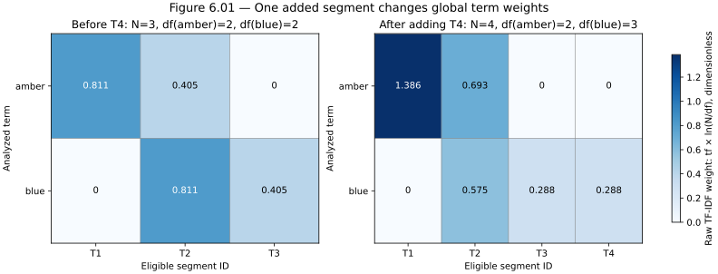

# Chapter 6 — TF-IDF, vector-space ranking, and lexical limits

*Part II: Information retrieval foundations · [FOUNDATIONAL]*

> **The question for this chapter:** Once postings find matching segments, which matches deserve the first few context slots, and how can we derive every number in that decision?

[Chapter 5](chapter-05-text-normalization-and-inverted-indexes.md) made term matches addressable. Its V1 preview keeps V0's deliberately blunt score: **one point per distinct shared query term** in a segment's title or body. That score treats a term seen in nearly every segment like a rare product code. It also ignores whether a matched term occurs once or repeatedly. In the frozen Helios corpus, this leaves several contract and incident passages tied; the tie rule, rather than term evidence, may decide which source enters a small context. [Chapters 2–4](chapter-02-build-the-first-rag-loop.md) already taught why a source can be an eligible candidate yet fail to support the final claim. We now improve the *ranking calculation*, holding the index, analyzer, source snapshot, scope and answer stub fixed.

There is an important warning at the outset. A more elaborate score is not automatically a better evidence selector. In the checked-in experiment, raw TF-IDF puts the required termination clause into the top two where unweighted overlap misses it, but it pushes the original governing contract clause out of the top two for the dated change. Both outcomes are real for this small fixture. Our task is to understand the formula, expose its trade-offs, and preserve that negative result for Chapter 9's judged retrieval baseline.

## 1. Count occurrences and documents, with a declared unit

For a term `t` and indexed segment `d`, **term frequency** `tf(t,d)` is the number of occurrences in the indexed fields. Chapter 5's posting stores title and body positions, so the counts are available without rereading the source. V1 Chapter 6 defines a field-adjusted raw count

\[
tf_w(t,d)=tf_{body}(t,d)+w_{title}\,tf_{title}(t,d),\qquad w_{title}>0.
\]

The default `w_title=1`, matching Chapter 5's equal title/body treatment. A title boost is a *chosen feature weight*, not proof that every title match is relevant. Because V0 repeats a document's title in every segment's search text, a title term can affect several segment candidates. This chapter retains that convention so the ranking rule is the primary change. Later fielded ranking must evaluate the impact of boosts on each query slice rather than tuning by one appealing example.

**Document frequency** `df(t)` counts *indexed units* containing `t` at least once. Our units are **segments**, so one source document split into three segments may contribute up to three to `df`. That differs from source-document frequency. `N` is the number of eligible indexed segments in the same scope and source snapshot. We intentionally compute scope-local statistics: a legal-only `D10` term must not alter a support-team score or expose its existence through a score difference. In a real multi-tenant service, these statistics, ACL policy and caches need consistent updates; the caller-controlled `support-team` argument in our lab is not authentication.

The chosen inverse document frequency is the natural logarithm

\[
idf(t)=\ln\frac{N}{df(t)}\quad\text{for }1\le df(t)\le N.
\]

It is larger when a term appears in fewer eligible segments. It equals zero when every eligible segment contains the term. For `df=0`, there is no posting in that scope; the searcher skips the term rather than calculating `ln(N/0)`. If `N=0`, there are no eligible candidates. This is **one IDF convention**. Smoothing, adding constants, counting full documents instead of segments, and using a different logarithm base all change numerical scores and sometimes rank order. The [Stanford IR text on IDF](https://nlp.stanford.edu/IR-book/html/htmledition/inverse-document-frequency-1.html) motivates discounting ubiquitous terms; it does not choose our application policy for us.

If a user queries only a term present in every eligible segment, those segments are still **matches** even though this convention gives each a zero weight. V1 returns them with zero scores and a deterministic tie order. A zero TF-IDF score here is not “no result,” and a positive score is not a calibrated relevance probability. An unseen term, by contrast, yields no posting candidate at all. Keep these cases distinct in logs and UI behavior.

## 2. Construct a sparse vector and work the score by hand

For a segment, define the raw TF-IDF weight of each vocabulary term as

\[
w_{t,d}=tf_w(t,d)\,idf(t).
\]

Most vocabulary terms do not occur in a short segment, so most coordinates are zero: this is a **sparse document vector**. For a query, the simplest score in this chapter is the sum of document weights over its **distinct** analyzed query terms,

\[
S_{raw}(q,d)=\sum_{t\in\operatorname{unique}(q)}tf_w(t,d)\,idf(t).
\]

Query repetitions do not count twice in this baseline; an application could instead give query terms their own weights. The score adds contributions only from matched terms and can therefore be accumulated by walking their postings. An absent query term contributes zero, so a document can rank even if it contains only part of a multi-term query. This is a ranking rule, not an AND requirement. [Manning, Raghavan and Schütze, *Tf-idf weighting*](https://nlp.stanford.edu/IR-book/html/htmledition/tf-idf-weighting-1.html) derive this family of weights.

The [four-record ranking fixture](../projects/V1/toy_ranking_corpus.json) makes the arithmetic exact. Initially index `T1: amber amber`, `T2: amber blue blue`, and `T3: blue`, all with empty titles and support-team scope. For query `amber blue`, `N=3`, `df(amber)=2`, and `df(blue)=2`. Thus each IDF is `ln(3/2)=0.405465` (rounded). `T1` has `(tf_amber,tf_blue)=(2,0)` and scores `2×0.405465=0.810930`. `T2` has `(1,2)` and scores `0.405465+2×0.405465=1.216395`. `T3` scores `0.405465`. The rank is **T2, T1, T3**.

Now add one segment `T4: blue` without changing the query or previous text. `N=4`, `df(amber)=2`, `df(blue)=3`, so `idf(amber)=ln(4/2)=0.693147` and `idf(blue)=ln(4/3)=0.287682`. The old segments' scores change because IDF is a **corpus statistic**: `T1=2×0.693147=1.386294`; `T2=0.693147+2×0.287682=1.268511`; `T3=0.287682`. `T4` also scores `0.287682`. **T1 now outranks T2.** No text in T1 or T2 changed; one added blue segment made amber relatively more distinctive.

**Figure 6.01 — The sparse term–segment matrix changes when the corpus changes.** Every cell is `tf × ln(N/df)` for the two query terms under the default field weight. Zeros are explicit; darker cells have larger weights. Adding T4 changes both IDFs and the weights of old segments. The horizontal axis is eligible segment ID, the vertical axis is analyzed term, and the color scale is dimensionless weight. Values are calculated exactly from the fictional fixture with no random seed or sampling uncertainty.



*Alt text:* The left two-row matrix has columns T1–T3 and equal IDF for amber and blue. The right adds T4, increases amber's IDF, lowers blue's IDF, and reverses the raw summed score of T1 and T2. *Reproducible source:* [plot program](../visuals/chapter-06/plot-06-01-sparse-tfidf-matrix.py) and [four-record data](../projects/V1/toy_ranking_corpus.json). *Rendered alternatives:* [SVG](../visuals/chapter-06/figure-06-01-sparse-tfidf-matrix.svg) · [PNG](../visuals/chapter-06/figure-06-01-sparse-tfidf-matrix.png). *Chapter association:* 06. *Plot environment:* matplotlib 3.11.0; values are generated from the Python scorer rather than hand-painted.

The figure's column sum is the raw score only for this two-term query. A full document vector includes every vocabulary term with nonzero weight, including terms absent from the query. That distinction matters when we normalize vectors. Updating, deleting, or reanalyzing sources can change `N`, `df`, weights and ranks across the corpus; a ranking comparison needs a pinned snapshot, analyzer and statistics version.

## 3. TF-IDF is a family of weighting choices

Raw term frequency says ten occurrences are ten times one occurrence. That can reward verbosity, repetitive templates, or long segments. A **sublinear** alternative for an integer field count is `1+ln(tf)` when `tf>0`, otherwise zero. Its values at `tf=1,2,10` are approximately `1, 1.693, 3.303`. Repetition still adds weight, with diminishing increments; unlike BM25's later saturation function, logarithmic growth is unbounded. Our code scales title and body counts separately, then applies `w_title` to the title component. This keeps the formula nonnegative even if a chosen title boost is below one. [The Stanford IR discussion of sublinear TF](https://nlp.stanford.edu/IR-book/html/htmledition/sublinear-tf-scaling-1.html) explains why repeated mention need not imply proportional relevance.

Raw score also favors longer segments that contain more query terms or repetitions. **Cosine normalization** compares the angle of query and document vectors by dividing their dot product by both Euclidean norms. For our declared cosine variant, the document coordinate is `tf_w(t,d)×idf(t)` across the *whole eligible vocabulary*; the query coordinate is `idf(t)` for each distinct query term and zero elsewhere. The score is

\[
S_{cos}(q,d)=\frac{\sum_t q_t w_{t,d}}{\sqrt{\sum_t q_t^2}\sqrt{\sum_t w_{t,d}^2}},\quad q_t=\begin{cases}idf(t)&t\in q\\0&\text{otherwise.}\end{cases}
\]

If either vector norm is zero, our implementation returns score zero while retaining a posting match as a candidate. With nonnegative weights, the nonzero cosine score lies between zero and one. It is **geometric similarity under this representation**, not answer confidence. The denominator includes document terms **not in the query**; dividing only by the norm of matched terms would be a different formula and would hide long, multi-topic content. [The Stanford IR vector-space account](https://nlp.stanford.edu/IR-book/html/htmledition/queries-as-vectors-1.html) presents cosine scoring and explicitly allows different query/document weighting schemes.

After adding T4, `q=(0.693147,0.287682)`, `T1=(1.386294,0)`, and `T2=(0.693147,0.575364)` in the amber/blue subspace. Their cosine scores are about **0.923610** for T1 and **0.955511** for T2: cosine keeps T2 first even while raw summed TF-IDF puts T1 first. Sublinear scoring also keeps T2 narrowly ahead, about `1.180235` versus `1.173600`. Thus “TF-IDF” alone does not specify a rank. State the term-frequency transform, IDF convention, query weights, field weights, length normalization, and tie rule when reporting a result.

Cosine normalization reduces one length effect but may penalize a multi-topic document whose extra terms increase its norm; it does not repair synonym mismatch or guarantee the best passage is short. Other lexical systems use explicit length normalization or different term-frequency saturation. Chapter 7 develops BM25 rather than treating cosine as the final answer. The [Stanford IR length-normalization discussion](https://nlp.stanford.edu/IR-book/html/htmledition/pivoted-normalized-document-length-1.html) gives a deeper account of why one size adjustment does not suit every query distribution.

## 4. Where the calculations live in V1

At **index time**, the [Chapter 6 scorer](../projects/V1/tfidf.py) uses Chapter 5's postings and field positions to compute `df` and precompute document-vector norms for each static scope. These statistics are versioned with the corpus, analyzer, scoring formula and title boost. At **query time**, it analyzes the question using the same analyzer, walks eligible postings for each distinct term, adds score contributions, divides by cached norms if cosine is selected, sorts with V0's deterministic tie break, and passes only the top `k` to the unchanged context builder and answer stub. Its ordinary trace adds `scoring_version`, `score_mode`, work counts and rounded candidate scores while retaining distinct candidate, context and supporting-evidence IDs. The [local `explain()` helper](../projects/V1/tfidf.py) prints term-level arithmetic for fictional or properly protected data; it is not a safe broad-access production log.

```text
INDEX TIME for each static eligible scope:
    N ← number of eligible segments
    df[t] ← count of eligible segment postings for term t
    norm[d] ← sqrt(sum over all terms (tf_w(t,d) × idf(t))²)
QUERY TIME for a request authorized to that scope:
    for each distinct analyzed query term t with a posting list:
        for each eligible posting d for t:
            score[d] += declared term contribution(t,d)
    if cosine: divide each score[d] by query_norm × norm[d], or use zero if absent
    sort scores with deterministic tie breaks; return top k candidate IDs and spans
```

This pseudocode shows the scoring boundary; the application still selects context and checks its answer separately. The precomputed norm sums **all indexed terms**, not just the current query's terms. A query-time implementation can accumulate a sparse dot product from posting lists while reusing that full norm.

The tiny index uses all eligible segments in scope for `N`, including those with no query term. The work to build statistics is roughly proportional to postings scanned per scope; storing norms and scope-specific frequencies adds memory and update cost. If there are many overlapping tenants or constantly changing ACLs, duplicating a full statistic set per scope is not a general scaling design. A production system must choose a secure statistics policy and measure both quality and leakage risk. The query path visits postings for matching terms and scores their eligible union; a common term can still touch nearly every segment. It sorts all scored candidates in this teaching code. Chapter 8 introduces better exact top-k execution after BM25 is understood.

The title boost is explicit, but no field-specific IDF is used: presence in title or body counts once toward `df`. `tf_w` combines their counts. The raw corpus text and locators remain in the forward store so a rank can be traced back to a clause. A different analyzer, chunker, source snapshot or scope statistics policy can change both the vocabulary and score distribution. Scores from different versions, queries or scopes are generally **not directly comparable** as probabilities; use ranks or calibrated methods only under a declared later design.

For a production analogue, Lucene's [`TFIDFSimilarity` documentation](https://lucene.apache.org/core/10_1_0/core/org/apache/lucene/search/similarities/TFIDFSimilarity.html) exposes term-frequency, IDF and norm choices. Its documented classic formula uses different transforms from our `ln(N/df)` toy, which is exactly why a product name or “TF-IDF” label cannot substitute for a formula and configuration. We implement the simple mechanism first and postpone engine-specific scoring behavior to the appropriate evaluation setting.

## 5. Measure a ranking change, including the loss

The [paired experiment](../projects/V1/experiment_ch06.py) freezes the original 13-segment V0 corpus, analyzer, `support-team` scope, source-word context budget, four query IDs and candidate depths `k=2,8`. It compares Chapter 5 overlap with raw, sublinear and cosine weighting. The two V0 tasks have **fixture-required evidence IDs**: `D1 §3` plus `D2 §2` for the dated change, and `D1 §8` for termination. These are narrow known-answer checks, **not a general qrel collection**. The other two queries probe a rare numeric term and no result without answer labels. The [raw result record](../projects/V1/chapter-06-experiment.json) retains source/code hashes, query-set version, build costs, per-query candidate scores, context IDs, required-span coverage, stub status, and seven paired search-time samples per mode. Method order is shuffled with a fixed seed. The numbers below come from one local run on 29 September 2026; reruns may differ.

| Frozen task, top 2 | Overlap required spans and stub | Raw TF-IDF | Sublinear | Cosine |
|---|---|---|---|---|
| Dated change (`D1 §3`, `D2 §2`) | 2/2; answered | 1/2; abstained | 1/2; abstained | 1/2; abstained |
| Termination (`D1 §8`) | 0/1; abstained | 1/1; answered | 1/1; answered | 0/1; abstained |

For the dated change, raw TF-IDF ranks `D2 §2` first but `D1 §3` fifth; an incident-runbook segment rises to second. The answer stub correctly abstains when its required old clause is absent from context. For termination, raw and sublinear ranking move `D1 §8` to second, repairing overlap's top-two omission, while cosine leaves it third. At `k=8`, all four ranking rules place the required spans in context and the deterministic stub answers both frozen tasks. Increasing candidate depth costs context space and does not prove future generation will use the right spans; it simply changes this controlled retrieval boundary.

In the checked-in seven-sample local run, median **search-only** latency for `q-contract-change`, `k=2`, was 24.7 µs for overlap, 33.8 µs for raw, 45.1 µs for sublinear and 36.5 µs for cosine. Index build and scope-statistics build are reported separately in the raw record. A seven-sample nearest-rank p95 is essentially a slow observed sample, not a production tail estimate. Python overhead, tiny corpus, one query set and a static scope limit generalization. Candidate coverage is not answer correctness; the result's `answered` field comes from V0's narrow exact-clause stub, not an LLM or human judgment. The experiment supports the smaller conclusion: **weighting can repair one omission and create another under a fixed context budget**. Formal qrels and ranking metrics arrive in Chapter 9.

## 6. When lexical weights stop helping

TF-IDF can distinguish rare from common *matched* terms. It cannot match a paraphrase whose analyzed terms never appear, infer that a draft supersedes a signed amendment, resolve a legal authority conflict, or force a generator to cite the right span. A misspelled `resett` remains absent under the exact Chapter 5 analyzer; increasing IDF cannot rescue a missing posting. Exact identifiers benefit from a conservative analyzer and often an exact field or route. Multilingual queries require language-aware analysis and later cross-lingual evaluation; an ASCII-only analyzer can silently erase a relevant term before weighting begins.

Errors should be localized by stage: Was the current licensed source present? Did segmentation retain the clause? Did analysis preserve the query identifier? Was the segment eligible? Did postings generate it? Did ranking keep it inside `k`? Did context packing retain it? Did the answer use and cite it? A high TF-IDF score is evidence of term discrimination, not of source trust, freshness or authorization. The V1 experiment records an actual rank failure for later regression testing instead of smoothing it away with an unmeasured special case.

### Practice and active recall

Complete the [Chapter 6 lab](../labs/chapter-06/LAB.md) before opening its [solutions](../solutions/chapter-06-solutions.md). From memory, derive `df` and `idf` for the three-record fixture, then predict which old scores change when T4 is added. Explain why a term with zero IDF can still return candidates, why a query term absent from a document is not an error, and why cosine requires the **whole-document** vector norm. State which measurements would show a ranking gain but a context loss. Reconstruct the two V0 top-two outcomes without looking at the result table.

**You understand this chapter if you can** compute raw and sublinear TF-IDF and cosine scores from postings; name the corpus unit, scope, analyzer and exact formula; explain a rank reversal after adding one segment; tell zero weight from no posting; trace a relevant clause through candidate rank and context selection; and defend a negative result without claiming that a different weighting convention is universally better.

### Further reading

- [Manning, Raghavan and Schütze, *Introduction to Information Retrieval*: term frequency, IDF and TF-IDF](https://nlp.stanford.edu/IR-book/html/htmledition/scoring-term-weighting-and-the-vector-space-model-1.html). Compare each textbook weighting option with this chapter's declared implementation.
- [The vector-space model and query vectors](https://nlp.stanford.edu/IR-book/html/htmledition/the-vector-space-model-for-scoring-1.html). Work one dot product and norm by hand before using a scorer library.
