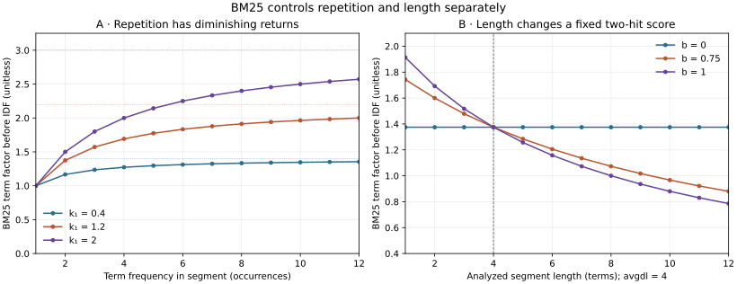

# Chapter 7 — BM25 and other lexical ranking models

*Part II: Information retrieval foundations · [FOUNDATIONAL]*

> **The question for this chapter:** When two eligible passages contain the same query words, how should repetition and passage length change their rank, and what does the resulting score actually mean?

[Chapter 5](chapter-05-text-normalization-and-inverted-indexes.md) gave us postings and field lengths. [Chapter 6](chapter-06-tf-idf-vector-space-ranking-and-lexical-limits.md) gave us three explicit TF-IDF weightings, plus a warning: raw term frequency can reward repetition, while cosine length normalization can change which evidence reaches a small context. In the frozen contract task, a higher weighted rank even displaced a required governing clause. We can now ask for a ranking rule that gives a term's second and third occurrence progressively less credit and controls the effect of passage length with a visible parameter. **BM25** is one such lexical rule.

We keep the V1 positional index, V0 corpus snapshot, analyzer, static eligibility scope, candidate-depth choices, context builder and deterministic answer stub. The new [V2 scorer](../projects/V2/bm25.py) changes the score assigned to *eligible posting matches*. This is the first part of V2; Chapter 8 will make exact top-*k* execution cheaper, and Chapter 9 will add qrels and judged ranking metrics. The two V0 tasks still provide narrow required-evidence checks rather than a general quality claim.

## 1. From uncertain relevance to a term weight

A query is an imperfect expression of an information need. The probabilistic relevance tradition asks whether a term is more likely in relevant than in nonrelevant documents. If `p_t=P(t present | relevant)` and `u_t=P(t present | nonrelevant)`, a binary independence model assigns an occurrence a log-odds contribution of

\[
\log\frac{p_t(1-u_t)}{u_t(1-p_t)}.
\]

That expression is motivation, **not a probability reported by our searcher**. In this project we do not have enough relevance judgments to estimate `p_t` and `u_t`. An older no-feedback approximation to the term's rarity, often called Robertson–Sparck Jones IDF, is `ln((N-df+0.5)/(df+0.5))`. It becomes negative when a term appears in more than half the corpus. Negative contributions can complicate an OR search: adding a matching common term could lower a segment's score. Implementations therefore choose and document an IDF convention. The [Stanford IR treatment of Okapi BM25](https://nlp.stanford.edu/IR-book/html/htmledition/okapi-bm25-a-non-binary-model-1.html) shows the probabilistic path and multiple formula choices.

Our chosen, **nonnegative** convention follows [Lucene's documented `BM25Similarity` IDF](https://lucene.apache.org/core/10_4_0/core/org/apache/lucene/search/similarities/BM25Similarity.html):

\[
idf_B(t)=\ln\!\left(1+\frac{N-df(t)+0.5}{df(t)+0.5}\right),\quad 1\le df(t)\le N.
\]

`N` counts **eligible indexed segments**, including segments without any query term; `df(t)` counts eligible segments containing `t` in either indexed field. These are scope-local statistics on one source/analyzer snapshot, exactly the unit declared in Chapter 6. For `N=4,df=2`, `idf_B=ln(2)=0.693147`. For `df=N`, it stays positive; it is **not** Chapter 6's `ln(N/df)`, which becomes zero. If `df=0`, the term has no eligible posting and contributes no candidates; we do not divide by zero or manufacture a match. Source eligibility is decided before score accumulation and text fetch. In this educational implementation, a caller-supplied scope is a fixture, not authentication.

Neither this IDF nor the final BM25 score is `P(relevant | query, segment)`. The probabilistic derivation motivates the shape of a ranking function under assumptions; the score is an uncalibrated ordering signal. It says nothing by itself about source authority, answer correctness or whether two contradictory clauses were reconciled.

## 2. Saturate repetition and expose length

For a matched term `t` in segment `d`, write `tf` for its count in the indexed title and body, `L_d` for the **analyzed term count** of those fields, and `avgdl` for the arithmetic mean of `L_d` across eligible segments in the same scope. In our default configuration the title and body counts are added equally; an optional positive `title_boost` multiplies title **term count** while the length remains the unboosted analyzed count. That is a declared toy field policy, **not BM25F**. Let

\[
K_d=k_1\left(1-b+b\frac{L_d}{avgdl}\right),\qquad
F(tf,d)=\frac{(k_1+1)tf}{tf+K_d}.
\]

The complete score is a sum over **distinct analyzed query terms with eligible postings**:

\[
S_{BM25}(q,d)=\sum_{t\in\operatorname{unique}(q)\cap d}idf_B(t)\,F(tf(t,d),d).
\]

This chapter uses `k1=1.2` and `b=0.75` as **teaching settings**, not universal optima. `k1>0` determines how quickly repetition saturates. At `L_d=avgdl`, the factor for `tf=1` is 1; for `tf=2` it is `2(k1+1)/(2+k1)`, smaller than 2. As `tf` grows without bound, the factor approaches `k1+1`, although every finite extra occurrence still adds a little. `b` lies in `[0,1]`: `b=0` removes length dependence, while a larger value discounts the same `tf` in longer-than-average segments and boosts it in shorter ones. These parameters interact; a change in average length after resegmentation changes many old scores.

**Figure 7.01 — BM25 separates repetition from length.** Panel A holds segment length equal to `avgdl=4`, sets `b=.75`, and varies `tf` and `k1`; dotted lines are the `1+k1` limits. Panel B holds `tf=2`, `k1=1.2`, `avgdl=4`, and varies analyzed segment length and `b`. The axes show occurrences or analyzed terms horizontally and a dimensionless term factor **before IDF** vertically. The curves come directly from the [V2 factor function](../projects/V2/bm25.py); they are exact formula outputs, with no sample, seed or uncertainty interval.



*Alt text:* Repetition curves rise and flatten; larger `k1` allows a larger repetition effect. At two occurrences, the length curve is flat for `b=0` and slopes downward for `b=.75` and `b=1`; all meet at length four. *Editable source:* [plot program](../visuals/chapter-07/plot-07-01-bm25-controls.py). *Rendered alternatives:* [SVG](../visuals/chapter-07/figure-07-01-bm25-controls.svg) · [PNG](../visuals/chapter-07/figure-07-01-bm25-controls.png). *Chapter association:* 07. *Environment:* Python and matplotlib 3.11.0; source uses no random data.

The figure also shows a limit of the intuition. BM25 does **not** know that one passage is needlessly verbose or that another is a substantive long policy. Length is a statistical proxy. A larger `b` may correct boilerplate-heavy chunks yet unfairly punish a long passage that contains several necessary clauses. `k1` and `b` should be chosen using held-out, labeled workload slices after Chapter 9, not by making one example look pleasing.

## 3. Calculate one ranking decision all the way through

The [five-record length fixture](../projects/V2/toy_length_corpus.json) has four support-team segments and one legal-only segment. The support passages are `S1: amber amber` (length 2), `S2: amber amber` followed by eight `filler` terms (length 10), `S3: filler filler` (length 2), and `S4: blue blue` (length 2). Their `avgdl=(2+10+2+2)/4=4`; `df(amber)=2` and `idf_B(amber)=ln(2)=0.693147`. Legal-only `S5` contains four `amber` occurrences but is **excluded** from support-team statistics, ranking and context.

For the one-term query `amber` at `k1=1.2,b=.75`, the two matching segments each have `tf=2`. For S1, `K=1.2(0.25+0.75×2/4)=0.75`, so `F=2×2.2/(2+0.75)=1.6` and `S=0.693147×1.6≈1.109035`. For S2, `K=1.2(0.25+0.75×10/4)=2.55`, so `F=4.4/4.55≈0.967033` and `S≈0.670296`. The shorter S1 ranks first. Under Chapter 6's raw TF-IDF, both score `2×ln(4/2)=1.386294` and the deterministic ID rule breaks the tie. Under BM25 with `b=0`, both have `K=1.2` and score `ln(2)×4.4/3.2≈0.953077`; the length difference disappears. These three comparisons isolate the length parameter. Do not compare the numeric magnitude of a TF-IDF score with a BM25 score as if they shared a probability scale.

The raw implementation retains every finite precision value until sorting. Display rounding does not determine the rank. Missing query terms contribute nothing, so a two-term query still uses OR-style candidate generation; BM25's sum is not an AND, phrase match, recency filter or citation check. An all-common term has a **positive** `idf_B` and eligible matches, whereas an unseen term has no candidates. A zero eligible corpus also has no candidates. If a segment has `tf>0`, its analyzed length and `avgdl` must be positive; our factor raises on an inconsistent index state rather than silently inventing a denominator.

### Read the scorer as two programs

```text
INDEX TIME, for each static eligible scope and analyzer/source snapshot:
    lengths[d] ← number of analyzed title and body terms in eligible segment d
    N ← number of eligible segments, including those with no query terms
    avgdl ← sum(lengths[d]) / N
    df[t] ← number of eligible segment postings for term t

QUERY TIME, after the caller has been authorized for that scope:
    for each distinct analyzed query term t:
        idf ← log(1 + (N - df[t] + 0.5)/(df[t] + 0.5)) if df[t] > 0
        for each eligible posting (t,d):
            tf ← body count + title_boost × title count
            score[d] += idf × ((k1+1)tf)/(tf + k1(1-b+b L[d]/avgdl))
    sort all scored segment IDs by descending score, then the V0 tie rule
    return top k candidates; context construction and answer checking follow
```

The [local `explain()` helper](../projects/V2/bm25.py) returns per-term `tf`, `df`, `N`, `L_d`, `avgdl`, IDF and contribution for a named eligible segment. It is for fictional or properly protected records: real query terms and source identifiers may be sensitive. The ordinary [engine trace](../projects/V2/bm25.py) records versions, candidate IDs and rounded scores, context IDs, answer evidence IDs, work counts, stage durations, status and reason, without raw query or source text. Candidate, selected context and supporting answer evidence remain distinct. `estimated_prompt_tokens` is a rough character proxy inherited from V0, not model usage or billed cost.

With `P_q` posting entries for distinct query terms and `M` eligible matched segments, this exhaustive Python query path visits `O(P_q)` postings and sorts `O(M log M)` candidates in the worst case. It stores a score for each matched segment and at index time stores per-scope lengths and document frequencies. The static per-scope build scans postings for each scope, which can be costly when many scopes overlap. A live permission change requires both eligibility enforcement and a consistent statistics/cache policy. Chapter 8 will retain this exact score while avoiding evaluation of some candidates; **BM25 is the scoring formula, not the top-*k* execution algorithm**.

## 4. The family, its alternatives, and what a name hides

BM25 is a family of conventions. The formula above omits repeated-query weighting: `amber amber` is treated like `amber`. Some forms add a query term-frequency factor, but for short natural-language queries it may add little; it must be declared if used. A raw `ln((N-df+.5)/(df+.5))`, a clipped version, and our `ln(1+(N-df+.5)/(df+.5))` produce different values, especially for common terms. Title/body boosts and segmentation change `tf`, `L_d`, `avgdl` and `df`. The production [Lucene `BM25Similarity` API](https://lucene.apache.org/core/10_4_0/core/org/apache/lucene/search/similarities/BM25Similarity.html) documents its own `k1`, `b`, IDF, field-length treatment and token-overlap policy; matching its IDF does not make our combined-field Python scorer numerically identical to Lucene.

**BM25+** addresses a particular long-document failure: length normalization can drive a present term's contribution close to zero. Using **our IDF convention** to show the mechanism, its matched-term contribution would be `idf_B(t) × (F(tf,d)+δ)` for `δ>0`, with **zero** contribution when `tf=0`. As `L_d/avgdl` grows without bound at fixed positive `tf`, ordinary `F` approaches zero; the added contribution approaches the positive floor `idf_B(t)×δ`. Lv and Zhai's [original BM25+ paper](https://timan.cs.illinois.edu/czhai/pub/cikm11-bm25.pdf) uses its own IDF convention, so numerical scores need not equal this illustration. The offset changes the ranking objective and introduces another parameter; use it after diagnosing long-document misses. **Fielded BM25 / BM25F** keeps fields and their length statistics distinct. One schematic field combination first forms `tf*_t=Σ_f w_f tf(t,d,f)/(1−b_f+b_f L_{d,f}/avgL_f)` and then saturates this combined pseudo-count. This permits a title to be weighted and normalized differently from a body; a title multiplier on a single combined count is only a teaching approximation. [Robertson and Zaragoza's BM25 survey](https://www.staff.city.ac.uk/~sbrp622/papers/foundations_bm25_review.pdf) explains the broader probabilistic framework and BM25F. A product may use another variant while displaying “BM25” in its configuration.

**Query-likelihood language models** take a different route: estimate how likely the query words are under a model built from each document, often using log probabilities for stable calculation. An unsmoothed term absent from a document would make the query likelihood zero; collection-based smoothing assigns it some probability and changes the ranking behavior. In one common interpolation, `P(t|d)=λ tf(t,d)/L_d+(1−λ)P(t|collection)` for `0<λ<1`. This is a probabilistic **query-generation model under assumptions**, not a calibrated probability that the document answers the question. It may rank documents with no literal term match if the searcher admits them as candidates; our V2 BM25 path only scores eligible posting matches. The [Stanford IR account of query likelihood and smoothing](https://nlp.stanford.edu/IR-book/pdf/12lmodel.pdf) derives these alternatives.

**Exact matching** belongs in candidate generation or a typed field when the information need names a code, version, quoted phrase or symbol. BM25 can favor a rare identifier only if the analyzer preserved it and the posting exists. **Fuzzy matching** can add typo-tolerant candidates under an explicit edit or expansion rule, at a risk of confusing nearby product IDs. Neither exact nor fuzzy matching is a replacement for permission checks, source version selection or evidence verification. Lexical rankers still miss a paraphrase with no shared analyzed terms. Future dense retrieval addresses some such gaps, while retaining lexical search as a serious comparator.

## 5. Run a paired comparison, then inspect the failure

The [Chapter 7 experiment](../projects/V2/experiment_ch07.py) asks a falsifiable question: **will BM25 at `b=.75` place all required evidence into top-two context for both frozen tasks, improving on raw TF-IDF's contract loss?** It compares Chapter 5 overlap, Chapter 6 raw and cosine TF-IDF, BM25 with `b=0`, and BM25 with `b=.75`. It freezes the same V0 source, analyzer, support-team fixture, four query IDs, top-*k* values 2 and 8, 120 source-word context budget, and deterministic answer stub. The independent variable is **the declared scoring configuration**; within the BM25 pair, only `b` changes. `k1=1.2` and title boost 1 stay fixed. Two V0 questions have known **required evidence IDs**, not exhaustive relevance labels. Seven randomized-order search-only timings per method/case, one-time build costs, hashes, work counts, candidate scores, context IDs and stub status are in the [raw record](../projects/V2/chapter-07-experiment.json). This local run was made on 29 September 2026.

| Frozen task at top 2 | Overlap | Raw TF-IDF | Cosine | BM25 `b=0` | BM25 `b=.75` |
|---|---|---|---|---|---|
| Dated contract change; two required spans | 2/2 in context; answered | 1/2; abstained | 1/2; abstained | 1/2; abstained | 1/2; abstained |
| Termination; one required span | 0/1; abstained | 1/1; answered | 0/1; abstained | 1/1; answered | 1/1; answered |

For the dated change, both BM25 configurations rank `D2 §2` first but leave governing `D1 §3` outside the top two. At `b=.75`, the second candidate is `D3 FAQ-7`; `D1 §3` is fourth. The first loss is **ranking at the chosen candidate depth**, not a prompt or answer failure. The stub abstains because selected context lacks the old governing clause. For termination, BM25 puts `D1 §8` second, as raw TF-IDF does. At top eight, every compared method includes the required spans in context for both tasks and the same stub answers them. Larger depth consumes more context and still does not prove a future LLM will reason or cite correctly. The two unlabeled probes test a rare numeric query and a no-result query; they cannot be folded into an answer-accuracy denominator.

For `q-contract-change` at top two, this checked-in seven-sample run had median **search-only** times of 23.7 µs for overlap, 32.6 µs for raw TF-IDF, 35.0 µs for cosine, 46.8 µs for BM25 `b=0` and 47.4 µs for BM25 `b=.75`. They are Python timings on 13 indexed segments, not service latency or proof of relative throughput at scale. Seven samples make nearest-rank p95 almost the slowest observation; the record keeps all raw samples and separates index/statistics build, context and stub work. Scores between methods are not comparable in magnitude. **The stated top-two hypothesis is falsified** by the missing `D1 §3` span. The result supports a limited conclusion: BM25's tunable length correction changes ranking, but it does not repair this fixture's most consequential contract omission. Chapter 9's reviewed qrels, rank metrics and query slices are needed before tuning a release candidate.

## 6. Debug and tune without mistaking score for evidence

Use a ranking trace to ask, in order: Is the current licensed source in the snapshot? Did the analyzer retain the exact identifier or clause terms? Did scope eligibility exclude it? Are its postings present? Did its `tf`, `df`, `L_d` and scope `avgdl` match the intended version? Which per-term contributions made it rank where it did? Did top-*k* and context packing retain it? Was the answer supported by the selected source version? An unauthorized source in a trace is a security failure even if the final answer omits its text. A stale clause cannot become authoritative through a higher BM25 score.

When Chapter 9 supplies qrels, tune `k1`, `b`, title/field policy and candidate depth on a development split, then report held-out exact-ID, short/long, repeated-boilerplate, paraphrase, permission and freshness slices. Never tune on the test questions used to declare a gain. Compare rank and evidence coverage at fixed eligibility and budget, plus p50/p95 search time and build/update cost. If a score threshold or a cross-index fusion later uses BM25 values, calibrate for its query and scope distribution; raw BM25 values are not answer confidence. Source additions, deletes, scope changes and chunking revisions can change `N`, `df` and `avgdl`, so pin those versions with each result.

### Practice and active recall

Complete the [Chapter 7 lab](../labs/chapter-07/LAB.md) before reading its [solutions](../solutions/chapter-07-solutions.md). From memory, derive `K_d` and the two toy scores; predict what changes when `b` becomes zero. Explain why `k1` does not mean “maximum term frequency,” why `df=N` differs from no result, and why a BM25 score is not a probability of a correct answer. Trace the lost `D1 §3` span through candidate rank and selected context. Defend the decision to keep a lexical baseline even when later dense retrieval is introduced.

**You understand this chapter if you can** compute and explain a BM25 score from a posting and scope statistics; isolate the effects of `k1`, `b`, IDF and field policy; distinguish BM25, BM25+, BM25F and smoothed query likelihood by mechanism; implement eligible posting accumulation; report both a ranking gain and a ranking loss; and name the next evidence needed for safe tuning.

### Further reading

- [Manning, Raghavan and Schütze, *Introduction to Information Retrieval*: Okapi BM25](https://nlp.stanford.edu/IR-book/html/htmledition/okapi-bm25-a-non-binary-model-1.html). Compare its IDF and query-frequency variants with the exact V2 formula.
- [Robertson and Zaragoza, *The Probabilistic Relevance Framework: BM25 and Beyond*](https://www.staff.city.ac.uk/~sbrp622/papers/foundations_bm25_review.pdf). Read the assumptions behind the heuristic score and its fielded extensions.
- [Manning, Raghavan and Schütze, *Language Models for Information Retrieval*](https://nlp.stanford.edu/IR-book/pdf/12lmodel.pdf). Work the smoothing example and identify the candidate-set difference.
