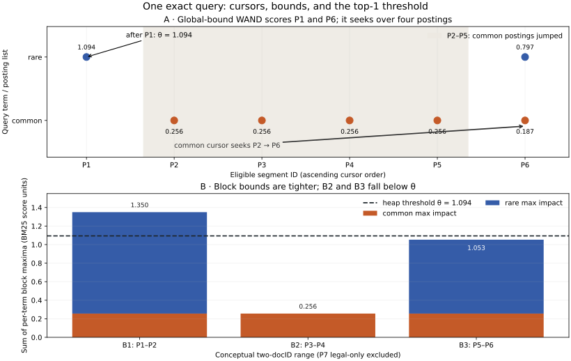

# Chapter 08 — Production lexical query execution [ADVANCED]

Chapter 7 gave us a credible lexical score. Its V2 program still visits every eligible posting for every query term, accumulates a score for every matching segment, sorts those segments, and keeps the first *k*. On the frozen contract question, twelve support-team segments receive full scores even when the caller requests one result. The scoring equation does not require this work. A search engine must answer a second question: **which candidates can be proved unable to enter the top *k*?**

This chapter keeps the Chapter 7 analyzer, corpus, authorization fixture, BM25 parameters, numeric scores, tie rule, context budget, and answer stub fixed. We change only query execution. That makes the claim testable: an exact optimizer should return the same ordered candidate IDs and scores, while doing less score work on some queries. It need not improve answer quality; the dated-contract evidence omission must remain visible.

**Workload identity:** `v0-frozen-tasks-v1`; see the [comparison registry](../evaluation/WORKLOAD_REGISTRY.md). Metrics across different workloads do not form an improvement sequence.

**Independent construction gate:** Read the mechanism explanations first. Before inspecting supplied Python reference code, attempt [lab A0](../labs/chapter-08/LAB.md#a0-independent-bounded-mechanism) on your own tiny fixture. Open the separate worked answer afterward; existing calculation, debugging and project-comparison tasks still apply.

## 1. A posting is a cursor over an on-disk structure

Recall Chapter 5's inverted index: a term maps to an increasing list of document IDs, with counts and optionally positions. An **index-time** writer analyzes fields, assigns local IDs, and writes those lists. At **query time**, a reader opens only the lists named by the analyzed query, advances cursors and ranks eligible documents. The logical order is independent of physical byte layout. Our [V1 index](../projects/V1/lexical_index.py) holds Python objects in RAM so that we can inspect it; a production index usually compresses postings and reads them in blocks.

Consider IDs `[3, 8, 138]`. Store the first ID and then positive gaps: `[3, 5, 130]`. With the variable-byte convention used in the [Stanford IR explanation](https://nlp.stanford.edu/IR-book/html/htmledition/variable-byte-codes-1.html), each byte carries seven payload bits; the high bit marks the **final** byte of an integer. The gaps become hexadecimal `83 85 01 82`: `3 → 83`, `5 → 85`, and `130 = 1×128+2 → 01 82`. The [small codec](../projects/V2/postings_codec.py) round-trips exactly this example. It teaches the byte rule; V2 search does **not** read compressed bytes. Real codecs choose block sizes, bit packing and exception handling based on collection and hardware. Compression saves storage and I/O, often improving cache use, but decoding consumes CPU. The byte count alone does not predict latency.

Frequencies, field identity and positions need their own representation. A phrase query may need positional postings even if a simple BM25 query reads only counts. A **fielded index** can keep title and body postings separate, allowing different analyzers and field lengths. V2's combined title/body count with a title multiplier is simpler than a fielded BM25 model. A skip entry records a later ID and an address or block location; when a cursor must reach at least that ID, it can jump over encoded data. [Postings compression](https://nlp.stanford.edu/IR-book/html/htmledition/postings-file-compression-1.html) and [skip data](https://nlp.stanford.edu/IR-book/html/htmledition/faster-postings-list-intersection-via-skip-pointers-1.html) solve related but distinct problems: fewer bytes to read and fewer entries to decode.

For a Boolean **AND**, sorted lists permit an intersection without inspecting every document. Given `A=[1,3,8,11]` and `B=[2,3,9,11]`, compare the current IDs, advance the smaller one, and emit equal IDs: `3,11`. If `A` had a skip from `3` to `11`, it could bypass `8` only when the other cursor's target made that safe. An **OR** query such as V2 BM25 considers the union; a document matching only one query term may still win. Replacing OR with AND to make execution cheaper silently changes retrieval semantics.

Most large indexes also write **immutable segments**. New documents go into new segments; background merging rewrites postings and local IDs, while deletions may be represented by live-document masks until merged. Readers can keep a stable snapshot as writers replace segments. This buys write/read isolation and sequential structures, but merges spend I/O and CPU and can alter local IDs, statistics, caches and term bounds. A result's source version and index snapshot must survive this process. The [Lucene index package documentation](https://lucene.apache.org/core/10_1_0/core/org/apache/lucene/index/package-summary.html) describes immutable segments and reader/writer behavior; [Stanford IR's dynamic indexing chapter](https://nlp.stanford.edu/IR-book/html/htmledition/dynamic-indexing-1.html) explains merging. No segment merge is implemented in V2.

## 2. Score accumulation is a query plan

Write the Chapter 7 BM25 term contribution as `w(t,d) ≥ 0`. Its exact score is

\[
S(q,d)=\sum_{t\in q\cap d} w(t,d).
\]

This uses distinct analyzed query terms and the same scope-local statistics, field-count policy and floating-point term order as Chapter 7. The score is dimensionless, not a relevance probability.

**Term-at-a-time (TAAT)** processing traverses all postings for one query term and updates a score accumulator keyed by document ID, then visits the next term. Chapter 7's implementation follows this pattern. It needs an accumulator for up to `M` matching documents. **Document-at-a-time (DAAT)** processing keeps one cursor per query term, advances them in document-ID order and computes a document's complete score when cursors meet. A top-*k* min-heap stores at most *k* winners; its root is the weakest retained result. Once the heap is full, that root's score is the **threshold** `θ`. Our ordering also breaks equal-score ties by the established document/section/segment order, so a score tie cannot be discarded merely because it equals `θ`.

An exhaustive DAAT engine might still score all `M` candidates. It can avoid sorting them all by using a heap, but it has not yet avoided score computation. With `P_q` query postings, TAAT accumulation costs `O(P_q)` posting visits and `O(M log M)` to sort all candidates in this V2 baseline. Exhaustive DAAT plus a heap still visits `O(P_q)` postings and costs up to `O(M log k)` for heap updates. These are algorithmic bounds, not predictions of wall time: cursor movement, decoding, cache misses and branches matter.

### A bound turns a score into a proof

At index time, for each eligible query term, record a bound `U_t` no smaller than any possible contribution of that term under the **same** scoring parameters and snapshot. For every candidate `d`:

\[
S(q,d) \leq \sum_{t\in q\cap d} U_t \leq \sum_{t\in q} U_t.
\]

If the bound of all terms that could still match a remaining document is **strictly below** `θ`, that document cannot enter the heap. Equality must remain eligible because the V0 tie rule may prefer the unseen document. Bounds must cover field boosts, length normalization, statistics, analyzer version, eligible scope and the exact score being optimized. A stale, underestimated bound makes the skip unsound. V2 caches exact term contributions and global maxima for each static scope at build time. It rounds each maximum outward and adds a small floating-point margin to sums; this is a practical guard for its tested finite Python workloads, **not a formal proof over arbitrary floating-point programs or unbounded query length**. The mathematical safety argument assumes true upper bounds and nonnegative contributions. A production implementation must validate numeric behavior against its scorer and fall back when it cannot establish a safe bound.

## 3. Walk a conservative WAND pivot

Our [from-scratch searcher](../projects/V2/wand.py) uses a conservative global-bound variant of **WAND**. Sort active term cursors by current document ID. Add their term bounds from left to right until the sum can reach `θ`; the cursor at that point supplies a **pivot ID**. If the lowest cursor ID is before the pivot, seek that cursor to the pivot. If it equals the pivot, compute that document's exact score, update the heap, and advance matching cursors. When no prefix can reach `θ`, remaining candidates can be terminated. `seek` uses binary search over sorted RAM ordinals, not physical skip data on compressed disk postings. This is the mechanism to learn; the [original WAND paper](https://research.ibm.com/publications/efficient-query-evaluation-using-a-two-level-retrieval-process) also discusses effectiveness/time trade-offs that should not be confused with our exact settings.

```text
INDEX TIME: for each fixed eligible scope and BM25 scoring version
    for each term posting (t, d): cache exact nonnegative impact w(t,d)
    U[t] ← conservative maximum impact for term t

QUERY TIME: initialize sorted posting cursors and an empty size-k min-heap
    while a cursor remains:
        θ ← heap's weakest score if full, otherwise -infinity
        pivot ← first cursor ID whose cumulative bounds can reach θ
        if no pivot: stop: all remaining scores are bounded below θ
        if first cursor ID < pivot: seek that cursor to pivot; continue
        score pivot ID using all matching term impacts in fixed term order
        insert it only if it beats the heap's full rank key
        advance all cursors at that ID
```

Why may the first cursor seek? For every intervening ID, only terms whose cursors appear **before** the pivot can match it; any later cursor is already beyond it. The sum of that prefix's upper bounds is below `θ`. With nonnegative contributions and valid bounds, none of those IDs can win. This explanation is the safety condition, not the acronym.

The fictional [toy corpus](../projects/V2/toy_pruning_corpus.json) makes the movement visible. In the support-team scope, P1 contains `rare`; P2–P5 contain `common`; P6 contains both. P7 is legal-only and is excluded before statistics, bounds and search. For `rare common`, *k*=1, P1's score is `1.093526829`, setting `θ` to that value. The global bound for `common` is about `0.256131`, too small to beat P1. The `rare` cursor is already at P6, so the pivot reaches P6. The `common` cursor seeks from P2 to P6, passing four postings. P6's exact score is about `0.983419`; P1 remains first. Exhaustive cached execution fully scores six candidates; WAND fully scores two. It does **not** skip P6, even though P6 loses.

**Figure 8.01 — One query, cursor bounds and a moving top-one threshold.** Panel A shows the actual global-bound cursor seek after P1 sets `θ`; panel B shows tighter **conceptual** two-ID block maxima for the same postings. Blue represents `rare`, orange `common`; vertical score units are Chapter 7 BM25 values. The block bars are a teaching comparison and are **not used by the implemented WAND algorithm**. B2's bound is `0.256`; B3's is `1.053`; both are below P1's `1.094` threshold, so a valid block-aware executor could skip them. B1's sum `1.350` exceeds `θ` because term maxima can occur in different documents: a bound is allowed to be loose. Data are deterministic formula outputs from the toy corpus, not sampled performance observations.



*Alt text:* The rare posting at P1 scores 1.094. A common posting cursor skips P2 through P5 and meets the rare cursor at P6, which scores below P1. In a separate illustrative block-bound view, only the P1–P2 block's summed bound exceeds the dotted 1.094 threshold. *Editable source:* [plot program](../visuals/chapter-08/plot-08-01-cursors-bounds-threshold.py); *data:* [checked-in experiment record](../projects/V2/chapter-08-experiment.json); *alternate format:* [PNG](../visuals/chapter-08/figure-08-01-cursors-bounds-threshold.png). Chapter 08; Python 3.14.2 and matplotlib; no random plot data.

## 4. The execution family and where its guarantees differ

**MaxScore** divides query terms into essential and nonessential sets using term-score upper bounds and the current threshold. It first scores candidates from essential lists; nonessential lists are consulted when their combined possible contribution can change a winner. It relies on the same invariant: an omitted contribution cannot push a candidate above `θ`. **WAND** uses document-ID cursor ordering and a pivot. **Block-Max WAND (BMW)** adds upper bounds for short ranges of document IDs, tightening the proof to the current block. [Ding and Suel's BMW paper](https://research.engineering.nyu.edu/~suel/papers/bmw.pdf) develops this block strategy. More block metadata takes space and build/update work but can avoid work that a global bound cannot. A block-bound implementation must know which segment/block and eligibility universe its maxima cover; our figure supplies block values but our code implements only global WAND.

**Impact ordering** organizes postings by contribution rather than document ID. High-impact candidates can raise `θ` early; the cost is more complex merging or reordering to recover exact document scores. A fixed posting budget, a timeout, or a low impact cutoff may return useful results quickly, but that is **approximate early termination** unless a bound proves all omitted documents cannot win. “Early termination” alone says nothing about correctness. [Stanford IR's treatment of impact ordering](https://nlp.stanford.edu/IR-book/html/htmledition/impact-ordering-1.html) and [inexact top-*k* methods](https://nlp.stanford.edu/IR-book/html/htmledition/inexact-top-k-document-retrieval-1.html) distinguish these choices.

| Plan | Main data movement | Possible saving | Exactness condition |
|---|---|---|---|
| Exhaustive TAAT | Scan each term list; accumulate all matched IDs | Simple sequential reads | Score and sort all eligible matches |
| Exhaustive DAAT + heap | Merge cursors by ID | Avoid full sort and large accumulator | Score every eligible candidate |
| Global WAND / MaxScore | Seek using global term maxima | Avoid full scores and some postings | Valid bounds, same eligibility/scorer/ties |
| Block-Max WAND | Seek using local block maxima | Avoid more low-impact blocks | Valid per-block bounds and block alignment |
| Budgeted impact order | Visit high impacts first | Lower bounded latency | Approximate unless omitted-score proof holds |

No plan wins everywhere. WAND can inspect many pivots or perform seeks whose overhead exceeds saved arithmetic. When *k* is large, the heap fills later and `θ` is lower, reducing pruning. Common broad queries, near-ties, and loose maxima weaken bounds. In the worst case, dynamic pruning still visits essentially all `P_q` postings, and its cursor sorting adds work proportional to the number of query terms at each iteration. Our teaching cache stores one floating impact per eligible scope/posting, in addition to the V1 index; its build is `O` of those postings and must be rebuilt when BM25 parameters, source snapshot, analyzer or scope policy changes. A real engine may compute impacts from compressed frequencies and norms instead, balancing extra CPU against storage.

## 5. Test the exactness claim and report the negative result

The [Chapter 8 experiment](../projects/V2/experiment_ch08.py) asks: **can global-bound execution score fewer segments while returning the exact Chapter 7 BM25 top *k*?** Its falsifiable hypothesis is that at least one case saves full scores, every tested case preserves ordered IDs, unrounded float scores and selected context, and no latency gain is assumed. The independent variable is cached exhaustive accumulation versus global WAND. Both read the same V0 source snapshot, V1 analyzer, support-team fixture, cached impacts, `k1=1.2`, `b=.75`, title boost 1, query text, *k*, 120 source-word context budget and deterministic stub. Chapter 7's direct BM25 scorer is an independent untimed correctness oracle. The five-query set includes the two frozen V0 tasks, rare numeric, no-result and a broad common-term probe; *k* is 1, 2 or 8. Eleven randomized-order search-only samples per method/case are kept with seed `8082026`. The [raw record](../projects/V2/chapter-08-experiment.json) pins code/corpus hashes, versions, per-query outputs, work, build times, timing samples and toy trace. It was recorded on 29 September 2026.

| Query slice | *k* | Fully scored, cached → WAND | Median search-only time, cached → WAND |
|---|---:|---:|---:|
| Dated contract | 1 | 12 → 2 | 16.3 → 39.0 µs |
| Dated contract | 2 | 12 → 9 | 14.6 → 98.9 µs |
| Termination | 1 | 12 → 3 | 22.5 → 58.9 µs |
| Termination | 2 | 12 → 5 | 22.7 → 88.7 µs |
| Rare numeric | 1 | 1 → 1 | 5.0 → 9.9 µs |
| No result | 1 | 0 → 0 | 2.9 → 3.2 µs |
| Broad common mix | 1 | 11 → 5 | 12.4 → 41.6 µs |

Every tested query/depth returned the same ordered IDs and raw scores as direct BM25; selected context and deterministic stub status also matched between plans. The contract task still lacks `D1 §3` at top two and abstains. That is the correct **negative quality finding**: execution did not repair ranking. The toy pruner's six-to-two full-score reduction and the V0 reductions support the work hypothesis. They do **not** support a speed claim. On this 13-segment Python/RAM corpus, WAND's cursor sorting, bound checks, seeks and heap cost more than the scores it avoids. Build times are excluded from the table; one local build recorded about 0.401 ms for postings, 0.085 ms for BM25 statistics and 0.228 ms for cached impacts/bounds. These are single local observations, not uncertainty estimates. Eleven samples are too few for meaningful production p95; the record preserves raw values and nearest-rank p95 only as a diagnostic. There are no human qrels, no general relevance metric and no LLM answer judgment yet. Chapter 9 introduces those labels and measures.

The evidence path remains visible: eligible posting union → scored **candidates** → selected **context** → stub **answer**. Work counters measure candidate execution; required-span coverage is a narrow fixture check, not a relevance label. A score count reduction cannot certify faster service, better context, supported claims or a safer answer. This is precisely why a baseline experiment must name the thing it measures.

## 6. Diagnose a bad skip before it becomes an answer error

If WAND and exhaustive BM25 differ, first compare analyzer output, source/index snapshot, scope eligibility, scoring parameters and tie policy. Then inspect the first document skipped by the pruning plan: calculate its true term contributions and each applicable bound under the same snapshot. A missing or underestimated bound, stale `avgdl`/`df`, field boost not included in an impact, float rounding, mixed segment versions or an unauthorized document in a bound/cache can invalidate the proof. A safe debug mode can fall back to exhaustive scoring and compare exact top *k*. The [toy cursor trace](../projects/V2/wand.py) contains terms and document positions; use it only on fictional data or behind protected diagnostic access.

In a service, a retrieval span should record query ID, authorized scope reference, corpus/analyzer/scorer/execution versions, candidate IDs and scores under access controls, *k*, matched-list count, scored count, seek count, posting advances, termination reason and elapsed time. Aggregated metrics can track p50/p95 latency and pruning ratio by route/version, without raw queries or tenant IDs as metric labels. A changed corpus, deleted source or permission update is a lifecycle event that may require bounds and caches to be rebuilt or invalidated; it is not a relevance-score adjustment. Candidate IDs must be checked for eligibility before source text enters context. The source's licensing and retention policy still governs stored postings, cached impacts, diagnostics and deletion propagation.

At scale, compare query slices and tail latency, not just arithmetic counts. A fast top-*k* on one shard is not automatically the global top-*k*: per-shard score comparability, bound scope and merge correctness become new obligations. Those distributed details are developed later, after the local exactness contract is stable. A production index should also expose segment merge load and cache churn separately from query latency. These are reasons to measure a working implementation, not reasons to give up the simple proof.

### Practice, recall and further reading

Complete the [Chapter 8 lab](../labs/chapter-08/LAB.md), then compare your trace and experiment card with the [separate solutions](../solutions/chapter-08-solutions.md). From memory, explain why a term bound must include every possible field contribution; why `bound < θ` is safe but `bound = θ` is not enough to skip with a tie rule; why global WAND still scores P6; and why fewer fully scored documents can coincide with worse latency. Defend when you would keep exhaustive execution for a small index.

**You understand this chapter if you can** encode and decode a small gap-coded posting list; trace an AND intersection and an OR BM25 plan; calculate a top-*k* heap threshold and a WAND pivot; state the exactness assumptions and failure modes; distinguish global and block maxima from approximate early termination; run the V2 pruner against an exhaustive oracle; and report score work, timing, context and answer behavior as separate observations.

Further reading: [Stanford IR on vector-score computation](https://nlp.stanford.edu/IR-book/html/htmledition/computing-vector-scores-1.html), [Broder et al. on WAND](https://research.ibm.com/publications/efficient-query-evaluation-using-a-two-level-retrieval-process), [Ding and Suel on Block-Max WAND](https://research.engineering.nyu.edu/~suel/papers/bmw.pdf), and [Lucene's segment-oriented index API](https://lucene.apache.org/core/10_4_0/core/org/apache/lucene/index/IndexWriter.html). Read the first for execution vocabulary, the next two for pruning proofs and variants, and the last as a production analogue rather than a specification for V2.
