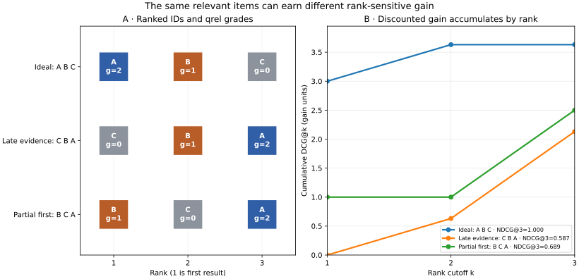

# Chapter 09 — Relevance judgments and ranking metrics [FOUNDATIONAL]

Chapter 8 proved that two execution plans can return identical BM25 results while doing different amounts of work. It did **not** establish whether those results are useful. In the dated-contract task, BM25 places a superseded FAQ ahead of the original signed clause at top two. The answer stub abstains because one required span never becomes context. A faster or mathematically exact top-*k* executor preserves that loss. We now need a standard against which a ranking can be checked: **for each question, which eligible source segments would actually help, and how much?**

This is the first judged retrieval chapter. We will build a small, inspectable set of **qrels** (query–item relevance judgments), implement rank measures, and compare the V1 overlap baseline with V2 BM25. A qrel is a statement about an information need and a source item under a declared snapshot. It is not an answer, an LLM opinion, a model score, or permission to read an item.

**Workload identity:** `ch09-lexical-judged-v1`; see the [comparison registry](../evaluation/WORKLOAD_REGISTRY.md). Metrics across different workloads do not form an improvement sequence.

## 1. First fix the unit and the information need

Our retrieval unit is the **indexed segment**, not the whole source document. The runbook's three windows are distinct candidates `D4:step-4:0`, `:1`, and `:2`; the two agreement clauses are separate candidates as well. A document-level judgment that calls all of D4 relevant because one window mentions the requested action would exaggerate segment recall. The unit in the qrels must match the unit returned by the retriever. A later system that changes chunking needs a new mapping or a new judgment set; it cannot silently compare old segment IDs to new ones.

The [Chapter 9 judgment record](../projects/V2/judgments_ch09.json) pins V0 source snapshot `support-corpus-2026-05-20`, the `support-team` eligibility fixture, twelve eligible segments, fourteen questions and a three-grade rubric. This makes `14 × 12 = 168` reviewed query–segment pairs. The file stores grades 1 and 2 compactly; it explicitly declares that every other **eligible** roster segment was reviewed as grade 0. [The loader](../projects/V2/eval_ch09.py) checks that the roster exactly matches the indexed snapshot before scoring any run. The legal-only `D10` is **outside** this evaluation universe. It must never be reclassified as a merely low-relevance support-team result. The scope fixture itself is not an authentication mechanism.

| Grade | Meaning for this frozen task | Example |
|---:|---|---|
| 2 | Direct, authoritative evidence for a requested fact | Signed amendment `D2 §2` for the current Helios Pro target |
| 1 | Useful context but insufficient alone | Original signed `D1 §3` when the question asks only for the *current* target |
| 0 | Does not help, addresses the wrong entity, or would mislead for the requested date/status | Old FAQ `D3 FAQ-7` for the target in force after the amendment |

“Authoritative” is relative to the question. The unsigned proposal `D9` is grade 0 for the *current signed* target but grade 2 when a question asks what the **unsigned proposal suggested**. Similarly, the incident report `D7` is direct evidence for an *observed response time*, not for a contractual target. This is why grades cannot be assigned to a passage once for every future query. For “how did the target change?”, both `D1 §3` and `D2 §2` are grade 2: a single passage cannot establish the before-and-after comparison. A grade-1 historical passage may be relevant for retrieval and still be unsafe to use as the sole answer source. In particular, “relevant” is weaker than “sufficient, current and supported.”

The query set preserves the two V0 questions exactly. It adds price, product disambiguation, runbook windows, observed-versus-contracted response, source status, one current-target question, and three zero-positive probes. `q-no-result` uses a nonexistent identifier. `q-unknown-renewal` includes generic “support” words but asks about an absent product. `q-private-target` asks about a legal-only addendum from a support-team scope: no support-team segment is relevant. The last two can return plausible lexical candidates despite having no eligible answer evidence. The qrels are a **single-author teaching artifact** created with knowledge of the corpus and earlier V0 failure; they are frozen for this comparison, but they are not a held-out human benchmark or proof of generalization.

### How a larger judgment set is made

For a real collection, sample information needs from the intended workload: exact identifiers, paraphrases, dates, entities, source types, languages, permission scopes and cases with no answer. Include human-authored/production questions as well as carefully marked synthetic coverage probes. Freeze the source and query versions. Write the rubric before looking at a proposed ranker's output. Have assessors inspect candidate source spans and record a grade, rationale, ambiguity and source version. Double-label a sample; resolve consequential disagreements through adjudication or report both label sets. A tiny example illustrates why raw agreement alone misleads: if two assessors agree on 7 of 10 pairs (`p_o=.70`) and their label prevalences imply chance agreement `p_e=.50`, Cohen's `κ=(p_o−p_e)/(1−p_e)=.40`. Ten pairs are far too few for a stable estimate, but the calculation forces a distinction between agreement and a presumed perfect “gold” label. [Stanford IR's relevance-assessment chapter](https://nlp.stanford.edu/IR-book/html/htmledition/assessing-relevance-1.html) discusses pooling and assessor variation.

Judging every query–item pair is usually infeasible. **Pooling** combines top results from several diverse systems, perhaps Boolean search and expert finds, then judges that pool. Its unjudged items are **unknown**, not known grade 0. A common evaluation convention treats unjudged results as nonrelevant for a measure, but that can favor systems that contributed to the pool or penalize a new retrieval method that finds different relevant items. State pool depth, participating systems, unjudged rate and the measure's convention; expand the pool when comparing a genuinely new family of retrievers. [NIST's TREC overview](https://trec.nist.gov/pubs/trec33/papers/overview_33.pdf) explains both the premise and limits of pooling. Our tiny V2 roster avoids this ambiguity by inspecting all twelve eligible items for each question.

Keep development and test questions separate. Do not mine “hard” cases from a test set, tune BM25 on them, then present the same test score as an independent gain. If labels come from a teacher model, say so and calibrate with independent human judgments. If a source is updated, deleted, relicensed, or newly restricted, freeze a new dataset version or invalidate affected qrels. Preserve a restricted audit trail without logging raw private questions, text or tenant identifiers as ordinary metrics.

## 2. Count relevant items before rewarding their rank

Let `R(q)` be the number of eligible segments with grade at least 1 for question `q`; our **binary threshold** is `grade ≥ 1`. Let `h_k(q)` be how many such segments appear in the first *k* results. A result list shorter than *k* has empty positions counted as nonrelevant for precision. Then

\[
P@k=\frac{h_k}{k},\qquad Recall@k=\frac{h_k}{R},\qquad
F_1@k=\frac{2(P@k)(Recall@k)}{P@k+Recall@k}
\]

when `R>0`, with `F₁=0` if both inputs are zero. **Hit Rate@k** is 1 if at least one relevant item appears, otherwise 0. Precision asks how much of the limited result budget is useful; recall asks how much of all *known* eligible evidence we found. These are query-level values. Increasing *k* cannot reduce recall under fixed qrels, but it can lower precision. A top-eight result list with one relevant segment has `P@8=1/8` even if it contains every known relevant item. `F₁` compresses the two numbers but hides which side failed.

**For a query with `R=0`, recall has no denominator.** We record Recall, Hit, F₁, reciprocal rank, AP and NDCG as `null` rather than pretend the system achieved zero or perfect recall. We separately measure whether the retriever returned **any candidate** for a zero-positive query. `P@k` remains 0 by its fixed-*k* denominator. These are explicit choices; other evaluation tools can use different zero-query conventions. A candidate on an unanswerable query does not alone prove the answer generator will hallucinate, but it makes answerability checking important.

For multiple evidence requirements, `Hit@k=1` is often too lenient. On the dated-contract task, BM25's top two include the amendment but omit the signed original. Hit@2 is still 1; Recall@2 is `1/2`. We therefore also track **grade-2 recall** and whether **all direct segments** appear by *k*. Even `all_direct@k` is an evidence-coverage check, not a proof that the selected context or answer used the passages correctly. Our rubric intentionally treats some partial context as binary relevant; the direct-only view keeps that distinction visible.

## 3. Make order count

Set membership cannot tell a useful first result from the same item buried at rank eight. Define the first binary-relevant rank `r₁`. **Reciprocal Rank@k** is `1/r₁` if `r₁≤k`, otherwise 0; **MRR@k** is its arithmetic mean over positive queries. MRR is suitable when the first useful item is the main goal. It ignores all later relevant items, so it can celebrate an incomplete multi-clause result.

**Average Precision@k** rewards every relevant rank. If `rel_i` is 1 when rank *i* is binary relevant,

\[
AP@k=\frac{1}{R}\sum_{i=1}^{k} P@i\,rel_i,\qquad
MAP@k=\text{mean}_{q:R(q)>0}\,AP@k(q).
\]

The denominator is **all known relevant items**, not only relevant items seen by *k*. A missed item contributes no term. This is a truncated AP convention and it must be named: when `R>k`, even a perfect first *k* cannot reach 1. The [Stanford IR ranked-evaluation treatment](https://nlp.stanford.edu/IR-book/html/htmledition/evaluation-of-ranked-retrieval-results-1.html) explains AP/MAP and rank-aware measures; our cutoff and zero-positive conventions are fixed in code.

For grades 0, 1 and 2, define gain `G(g)=2^g−1`: gains 0, 1 and 3. **Discounted Cumulative Gain** at *k* is

\[
DCG@k=\sum_{i=1}^{k}\frac{2^{g_i}-1}{\log_2(i+1)}.
\]

The **ideal DCG** (`IDCG@k`) sorts all eligible grades in descending order before applying the same formula; `NDCG@k=DCG@k/IDCG@k` when the ideal is positive. IDCG depends on the full judged eligible set, not just retrieved items. Normalization makes different positive queries easier to average, while the grade mapping declares that one direct segment has three times the undiscounted gain of a partial one. A different mapping or grade rubric changes NDCG. It is not a universal utility function, and independent graded gains do not ensure all parts of a multi-evidence question are present.

### Work one list by hand

Suppose `A` has grade 2, `B` grade 1, `C` grade 0 and `D` grade 0. Ranking `[C,B,A]` has binary labels `[0,1,1]` and `R=2`. At *k*=2, `P@2=1/2`, `Recall@2=1/2`, `Hit@2=1`, `F₁@2=1/2`, `RR@2=1/2`, and `AP@2=(P@2)/2=1/4`. At *k*=3, `P@3=2/3`, `Recall@3=1`, `F₁@3=4/5`, and `AP@3=(1/2+2/3)/2=7/12≈0.5833`. Rank-sensitive graded gain is `DCG@3=0+1/log₂3+3/log₂4≈2.1309`. The ideal `[A,B,C]` has `IDCG@3=3+1/log₂3≈3.6309`, so `NDCG@3≈0.587`. All quantities are dimensionless; the DCG axis calls them gain units to distinguish them from latency.

**Figure 9.01 — The same items, different rank-sensitive gain.** The left panel displays the grades for three permutations of the same A/B/C items. The right panel accumulates their DCG by rank; the first relevant hit and grade-2 item's position explain the separation. The values are exact formula outputs from the four-item toy qrels above, computed by [the plot source](../visuals/chapter-09/plot-09-01-ranked-gain.py) and checked against [the metric implementation](../projects/V2/eval_ch09.py). There is no sampled data, seed or uncertainty interval. The plot does not claim that DCG predicts answer quality.



*Alt text:* Ideal A-B-C begins with grade 2 and reaches DCG 3.631; C-B-A delays both relevant items and reaches 2.131; B-C-A places partial evidence first and reaches 2.5. *Editable source:* [plot program](../visuals/chapter-09/plot-09-01-ranked-gain.py). *Rendered alternative:* [PNG](../visuals/chapter-09/figure-09-01-ranked-gain.png). Chapter 09; Python 3.14.2 and matplotlib; horizontal axes are result rank and rank cutoff, vertical axis is cumulative gain.

The evaluation code requires a **unique ranked segment ID** and a qrel for every returned ID. The retriever's deterministic tie key chooses the actual order; the metric function does not resolve score ties after the fact. For cross-run comparison, keep the same tie policy and source snapshot. A duplicate returned ID must not score twice, and an unauthorized or unjudged ID must raise an error in this complete tiny collection rather than disappear from a denominator.

### Macro and micro are different workload questions

**Macro** averaging gives each positive query equal weight, regardless of its number of relevant items. **Micro Recall@k** sums hits across positive queries and divides by the total count of relevant query–segment pairs, so questions with more relevant segments carry more weight. If one question has two positives and retrieves one, and another has one positive and retrieves none, macro recall is `(1/2+0)/2=1/4`; micro recall is `1/(2+1)=1/3`. Neither is automatically “fairer.” Report the choice, query counts and slices. Do not average percentages across languages or tenants without checking whether a large easy slice hides a small hard one.

## 4. Implement the harness before comparing rankers

[The pure metric module](../projects/V2/eval_ch09.py) expands and validates the qrels, then computes each top-*k* measure from ordered IDs. [The experiment runner](../projects/V2/experiment_ch09.py) uses the same V1 index for overlap, Chapter 7 exhaustive BM25 and Chapter 8 exact WAND. The primary quality variable is **overlap versus BM25 scoring**. WAND is a same-score execution control and must return the same IDs, raw scores and selected context as exhaustive BM25. The 120-source-word context builder and V0 stub are unchanged; the stub runs only for its two original questions. No general generator or answer judge is present.

```text
DATASET PREPARATION, once per frozen source/query version:
    inspect all eligible segment IDs for each information need
    record grade 0, 1 or 2 with a written rubric and rationale
    validate corpus snapshot, scope, segment roster and frozen question text

EVALUATION, for each query and declared cutoff k:
    run each retrieval mode on the same index and eligibility fixture
    reject duplicate, unjudged or ineligible result IDs
    calculate binary and graded metrics against the full eligible qrels
    record candidate IDs/scores, selected context IDs and optional stub status separately
    measure search-call latency on a declared repeated workload
    aggregate positive-query quality, zero-positive behavior and latency separately
```

For `Q` queries, `N` judged eligible segments per query, and cutoff *k*, validating/expanding a complete matrix costs `O(QN)` time and storage in this simple Python module. A per-query metric calculation examines `O(k)` returned ranks and sorts the `N` grades for ideal DCG, `O(N log N)` in this teaching code; a production evaluator can count grade frequencies instead. The runner stores raw timing samples and candidate lists, so report size grows with queries, cutoffs, runs and trials. These are **offline evaluation costs** on a frozen dataset, not per-request production costs. Source indexing remains Chapter 5's index-time work; query retrieval and timing are separate; judging is an offline human/evaluation process.

## 5. Compare against a real baseline, including the loss

The [checked-in Chapter 9 record](../projects/V2/chapter-09-experiment.json) asks whether BM25 improves judged segment ranking over overlap while exact WAND preserves BM25 quality. The falsifiable quality hypothesis was **BM25 macro NDCG@2 > overlap** across positive queries; it failed. Both rankers use the same V0 source snapshot, V1 analyzer/postings, support-team scope, fourteen frozen questions, segment qrels and cutoffs 1/2/5/8. BM25 uses `k1=1.2,b=.75`, title boost 1. WAND's scoring parameters match. Fourteen questions contain eleven with at least one positive and three with none. Eleven randomized-order local search-only samples were taken for each mode, query and cutoff (seed `9092026`). The table's p50/p95 use nearest rank over **154 search-call samples per mode at *k*=2**, with equal query frequency. Build, context and stub time are excluded. The record pins source, qrel and code hashes, versions, measurement window, raw samples, per-query rankings and limitations. It was collected on 30 September 2026.

| Mode at *k*=2 | Macro NDCG | Macro Recall | Macro direct recall | Macro MAP | Search p50 / p95 |
|---|---:|---:|---:|---:|---:|
| V1 overlap | 0.9091 | 0.9091 | 0.9091 | 0.9091 | 21.5 / 30.2 µs |
| V2 exhaustive BM25 | 0.8997 | 0.8636 | 0.9545 | 0.8182 | 43.1 / 62.0 µs |
| V2 exact WAND | 0.8997 | 0.8636 | 0.9545 | 0.8182 | 128.5 / 195.7 µs |

The difference is small and the query set is tiny, single-author and partly drawn from known failures. It is **not** evidence that overlap generally beats BM25. It is enough to reject the declared gain on this fixture. BM25 ranks a direct segment in the top two for the termination question where overlap misses it, raising the mean **direct** recall. But on the contract-change question, overlap returns `D2 §2` and `D1 §3`, while BM25 returns `D2 §2` and the outdated `D3 FAQ-7`; BM25 has `Recall@2=1/2`, `NDCG@2≈0.613`, `Hit@2=1` and the V0 stub abstains. On the urgent-arrival and current-target questions, BM25 also drops a grade-1 contextual segment from top two. Those changes lower binary recall and graded NDCG under the declared rubric. The direct-recall improvement and overall NDCG decline are compatible because they answer different questions.

At *k*=8, every positive query's known binary and direct evidence is in the candidate list for both scoring methods: macro Recall@8 and direct recall are 1. Macro Precision@8 is only about 0.1818 because the fixed eight positions include many nonrelevant items. The top-eight result is **not** an eight-item context or an answer-quality result. In this frozen 120-word context check, direct evidence stays selected for the measured cases, but another budget or longer chunks could drop it. The three zero-positive queries are excluded from positive-query macro means; two of three return one or more irrelevant candidates at top two in all modes. `q-no-result` returns none. The legal-only D10 never appears in the support-team candidate, qrel or context lists. An irrelevant public hit on `q-private-target` is an answerability failure risk, not a demonstrated private-data leak.

WAND and exhaustive BM25 agree on ordered IDs, raw floating scores and selected context in every measured query/cutoff case. They have identical quality values by construction, though WAND fully scores fewer candidates at *k*=2 on average (6 versus about 10.71). On this tiny Python index it is slower. The table's p95 is a **local workload-sample percentile**, not a service SLO, a confidence interval or a production tail estimate. A single build recorded about 0.517 ms for postings, 0.122 ms for BM25 statistics and 0.324 ms for WAND impacts/bounds, outside the search timings. No paid model calls or token costs exist here. Repeating the script can move all microsecond values; preserve raw samples and the run environment rather than selecting a flattering run.

### Complete the deferred BM25 selection

The Chapter 7 controls need a selection procedure, not a nicer-looking inspected case. The separate workload `ch09-bm25-devtest-v1` has six development questions and six test questions over the unchanged twelve eligible segments (144 reviewed pairs). It holds out **question wording/IDs**, not source families or author knowledge. The original fourteen Chapter 09 queries remain diagnostics (`ch09-lexical-judged-v1`), including overlap's better aggregate and exact BM25/WAND parity.

The [bounded tuning lab](../labs/chapter-09/LAB.md#6-complete-the-bm25-parameter-selection) evaluates `k1=[.8,1.2,1.6,2]` and `b=[0,.25,.5,.75,1]` by development macro positive-query NDCG@2, chooses a deterministic winner, freezes it, and only then evaluates test. The preregistered tie rule retains the default before choosing a nearby setting. All twenty settings tie on development in this authored fixture; the selected `(1.2,.75)` is therefore unchanged. [The separate result](../projects/V2/chapter-09-tuning-experiment.json) reports test Recall@2=1.000 and NDCG@2=0.926186 for both default and selected, with per-slice outcomes, no-evidence behavior, work and warmed local timings. This is a methodology exercise with no tuning gain. These scores cannot be compared as an improvement over the different original Chapter 09 workload.

The [workload registry](../evaluation/WORKLOAD_REGISTRY.md) states which comparisons are valid. Selecting on development, freezing, then reporting test applies even when selection changes nothing. A more representative independently judged workload would be necessary for deployment.

## 6. Trace a bad ranking without mistaking a metric for a diagnosis

A regression table tells you **where to inspect**, not why it happened. Start with a failing query ID and its reviewed qrels. Check whether the required source version exists in the snapshot, whether permission made it eligible, whether the segmenter preserved the span, whether the analyzer and posting list contain its terms, and whether candidate generation included it. If present but below *k*, compare exact scores, field lengths, IDF and the tie key. If a relevant candidate was retrieved but not selected, inspect context budget and packing. Only then evaluate the answer and citations. For `q-contract-change`, the first observed loss is **candidate rank at top two**; context packing cannot select a clause it never receives. For `q-unknown-renewal`, the corpus has no positive support-team evidence even though generic lexical terms return candidates; rank metrics alone do not implement abstention.

The evaluation record is a **judged observation** tied to `qrel_version`, source snapshot, analyzer/scorer/execution version, cutoff and rubric. A request trace is a different record: it links query ID, protected scope reference, candidate IDs/scores, context IDs, latency and status for a particular call. Aggregated metrics can chart p50/p95 retrieval time, no-result rate, and query-slice evaluation results over a stated window. They must not carry raw question text, source passages or tenant IDs as low-cardinality labels. Source updates or deletions are lifecycle events that trigger reindexing and possibly qrel review, not automatic revisions to an old score. Keep failed and security-relevant traces under an appropriate restricted retention policy. Later chapters add judged context, faithfulness, citation and end-to-end outcomes; a high NDCG or Recall@k here cannot certify any of them.

External benchmark literacy begins with the same five questions: **What is the corpus? What is the query distribution? What exactly is judged? Which metric and unjudged policy are used? How close is that workload to ours?** TREC publishes topics and qrels; its [qrel guidance](https://trec.nist.gov/data/reljudge_eng.html) stresses matching collection and judgments, and the official [trec_eval](https://github.com/usnistgov/trec_eval/blob/main/README) offers standard measures with conventions that must be checked. A leaderboard value on another corpus cannot be substituted for the Helios source, date and permission slices. The research reading path expands benchmark analysis after this metric foundation.

### Part II checkpoint — explain the whole lexical path

Close this part by drawing, from memory, the two lanes: **index time** `source/version → segment → analyzer → postings/statistics/optional safe bounds`, and **query time** `question → same analyzer → eligibility → posting candidates → lexical score/execution → top-k IDs → context → limited stub`. Place the offline `question + eligible qrels → rank metrics` evaluation path beside the query lane, not inside the scorer. Annotate where a stale FAQ can enter, where a private segment must be excluded, and where a missing signed clause first disappears.

Then answer five cumulative questions before checking the lab solutions: (1) What does the inverted index avoid compared with V0's scan? (2) Why can changing normalization break an exact product ID? (3) What distinguishes TF-IDF weighting from the declared BM25 saturation and length treatment? (4) What must be true for WAND to skip a posting without changing the top *k*? (5) Why can BM25 gain direct-evidence recall yet lose macro NDCG under this rubric? Compare V0, V1 and V2 with their **measured** findings, not a presumed progression of universal winners. V0 makes evidence and failures visible; V1 supplies postings and term weighting; V2 adds BM25, exact execution and judged evaluation. The dated-contract loss persists through several upgrades, which is why the next retrieval family needs this baseline.

### Practice, recall and further reading

Complete the [Chapter 9 lab](../labs/chapter-09/LAB.md) before consulting its [worked solutions](../solutions/chapter-09-solutions.md). Recompute the toy list's `AP@2` and `NDCG@3` without code; explain why Hit@2 hides the dated-contract omission; compare macro and micro recall; decide whether a legal-only segment belongs in support-team qrels; and name a reason an unjudged pool item differs from a reviewed grade-0 item. Revisit these questions after roughly 1, 3, 7 and 21 days.

**You understand this chapter if you can** define a query/snapshot/segment-level judgment rubric; distinguish partial, direct, nonrelevant, unjudged and ineligible items; calculate Precision, Recall, Hit, F₁, RR, AP/MAP and DCG/NDCG at a cutoff; state zero-positive and tie conventions; implement and version a small evaluation harness; explain both a positive slice and an aggregate negative result; and localize a retrieval failure before making an answer-quality claim.

Further reading: [Stanford IR on test collections](https://nlp.stanford.edu/IR-book/html/htmledition/information-retrieval-system-evaluation-1.html), [unranked measures](https://nlp.stanford.edu/IR-book/html/htmledition/evaluation-of-unranked-retrieval-sets-1.html), [ranked measures](https://nlp.stanford.edu/IR-book/html/htmledition/evaluation-of-ranked-retrieval-results-1.html) and [relevance assessment](https://nlp.stanford.edu/IR-book/html/htmledition/assessing-relevance-1.html); [NIST's TREC pooling overview](https://trec.nist.gov/pubs/trec33/papers/overview_33.pdf). Compare each source's zero-positive, grade and unjudged policies with our declared implementation before copying a metric name.
