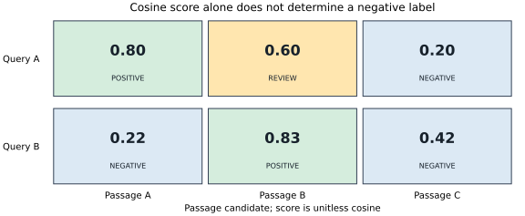
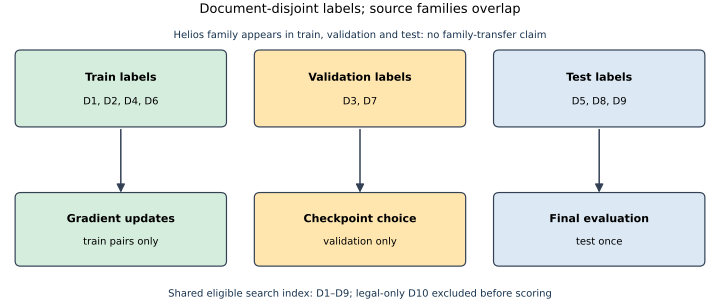

# Chapter 12 — Retriever training and domain adaptation [INTERMEDIATE]

Chapter 11 showed that a frozen sentence encoder can close a paraphrase gap on our small support corpus. It also returned the wrong product for one request and a candidate for every question with no eligible answer. A closer vector is only a geometric observation. Suppose a support organization now has its own questions and judged passages. Can those labels improve retrieval? Training can move the query and passage representations, but on a tiny domain set it can also teach the model to recognize the training documents and forget how to rank new ones. This chapter treats **retriever learning as an experiment with an untouched test**, not as a command to fine-tune whenever a leaderboard model is imperfect.

The working prerequisite is Chapters [9](chapter-09-relevance-judgments-and-ranking-metrics.md) through [11](chapter-11-how-embedding-models-learn-retrieval-spaces.md): a complete eligible qrel roster, top-*k* metrics, exact vector search, and a frozen encoder baseline. V2 BM25 remains the lexical reference. The [lab](../labs/chapter-12/LAB.md) and [separate solutions](../solutions/chapter-12-solutions.md) use a new document split. Chapter 11's inspected questions are regression probes only; using them as a fresh test would leak model-selection knowledge.

## 1. The unit of learning is a judged query–passage relationship

Let a query encoder produce `u = E_q(q)` and a passage encoder produce `v = E_p(p)`. A dual encoder scores `s(q,p) = u·v` after a declared normalization policy. A **positive** is a passage judged useful for a particular query; it is not intrinsically positive for every query. A **negative** is a passage judged unsuitable for that query. This distinction matters when two passages repeat the same fact, or one contains only part of the needed evidence. Chapter 9's grade-1 passage can be useful context even if grade 2 is needed for a complete answer. Casting every unjudged passage as grade 0 silently invents labels.

Training data may come from human qrels, search clicks, query logs, support tickets, question–answer pairs, or generated questions. Their reliability differs. A click can reflect rank and interface position; an answer sentence may need more than one passage; a generated question may merely echo the passage's words. **Weak supervision** uses such imperfect signals while tracking their origin. A **synthetic query** is a generated query paired with a source passage; its presence in a pair does not prove that no other passage answers it. Keep provenance, document version, author/teacher, sampling rule, and label confidence. Remove private text and enforce retention rules before training or sending source material to a teacher service.

Negatives have several origins. An **explicit negative** was reviewed for the query. An **in-batch negative** is another query's positive passage treated as irrelevant to this query. A **mined negative** was found by a retriever. A **hard negative** scores highly while judged irrelevant. Hardness is model dependent: BM25 may select a same-keyword wrong entity; dense search may select a semantic near miss; a reranker may find subtle contradictory evidence. None is safe merely because it was retrieved. A **false negative** is genuinely useful evidence mistakenly placed in the negative set. The cost of that error is a gradient pushing useful evidence away.

Consider a query about *the current signed Helios Pro response target*. The signed old clause, signed amendment, FAQ summary, observed incident, draft proposal, other product agreement, and legal-only addendum are distinct. The amendment is the governing positive. The old clause might be valuable version context, so it should not be an automatic negative. The legal-only passage is **ineligible**, not a hard negative to train into a support-team answer. Source status and access eligibility must be preserved independently of relevance.

## 2. What contrastive training actually optimizes

For one query and candidate set `C`, a common row-softmax objective is

`L(q) = −log[exp(s(q,p⁺)/τ) / Σ_{p∈C} exp(s(q,p)/τ)]`.

Here `τ>0` is a dimensionless **temperature**. With L2-normalized vectors, the score is cosine in `[-1,1]`; dividing by smaller `τ` sharpens differences and increases gradient sensitivity to the highest-scoring candidates. The ratio is a probability **within this constructed training row**, conditional on its labels and negatives. It is not calibrated probability that the passage is relevant in the live corpus, and it is not answer confidence.

Work a three-passage example. A positive has score `0.8`; two reviewed negatives have `0.6` and `0.2`; let `τ=0.2`. The logits are `4,3,1`. Dividing by `e⁴+e³+e¹` gives positive probability about `0.705`, so the loss is `−ln(0.705)≈0.349` nats. If the `0.6` passage is actually a second valid answer, the objective punishes correct behavior. Mask that pair, permit multiple positives with a suitable objective, or adjudicate it before training. Numerically, implementations subtract the row maximum before exponentiating; the [Chapter 11 arithmetic module](../projects/V3/contrastive_math.py) shows why.

With `B` distinct positive passages in a batch, the `B×B` similarity matrix can use the diagonal as positives and off-diagonal cells as proposed negatives. Figure 12.01 makes the assumption visible. A batch with two differently worded queries pointing to the *same* passage cannot treat the other diagonal as a negative. Group by source or mask same-positive and near-duplicate cells. Larger batches offer more negatives, but they also raise memory cost and false-negative exposure.

**Figure 12.01 — A contrastive row is a labeling decision.** The small score matrix shows two query–passage pairs with a high off-diagonal score. The score alone cannot tell whether that cell is a useful second passage; a reviewer must decide before the loss treats it as a negative.

*Alt text:* Two query rows score three passages; diagonal positives are green, reviewed negatives are blue, and one plausible false negative is amber. *Editable source:* [plot script](../visuals/chapter-12/plot-12-01-training-matrix.py); [PNG](../visuals/chapter-12/figure-12-01-training-matrix.png). Chapter 12; illustrative cosine scores, no sampled data or uncertainty.

A **triplet loss** instead enforces `s(q,p⁺) ≥ s(q,p⁻)+m` with margin `m>0`, penalizing violations by `max(0,m−s⁺+s⁻)`. If scores are `0.8` and `0.6` and `m=0.3`, the violation is `0.1`. A pairwise ranking loss similarly compares two candidates. A listwise objective consumes a slate and may match a target ranking distribution or optimize a surrogate for list quality. These objectives express different assumptions about labels and relative order. Do not select one by its training loss alone: score distributions, `Recall@k`, `NDCG@k`, wrong-entity slices, and latency matter on held-out queries. Scores from different models or training temperatures are not directly comparable; any acceptance threshold requires new calibration on a representative validation set.

## 3. Mining and distillation without manufacturing truth

Random negatives quickly become easy: the model already ranks them far below the positive. Hard-negative mining begins with a retriever, inspects high-ranked nonpositives, and adds verified mistakes to training. A useful cycle is:

1. Freeze a training corpus and run BM25, the current dense model, or a reranker on training queries.
2. Sample high-ranked candidates from each method, with source, entity, version and permission strata.
3. Check whether each is a true negative, a partial positive, a duplicate, contradictory evidence, or unjudged. Mask or relabel uncertain cases.
4. Train a new checkpoint on the reviewed pool. Rebuild the dense index with that checkpoint, then mine again only on training data.
5. Compare fixed validation slices, then inspect the untouched test once after choosing the checkpoint.

BM25 hard negatives expose lexical decoys; dense hard negatives expose semantic and entity confusion. A reranker can pick even subtler cases, but its judgment is still a label proposal. Iterative dense mining can become self-reinforcing: the model retrieves its own favorite errors, while failures it never retrieves remain invisible. Mix retrieval methods and sample the corpus beyond the top results. Deduplicate near-identical passages and prevent siblings of held-out source documents from entering training.

A **cross-encoder teacher** reads query and passage together and can produce pairwise scores. A cheaper bi-encoder student can learn from those scores. **Score distillation** fits a teacher's relative or softened score distribution; **ranking distillation** teaches order or pair preferences. The teacher is neither a ground-truth qrel nor a permission authority. Check its false positives, candidate coverage, calibration, and domain bias before propagating labels. If the teacher sees only a retriever's top 20, it cannot teach the student about a relevant passage omitted from that pool. Generated questions plus a teacher's pseudo-labels are one adaptation pattern, described in [GPL](https://arxiv.org/abs/2112.07577); its reported domain results do not transfer automatically to this corpus. [DPR](https://arxiv.org/abs/2004.04906) and [ANCE](https://arxiv.org/abs/2007.00808) are useful primary readings for dual-encoder learning and evolving negatives.

## 4. Domain adaptation requires a split that tests transfer

**Zero-shot retrieval** uses the pretrained model unchanged on a new corpus. **Fine-tuning** updates some or all model parameters with domain pairs. An **adapter** updates a smaller attached parameter set while keeping the base encoder frozen. Full two-tower fine-tuning can change passage embeddings; then every passage must be re-encoded and the vector index rebuilt under the new model version. A query-side adapter with a frozen passage tower avoids that particular rebuild, but it has less capacity and can still distort query scores.

Split by the unit that could leak. If a source agreement appears in training under one query and test under another, a query split alone does not test retrieval of a new agreement. The Chapter 12 fixture separates **source documents**: D1, D2, D4 and D6 train; D3 and D7 validate; D5, D8 and D9 test. All 12 support-team segments remain in the actual search index, as they would in a deployed system; only training positives, candidate negatives and checkpoint selection exclude validation/test documents. The legal-only D10 stays outside eligibility. Figure 12.02 shows this difference between *indexed* and *used to update weights*.

**Figure 12.02 — Source-disjoint labels, shared search corpus.** The indexed corpus includes all eligible documents. Only training documents supply gradient pairs; validation chooses the checkpoint; test labels are read only for the final report. This controls one leakage path, not related wording across documents or author knowledge.

*Alt text:* Train documents D1/D2/D4/D6, validation D3/D7 and test D5/D8/D9 have separate label paths, while all enter the eligible retrieval index; D10 is excluded. *Editable source:* [plot script](../visuals/chapter-12/plot-12-02-document-split.py); [PNG](../visuals/chapter-12/figure-12-02-document-split.png). Chapter 12; fixed V0 IDs, no sampling or uncertainty.

The split must be frozen before model selection. Near duplicates, revisions, translated copies, generated queries paraphrasing test questions, and a teacher trained on test labels can still leak information. For a real deployment, use temporal holdouts and corpus-family grouping, sample frequent and rare intents, check permissions, and retain a later untouched audit set. A small authored split has no reliable confidence interval for broad production behavior. Chapter 41 will address experiment design.

## 5. The V3 adaptation experiment

The [judgment manifest](../projects/V3/judgments_ch12.json) contains 10 authored training pairs, four validation queries, and 11 test queries (nine positive, two with no eligible evidence). For every validation and test question, all 12 eligible segments were reviewed: 180 query–segment judgments. The 10 training pairs target five distinct training segments and mask potentially useful adjacent runbook windows or the old signed clause as negatives. No test passage is used as a training negative. The test slices are Basic, Atlas, unsigned draft and no-evidence. The corpus, query text, qrels, and split are versioned and hashed in the [checked-in record](../projects/V3/chapter-12-experiment.json).

The pinned Chapter 11 encoder maps each title plus segment body and each question to a normalized 384-vector. The experiment trains a rank-16 residual **query projection**, `u' = normalize(u + B A u)`, with `A∈R^(16×384)` and `B∈R^(384×16)`. It initializes `B=0`, so the initial output is the frozen query vector, then optimizes masked row-softmax over seven train-document passages using temperature `0.12` and a small squared-projection penalty. The transformer and passage vectors are frozen. This is an actual gradient-trained dual-encoder *query tower adaptation*, not full retriever retraining. Its 12,288 trainable scalar parameters add about 49 KiB as float32 before optimizer state. At training time, a ten-query by seven-passage score matrix costs `O(10×7×384)` dot-product work per update plus the low-rank projection; production exact search still costs `O(Nd)` after query encoding. Adam optimizer state, model memory, source storage and service overhead are additional costs.

The [runner](../projects/V3/experiment_ch12.py) uses a fixed seed, 60 steps, recorded learning rate, and checkpoints at epochs 1, 5, 10, 20, 40 and 60. The checkpoint with highest validation `NDCG@2`, then `Recall@2`, wins; an earlier epoch wins ties. Only after selection does the runner score the test labels. BM25 is a separate lexical reference. The same support-team gate, exact cosine, ID tie rule, top two, source text and 120-word context builder are applied to both dense methods. Raw candidate IDs/scores and selected context IDs are recorded; there is **no new answer generator run**, so answer correctness and faithfulness are not inferred.

| Method | Held-out positive-query Recall@2 | Held-out NDCG@2 | No-evidence candidate return | Local p50 query and search |
|---|---:|---:|---:|---:|
| V2 BM25 | 0.667 | 0.667 | 2/2 | 22.1 µs |
| Frozen encoder | 0.889 | 0.807 | 2/2 | 7,902 µs |
| Selected adapted query tower, epoch 1 | 0.889 | 0.807 | 2/2 | 8,154 µs |

The nine positive questions divide evenly among Basic, Atlas and draft sources. BM25 finds the target in the top two for `2/3` in each slice. Frozen and adapted find `3/3` Basic, `2/3` Atlas and `3/3` draft. These fractions locate the Atlas weakness but have denominators too small for a stable comparative claim. The record also supplies slice-specific p50/p95 timings; per-slice timing is a diagnostic sample, not a workload estimate.

The hypothesized held-out Recall gain **did not occur**. At epoch 1, validation `NDCG@2≈0.723` and Recall@2 is 1.0, both tied with the frozen baseline. By epoch 5 the training loss has fallen from about `0.249` to `0.013`, yet validation `NDCG@2` and Recall@2 both fall to zero. The selection rule prevents shipping those later checkpoints; it cannot manufacture a gain from the selected one. This is over-specialization on ten pairs, visible before the test was opened. Nine positive test questions across only three source documents are too few to estimate a general domain effect.

The frozen and selected adapted models both miss `te-atlas-b`: the query asks for a *signed* two-hour contract, but the top two are the observed incident and unsigned proposal. BM25 misses that case too and additionally misses one Basic and one draft question. All methods return candidates for both no-evidence questions because this exact top-*k* route has no calibrated rejection rule. Candidate presence must not become an answer. The selected adapter's score values change, but its top-two ranking does not; an equal retrieval metric is not a failed training run, and a lower training loss is not a successful retrieval result.

The p50 timings are five warmed CPU samples per test question and method, measured with model query encoding plus exact scan for dense versus BM25 search only. Passage build, model load, training and context are outside that request boundary. These local values describe this machine and Python implementation; they do not establish production latency or an intrinsic BM25-to-dense speed ratio. The result is also English-only. Adding unreviewed translated questions to this test would not establish multilingual transfer.

## 6. Model selection, language shift and operating the learned index

**Domain shift** changes vocabulary, writing style, document length, label policy, or which facts count as relevant. A model trained on web question–answer pairs may rank a support contract's superseded clause highly because it looks answer-like. Catastrophic over-specialization appears when adaptation improves the sampled training tasks but harms previously useful retrieval behavior. Preserve a general-domain regression suite and hold out source families, customers, periods or languages according to the intended use. Use corpus sampling to capture long-tail identifiers and rare document types, not only popular queries.

**Multilingual retrieval** asks and retrieves within a language; **cross-lingual retrieval** may ask in one language and retrieve in another. Evaluate each language/direction with its own qrels, script, tokenizer limits, transliteration and entity-handling cases. A translated English test can miss native query phrasing and cultural intent. The Chapter 12 English MiniLM fixture makes **no multilingual performance claim**. If the lab environment supplies a licensed multilingual model and human-reviewed queries, run it as a separate optional experiment with a new model/index version. Do not treat MIRACL as a cross-lingual benchmark: its [authors describe monolingual retrieval across 18 languages](https://arxiv.org/abs/2210.09984).

Benchmark names indicate different tasks. [MS MARCO](https://github.com/microsoft/msmarco/blob/master/Datasets.md) passage ranking uses web-derived passages and relatively sparse answer-bearing labels; a high MRR can reward one early answer without proving complete evidence coverage. [BEIR](https://arxiv.org/abs/2104.08663) tests zero-shot transfer across heterogeneous retrieval tasks and reports that BM25 remains a strong comparator; its aggregated score can hide failures in the user's own domain. [MTEB](https://arxiv.org/abs/2210.07316) spans embedding tasks beyond retrieval, so an overall embedding rank is not a support-corpus retrieval metric. [MIRACL](https://arxiv.org/abs/2210.09984) tests monolingual retrieval in multiple languages over Wikipedia, with native-speaker relevance assessments; it does not measure our cross-lingual contract search. For any benchmark, record the corpus, query distribution, relevance-label construction, metric, candidate depth, language, and whether the workload resembles yours. Leaderboard gains are evidence about that benchmark, not a deployment decision.

At index time, preserve source version, permission metadata, passage text format, encoder and adapter versions, vector normalization and a reversible path to re-embed. At query time, log the model/index version, query processing, eligibility outcome, candidate IDs/scores, selected context IDs, top-*k*, latency, and abstention trigger without exposing private query text in ordinary telemetry. Monitor score distributions by slice, qrel performance on a frozen set, no-result and false-result rates, corpus drift and retriever drift. A learned score threshold needs separate calibration and can become unsafe after a model revision; retriever confidence is not answer confidence. Query/passage vectors and training pairs can retain sensitive content even when source text is removed. Apply the source's licensing, access and deletion policy to derived data and training copies.

### Practice and checks

1. Recompute the three-passage softmax and the triplet violation above. Explain why a second relevant passage changes the training objective.
2. In the [lab](../labs/chapter-12/LAB.md), inspect the document split and excluded negatives before running the adapter. Reproduce the validation collapse and the `te-atlas-b` failure.
3. Design a mining pass for *current signed target* queries. Identify which retrieved decoys require human judgment, which are partial context, and which are ineligible.
4. Interview prompt: a team reports a 4-point MTEB leaderboard improvement after fine-tuning. What corpus-specific evidence and rollout checks would you request before replacing a production retriever?

**Active recall.** After one day, state the difference between explicit, in-batch and mined negatives; explain how a false negative changes the gradient; sketch a document-disjoint split; and say what this experiment's lower training loss did *not* establish. After one week, compare a cross-encoder teacher with a bi-encoder student and design one multilingual and one cross-lingual evaluation slice.

**You understand this chapter if you can** construct and audit query–passage pairs, calculate a contrastive row, identify false-negative and leakage paths, train a declared adapter, choose a checkpoint from validation only, report held-out quality and latency by slice, and decline a model change when the evidence shows no gain.

**Further reading.** [DPR](https://arxiv.org/abs/2004.04906) establishes a dense dual-encoder baseline; [ANCE](https://arxiv.org/abs/2007.00808) studies mined negatives; [GPL](https://arxiv.org/abs/2112.07577) studies synthetic questions and pseudo-labels for domain adaptation. Read [BEIR](https://arxiv.org/abs/2104.08663), [MTEB](https://arxiv.org/abs/2210.07316) and [MIRACL](https://arxiv.org/abs/2210.09984) with the benchmark questions above. Chapter 13 turns from learning to operating dense candidate retrieval.
