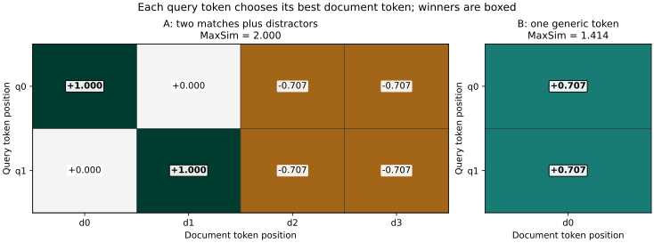

# Chapter 14 — Sparse neural search and late interaction [INTERMEDIATE]

Chapter 13 left us with a useful disagreement. BM25 could follow literal terms, while a frozen single-vector encoder sometimes found a colloquial paraphrase. Both still missed some direct evidence at depth two. A passage collapsed to one vector can lose a small but decisive detail; a lexical index cannot retrieve a passage when useful words have no shared surface form. This chapter studies two ways to retain more matching structure: **learned sparse vocabulary weights** and **token-level late interaction**. They are alternatives for candidate retrieval or stages within a larger ranking system, not automatic replacements for BM25 or dense search.

The prerequisites are Chapters 6–13: weighted terms and inverted indexes; judged rankings; vector metrics; contrastive training; and the materialized exact dense baseline. We will keep three boundaries explicit. A model produces a *representation*; an index executes a *search plan* over that representation; qrels decide whether the resulting candidates are useful. A candidate still needs eligibility, context selection, and grounded generation. The [Chapter 14 lab](../labs/chapter-14/LAB.md), [solutions](../solutions/chapter-14-solutions.md), and [V3 mechanism code](../projects/V3/sparse_late_ch14.py) are meant to be used after the derivations below.

**Workload identity:** `ch14-sparse-fixture-v1 / ch14-token-fixture-v1`; see the [comparison registry](../evaluation/WORKLOAD_REGISTRY.md). Metrics across different workloads do not form an improvement sequence.

**Independent construction gate:** Read the mechanism explanations first. Before inspecting supplied Python reference code, attempt [lab A0](../labs/chapter-14/LAB.md#a0-independent-bounded-mechanism) on your own tiny fixture. Open the separate worked answer afterward; existing calculation, debugging and project-comparison tasks still apply.

## 1. The representation choice is the mechanism

Consider a support query phrased as “ticket reply latency” and an incident passage saying “incident response took 120 minutes.” Surface matching may find neither *ticket* nor *reply*. Chapter 13's pooled embedding may find the incident, but a single point does not tell us which parts matched, whether *120* was preserved, or whether another passage about ticket sales is being mistaken for the incident. A richer representation can address part of this failure, at higher index or query cost.

| Representation | What is stored for a passage | Basic comparison | What can go wrong |
|---|---|---|---|
| BM25, Chapters 7–8 | Observed terms and posting statistics | Term match with TF, IDF and length normalization | Vocabulary mismatch; surface overlap may be spurious |
| Chapter 13 dense | One normalized vector | One cosine/dot score per passage | A detail can be diluted; exact IDs and status remain difficult |
| Learned sparse | A few nonzero weights in a large vocabulary | Weighted overlap through postings | Expansion may create wrong matches or long posting lists |
| Late interaction | Several contextual token vectors | Best document-token match for each query token, summed | More vector storage and more comparison work |
| Cross-encoder, Chapter 26 | No reusable document-only final representation | Query and passage jointly encoded | More computation for every candidate pair |

“Sparse” describes the number of nonzero coordinates, not whether a model learned them. “Neural” describes how weights are produced. BM25 and a learned sparse model can both run through inverted indexes, while computing different scores. Late interaction uses independently encoded query and passage tokens; it is neither ordinary one-vector ANN nor a full cross-encoder with joint query–document attention. [SPLADE](https://arxiv.org/abs/2107.05720) and [ColBERT](https://arxiv.org/abs/2004.12832) are concrete research examples of these two families. The formulas and papers matter more than their names.

## 2. Learned sparse retrieval: a vocabulary that can expand

Chapter 6 represented a text as term weights over a chosen vocabulary; Chapter 7 calculated BM25 from terms actually found in the text. A learned sparse encoder retains the large vocabulary coordinate system but can assign a positive weight to a term that is **not literally present**. The output is a sparse map such as `{incident: 1.03, response: 1.03, ticket: 1.10, reply: 1.10}`. The expansion coordinates are still vocabulary terms. The index then performs exact weighted overlap over nonzero shared coordinates, using postings. This is distinct from Chapter 13's 384-dimensional dense geometric neighborhood.

In a SPLADE-style encoder, contextualized input positions produce logits for every vocabulary term. One version transforms a logit `zᵢⱼ` at input position `i` and vocabulary coordinate `j` to `log(1 + max(0,zᵢⱼ))`, then pools across positions. The original SPLADE paper used a **sum**; [SPLADE v2](https://arxiv.org/html/2109.10086v1) studied a **maximum**, which the small code here implements:

`wⱼ(text) = maxᵢ log(1 + ReLU(zᵢⱼ))`, and `score(q,d) = Σⱼ wⱼ(q) wⱼ(d)`.

The maximum means repeated activations do not accumulate indefinitely. `ReLU` removes negative activations, and `log1p` compresses large positive ones: `log(1+x)` keeps growing without a finite ceiling, but increasingly slowly. This differs from Chapter 7's finite BM25 TF saturation, which approaches `k1+1` at fixed length. A positive weight for a nonliteral term is an expansion. A genuine model learns the logits from query–positive–negative training; it does not consult a hand-written synonym list at query time. Chapter 12's concerns about false negatives, hard negatives, held-out testing, and domain drift therefore apply here too. A high expansion weight is a model behavior, not proof that the expansion is correct.

Sparsity is a **training and execution** requirement. An encoder that emits nonzero weights for almost every vocabulary term would make huge postings and expensive queries. One SPLADE formulation combines ranking loss with separate query and document regularizers. Its FLOPS-style penalty sums squared mean coordinate activation across a training batch, `Σⱼ(mean_batch wⱼ)²`; frequent heavy coordinates are expensive because their posting lists will be visited often. Query and document penalties can have different strengths. The penalty is a surrogate for retrieval work, not a latency guarantee: actual posting lengths, compression, caching, pruning, hardware, and workload determine latency. Raising regularization may reduce index size and work while also removing useful expansions. [SPLADE v2's paper](https://arxiv.org/html/2109.10086v1) treats that quality–efficiency trade-off explicitly.

### From encoder output to a posting search

At **index time**, encode each permitted passage under a pinned vocabulary, tokenizer, model revision, text and source version. Store each nonzero term weight in `term → [(passage ID, weight)]` postings, along with source locator and policy metadata. Expansion terms increase posting count and may create high document-frequency lists. At **query time**, encode the question with the compatible query path, obtain nonzero weights, apply the trusted eligibility constraint, visit only postings for those query terms, accumulate products by eligible ID, and retain top-*k*. Candidate IDs and raw scores then go to context construction; no answer is produced by a posting list.

```text
INDEX TIME: source segment → compatible sparse encoder → nonzero vocabulary weights
            → weighted postings + source/version/scope manifest
QUERY TIME: question → compatible sparse query encoder → weighted terms
            → trusted eligible-ID set → relevant postings → weighted accumulation
            → top-k candidates → selected evidence → later answer path
```

For a query with `m` nonzero coordinates, the toy exact posting-union scorer visits `Σ_{j in query} df_scope(j)` eligible entries, then sorts the positive-score candidates. A production top-*k* engine can use Chapter 8's bounds, WAND-like pruning, impact ordering or heaps if its bounds remain valid for **nonnegative learned weights**. A model with negative weights needs a different bound and scoring contract. More expansion coordinates can improve candidate recall yet lengthen the union. Document-only expansion is also possible: keep a cheap literal query and place learned expansion weights into the document index; this shifts neural inference to index time but changes what the query encoder can express. Raw BM25 points and learned sparse dot scores are incomparable without calibration; the same warning applies across model revisions and shards.

```text
scores := empty map
for each nonzero query term j:
    for each (document ID, document weight) in postings[j]:
        if document ID is eligible:
            scores[document ID] += query_weight[j] × document_weight
return highest k positive scores, resolving ties by stable ID
```

Here is the reproducible toy from the [Chapter 14 record](../projects/V3/chapter-14-experiment.json). Every logit is **hand-authored** to expose the arithmetic. It is not a trained SPLADE checkpoint. The query's two observed coordinates have logit `2`, hence weight `log(3)=1.099`; its two expansion coordinates have logit `1.8`, hence weight `log(2.8)=1.030`. The incident passage gives *incident* and *response* weight `1.099` each. A ticket sale has *ticket*; a reply template has *reply*. With only the literal query terms, the incident is absent at every depth. With expansion, it scores `2×1.030×1.099=2.262` and ranks first. The literal distractors each score `1.099²=1.207`. Both the gain **and** the risk are visible: expansion retrieves the intended passage, but it also leaves two unrelated candidates with positive scores. A different false expansion could rank a distractor first.

The [implementation](../projects/V3/sparse_late_ch14.py) stores four rows, one of which is legal-team only. For the support-team fixture it reports three eligible rows, two posting entries visited by surface matching and four after expansion. The legal-only row may appear in an in-memory posting, but it is excluded **before score accumulation**. In a real system the scope must come from authenticated policy; caller-supplied `support-team` is a teaching fixture. A source deletion must also remove or invalidate its expanded postings, traces and any derived cache. Expansion terms can reveal source content, so retention and licensing obligations carry into the derived index.

## 3. Late interaction: preserve the query's individual needs

A single passage vector collapses all positions into one representation. A late-interaction encoder instead stores a **bag of contextual token vectors** for each passage. “Contextual” means a token vector is conditioned on the passage in which the token occurs; it is not a fixed dictionary lookup. The query is encoded separately. Only after these independent encodings do token vectors interact. The classic ColBERT operator takes, for each query vector, its highest similarity with **any** document vector and sums those maxima:

`MaxSim(q,d) = Σ_{i=1}^{|q|} max_{1≤j≤|d|} qᵢ · dⱼ` for normalized token vectors.

The dot in this chapter's toy is cosine because each token vector has norm one. Other variants can use different similarity and query weighting. A document token may win for several query tokens; MaxSim does not enforce a one-to-one alignment, term order, numeric consistency, negation understanding or source authority. It is a soft matching function learned through its encoder and training data, not a logical proof of coverage. [ColBERT's paper](https://arxiv.org/html/2004.12832v2) describes independent query/document encoding, normalized token vectors, MaxSim and both reranking and full-collection search. It also uses model-specific query augmentation and document-token filtering; the toy code omits those training and encoder details.

Because the operator **sums over query positions**, the raw score range changes with the number of retained query vectors. A single fixed threshold across very different query lengths or encoder versions is unsafe without calibration. Inspect special/padding-token masking and truncation before interpreting a token winner; a high-scoring token can be a spurious soft match rather than the number, negation or relation the question needs.

```text
score := 0
for each unmasked query token vector qi:
    best := maximum dot(qi, dj) over retained document token vectors dj
    score += best
return score and the winning document-token position for each qi
```

### Work one score grid by hand

Let two unit query vectors be `q0=(1,0)` and `q1=(0,1)`. Passage A contains matching tokens `d0=(1,0)` and `d1=(0,1)`, followed by two distractors `d2=d3=(-√½,-√½)`. Passage B has one generic token `g=(√½,√½)`. Every coordinate is abstract; no word meaning is implied.

| Query token | A:d0 | A:d1 | A:d2 | A:d3 | Row maximum |
|---|---:|---:|---:|---:|---:|
| q0 | 1 | 0 | −0.707 | −0.707 | **1 at d0** |
| q1 | 0 | 1 | −0.707 | −0.707 | **1 at d1** |

Therefore `MaxSim(q,A)=1+1=2`. For B, both query tokens score `√½≈0.707` against its sole token, so `MaxSim(q,B)=√2≈1.414`. A wins. Figure 14.01 is generated directly from the [checked-in score grid](../projects/V3/chapter-14-experiment.json), and boxed cells are the exact winning positions.

**Figure 14.01 — Each query token selects its best document-token match.** The two exact matches in A survive its distractors, while B's one generic vector supplies only partial matches. These are unit-vector dot products in a two-dimensional **fixed toy**, not learned ColBERT scores or measured retrieval quality.



*Alt text:* A's two row maxima are 1 and 1; B's are 0.707 and 0.707. *Editable source:* [plot program](../visuals/chapter-14/plot-14-01-maxsim-grid.py), [PNG](../visuals/chapter-14/figure-14-01-maxsim-grid.png). Chapter 14; horizontal axis is document-token position, vertical axis query-token position, and cell units are normalized dot scores. The fixed data have no sampling uncertainty.

Now mean-pool each sequence and compare pooled cosine. The query mean is `(0.5,0.5)`. A's mean points opposite to it, so cosine is `−1`; B's mean is parallel, so cosine is `+1`. Pooling ranks **B above A**, the reverse of MaxSim. Passage C contains only `(1,0)`; its MaxSim is `1`, pooled cosine about `.707`, and its judged grade in this toy is 1 (partial). This reversal is a construction that isolates the operator; a trained Chapter 11 sentence encoder could behave differently, and the toy has no estimate of corpus-level accuracy.

### Index, query and cost boundaries

At index time, tokenize and encode passage text using a pinned model and its document-specific input contract; retain selected contextual token vectors with passage IDs, source version, scope, and token offsets if they are needed for inspection. At query time, encode the question once, restrict eligible passages, obtain candidates, compute or refine MaxSim, and hand ranked **candidate IDs** to context construction. The token argmax indices help diagnose a score but are not by themselves citeable source spans. A source offset and original text still have to be preserved.

An exact scan over `N` passages, `Q` query tokens, average `D` stored passage tokens and dimension `h` takes roughly `O(NQDh)` arithmetic, apart from encoding and top-*k*. It stores roughly `N×D×h×b` raw vector bytes for `b` bytes per coordinate, plus IDs, offsets, index structures, source and model. For 13 passages with 100 retained tokens, 128 coordinates and float32, raw token vectors alone would be `13×100×128×4 = 665,600` bytes, versus `6,656` bytes for one float32 vector per passage at that dimension: 100 times as many coordinates. Real compression, masking, variable passage length, replicas and ANN structures change the total. [ColBERTv2](https://arxiv.org/abs/2112.01488) specifically studies residual compression and denoised supervision; its reported footprint change is a paper result, not measured by this project.

There are two deployment roles. As a **reranker**, late interaction scores a bounded candidate set from BM25, sparse or dense retrieval. This controls MaxSim work but cannot rescue a relevant passage absent from the candidate set. As a **first-stage retriever**, a token-vector index finds candidate passage IDs from approximate per-token matches, then exact MaxSim refines them. Candidate generation can miss a passage that a full MaxSim scan would rank highly; measure exact-MaxSim neighbor recall and qrel Recall@*k* separately. Chapter 15 will formalize approximate-neighbor errors; Chapter 26 will compare this staged choice with cross-encoder and learned reranking. Pruning and compression require a fixed model, index and scoring contract so that quality changes can be attributed to the approximation rather than a changed encoder.

## 4. What the local probe establishes

The [experiment runner](../projects/V3/experiment_ch14.py) freezes two separate toy tasks before scoring. Each has one question with complete three-row judgments under a 0/1/2 rubric. In the sparse task, grade 2 is the incident, and the ticket sale and reply template are grade 0. In the token task, A is grade 2, C is grade 1 and B is grade 0. The baseline and changed operator use **the same rows and qrels within each task**. Neither task is the Chapter 13 V0 corpus; the Chapter 13 BM25/dense results remain the real running-project diagnostic baseline, with their known failures and no approved model replacement.

| Fixed mechanism task | Baseline order | Changed order | Judgment at rank one |
|---|---|---|---|
| Surface weights → expanded query weights | reply template, ticket sale; incident absent | incident, reply template, ticket sale | Grade 0 → grade 2; Recall@1 `0 → 1` |
| Mean-pooled cosine → exact MaxSim | B, C, A | A, B, C | Grade 0 → grade 2; direct grade-2 Recall@1 `0 → 1` |

This is a **mechanism check**, not evidence that SPLADE beats BM25 or ColBERT beats the pinned MiniLM model. One author chose the vectors, logits and qrels to exhibit the failure, and there is one query per task. The checked record retains raw sparse weights, score grids, winner positions, rankings, grades, scope/work counters, code digest and 31 warmed in-process scoring samples per method. Those microsecond timings exclude neural inference, index build, source loading, network, context and generation; they should not be compared with Chapter 13's CPU model-encoding milliseconds. No uncertainty interval or production latency claim is warranted. The static `support-team` fixture again excludes a legal-only row before scoring; it does not implement authentication. No generation occurred, so answer correctness, citation support, faithfulness and abstention are **unmeasured**, not successful by implication.

The record also gives four small request-trace examples, one per scoring route: query/request ID, fixture snapshot/index, eligible count, ranked IDs and raw scores, one replayed scoring elapsed time in milliseconds, scoring status and timing-summary reference. `selected_context_ids=null` and `answer_status=not_run` preserve the candidate/evidence/answer boundary. These traces are examples of local scored requests, not a distributed tracing system; their fixed-order warmed microbenchmarks are sensitive to interpreter overhead and cache state.

For a genuine candidate-system decision, freeze a trained sparse or late-interaction model revision and a materialized index built from the same V0 source snapshot, then score Chapter 13's fully judged query slices alongside BM25 and frozen dense. Report relevant-evidence Recall/NDCG at fixed depths, index bytes and build time, warm query encode versus search versus refinement latency, exact versus approximate rank loss, no-evidence candidate behavior, and per-query failures. The inspected Chapter 13 slices are a regression set, not an untouched validation set for repeated tuning. A separate held-out corpus or independently reviewed questions are necessary before a general gain claim. Calibration of a no-result threshold needs positive and negative examples for the **specific** representation and scope. Sparse dot, cosine and MaxSim raw scores cannot be compared directly or turned into answer confidence.

The first debugging question is *where did the relevant passage disappear?* If its source was absent or unauthorized, retriever weights cannot fix it. If a sparse encoder omitted the needed expansion, inspect its nonzero query/document coordinates and training labels. If the expansion existed but the candidate was pruned, compare full posting-union results with the production plan. For late interaction, compare exact full-set MaxSim with candidate-generation results; inspect masked tokens, truncation, token winners and model/index versions. If a candidate is present but selected context drops its decisive span, the failure belongs downstream. A passage can have high MaxSim while contradicting another current source, and either model can return candidates for a no-evidence question. Status, negative evidence and answerability require their own checks.

## 5. Choosing the next experiment

The correct next step depends on the measured failure. Vocabulary mismatch with good literal ranking invites a learned sparse comparison against BM25, with posting work and expansion errors audited. A relevant passage diluted in a pooled representation invites late interaction, provided token storage and candidate work fit the budget. A missed opaque ID calls for an authorized exact-ID field, not a larger token model. A stale SLA answer calls for source version and status handling, not a higher similarity score. Existing BM25 and frozen dense remain viable alternatives or complementary candidate routes. Hybrid fusion is introduced later only after its benefit and score/rank-combination rules can be evaluated against these baselines.

The full [lab](../labs/chapter-14/LAB.md) makes you recompute both score mechanisms, test a false expansion, verify scope and read the saved trace. Chapter 15 begins from the already measured **exact** vector and MaxSim baselines to ask which comparisons may be skipped; we stop here before approximation.

### Practice, active recall and mastery

1. With query sparse weights `a=2,b=1` and passage weights `a=.5,b=3,c=9`, compute their dot score and explain why `c` contributes nothing. Name the postings visited and state what an eligibility gate must do.
2. Recompute A and B's MaxSim and pooled cosines from the coordinate definitions. What specific information does pooling discard in A? Why does the argmax grid still not prove answer correctness?
3. Suppose an expansion term appears in nearly every passage. Predict its effect on posting work and ranking, then identify a regularization or query-pruning trade-off to test.
4. Interview prompt: a team says “ColBERT is a reranker, so it cannot retrieve.” Explain both roles and the recall limit imposed by a bounded input candidate set.
5. Design a held-out experiment for the Chapter 13 acronym, code, numeric and no-evidence failures. Name the baseline, frozen qrels, retrieval depths, build/request cost, scope test and failure traces. Do not tune and test on the same inspected 14 questions.

**Active recall.** Tomorrow, draw index-time and query-time paths for both representations; write `Σⱼ wⱼ(q)wⱼ(d)` and `Σᵢ maxⱼ qᵢ·dⱼ` from memory, and explain where eligibility enters. In a week, distinguish a neural sparse weight from BM25, a token vector from a pooled vector, and exact MaxSim from approximate candidate generation.

**You understand this chapter if you can** implement weighted sparse posting accumulation and exact MaxSim, derive the toy ranking reversal, estimate their index/query costs, keep candidate/evidence/answer outcomes separate, and design a fair judged comparison with BM25 and frozen dense without calling illustrative weights a trained model.

**Further reading.** Read [SPLADE](https://arxiv.org/abs/2107.05720) and [SPLADE v2](https://arxiv.org/abs/2109.10086) for learned expansion, pooling, regularization and their first-stage measurements. Read [ColBERT](https://arxiv.org/abs/2004.12832) for independent token encoding, MaxSim and two search roles; [ColBERTv2](https://arxiv.org/abs/2112.01488) is optional for compression and supervision. Use [Track D of the paper path](../PAPER_READING_PATH.md) to record each paper's task, corpus, labels, metric and transfer limits. These studies do not establish quality on the fictional V0 corpus.

## Part III cumulative checkpoint: reconstruct representation and retrieval

Without the chapter diagrams, draw:

`raw text -> representation -> embedding training or frozen model -> exact dense index -> candidate scoring -> judged evaluation`

Separate index time from query time, and training/dev/test label paths from an indexed passage. Mark eligibility before scoring and carry model/source/index/workload/qrel versions into the redacted request envelope. Explain how V2's positional lexical index, BM25 and exact WAND remain baselines while V3 adds exact binary vectors, a pinned frozen encoder, a rejected query adapter, materialized float32 vectors, and two independent Chapter 14 scoring fixtures. Do not imply the toy sparse/MaxSim fixtures replaced the running dense engine.

Answer cumulatively:

1. Distinguish BM25 relevance score, embedding similarity, exact vector neighbor and judged relevance.
2. Why does an exact nearest-neighbor oracle still miss a signed-current SLA or metadata ID?
3. Compare one lexical and one dense failure slice on the **same** Chapter 13 stress workload; explain why scores from Chapter 09/11/12 cannot be read as a progress curve.
4. Trace one training update, explain the frozen passage index, and state what Chapter 12's family-overlapping split actually tests.
5. Explain V2 -> V3 evolution using a preserved baseline, one failed hypothesis and the 34 materialization parity checks.
6. What approximation has not been introduced yet? Contrast exact top-k pruning with lossy neighbor candidate omission; separate toy neural weights from a trained encoder.

Complete the [lab checkpoint](../labs/chapter-14/LAB.md#part-iii-cumulative-checkpoint). Teach the diagram aloud and redraw it after three and seven days. Use the separate rubric after your first attempt; this cumulative explanation is part of the Part III mastery gate.
