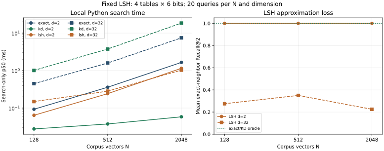

# Chapter 15 — Exact KNN to trees and hashing [ADVANCED]

The Chapter 13 index scores every eligible vector. That is a trustworthy geometric baseline, and on twelve support-team segments it is cheap: the model's query encoding takes far longer than the scan. At a larger `N`, a full scan can become a cost worth avoiding. The question is precise: **which vector comparisons can we skip, and what do we lose by skipping them?** Chapter 10 supplied metrics and an exact-neighbor oracle; Chapter 13 materialized normalized passage vectors and measured stage time; Chapter 14 showed why a retrieval operator and its execution plan must be evaluated separately. We will now build one *exact* spatial partition and one *approximate* hash index before approaching compressed and graph indexes in later chapters.

The running [V4 project](../projects/V4/README.md) uses Chapter 13's checked 384-coordinate snapshot and the same 14 fully judged diagnostic questions. It also uses controlled synthetic vectors to expose scale and dimensional effects. The [lab](../labs/chapter-15/LAB.md), [solutions](../solutions/chapter-15-solutions.md), [from-scratch code](../projects/V4/ann_ch15.py), and [experiment record](../projects/V4/chapter-15-experiment.json) let you reproduce each distinction. No ANN index is approved as a replacement in this chapter.

## 1. Define the oracle and the cost boundary

For a question vector `q`, eligible passage vectors `d₁…d_N`, a fixed metric and a tie rule, **exact top-*k*** is the ordered set that results from scoring every eligible vector. It is exact only relative to those vectors, that metric, that source snapshot and that eligibility scope. It does not mean that the passages are relevant, current, sufficient or safe to answer from. On the Chapter 13 normalized vectors, cosine equals the dot product of unit vectors. Our experiment keeps this representation and the `support-team` roster frozen; D10 is legal-only and never enters an eligible score or context.

The naive scan performs roughly `N×d` coordinate products and keeps the best `k` in `O(k)` heap state or sorts all `N`. At `N=1,000,000`, `d=384`, float32 coordinates alone occupy `1,536,000,000` bytes (about 1.43 GiB), excluding IDs, source text, replicas, indexes and model weights. A search implementation must read vectors from somewhere; cache misses and memory bandwidth can dominate arithmetic. Contiguous batched matrix operations, vectorized kernels and GPU throughput can make an optimized full scan difficult to beat at moderate scale. The local standard-library timings here measure Python implementations, not that optimized ceiling.

Always separate **index build**, **model load**, **query encoding**, **candidate search**, **context construction** and **generation**. Chapter 13's full scan of twelve eligible rows was about `0.61 ms` in the new Chapter 15 run, while the pinned query encoder's median was `17.45 ms`. These are local, short-query CPU observations, not service p95 estimates. Reducing the vector comparisons does not remove the encoder cost. The metric for approximation is likewise specific:

`exact-neighbor Recall@k = |approximate top-k IDs ∩ exact top-k IDs| / |exact top-k IDs|`.

The denominator is the oracle's geometric neighbors, not the human qrels. Separately measure **relevant-evidence Recall@k**, NDCG and direct-evidence coverage on judged questions. An approximate index can miss exact neighbors yet keep judged evidence, or match exact neighbors perfectly while both methods miss a required source. Do not replace either metric with a high cosine score. Empty candidate buckets count as misses; silently filling them with arbitrary passages would hide the approximation failure.

## 2. Exact pruning with a KD tree

A **KD tree** recursively divides points along coordinate axes. Our small implementation chooses the axis with the largest range in the current node, sorts on that coordinate, splits at the median, and stores each node's coordinate-wise bounding box. This is an *index-time* construction over an already eligible static roster. At query time, visit the closer-looking child first, maintain the current top-*k*, and test whether the other child's box could contain a point closer than the current worst result. If it could, **backtrack**. The right to prune comes from a lower-bound proof, not from guessing that a nearby branch looks better. [Bentley's original KD-tree paper](https://cs.wmich.edu/gupta/teaching/cs6310/lectureNotes_cs6310/kdtree-bentley.pdf) and the [scikit-learn nearest-neighbor guide](https://scikit-learn.org/stable/modules/neighbors.html) describe the axis-partitioning family; this project's implementation favors transparent counters over an optimized tree layout.

For a box with lower/upper coordinates `lⱼ,uⱼ` and query `qⱼ`, the squared lower bound is

`LB²(q, box) = Σⱼ [max(lⱼ−qⱼ, 0, qⱼ−uⱼ)]²`.

Each bracket is the shortest displacement required to enter the box on that axis. Every point inside the box is at least `LB` away in Euclidean distance. If the current *k*th distance is `R` and `LB > R`, the whole node can be skipped. Equality must be handled carefully because a tied point with a lexicographically smaller stable ID may belong in the result; our code uses a strict comparison with a small floating tolerance. The tree performs **exact** KNN despite pruning because it only skips nodes whose bounds prove they cannot improve the ordered top-*k*. The proof presumes the same metric, coordinates, complete index and eligible population as the oracle.

Work one two-dimensional example. Store `(0,0)`, `(0,2)`, `(2,0)` and `(2,2)`; split at `x=1`. Query `(0.9,0.1)` with `k=2`. Search the left child first: distances to `(0,0)` and `(0,2)` are `√0.82≈0.906` and `√4.42≈2.102`. The right child's box begins at `x=2`, so its lower bound is `2−0.9=1.1`. Because `1.1 < 2.102`, the right child **cannot** be pruned. Backtracking finds `(2,0)` at `√1.22≈1.105`, the true second neighbor. With `k=1`, the current radius would be `0.906`; then `1.1 > 0.906` safely prunes the right child. A “search only the nearest split side” implementation would be wrong for `k=2`.

```text
visit(node):
    if top-k full and box_lower_bound(node, query) > current_worst_distance:
        prune node
    else if node is a leaf:
        score its eligible vectors; update stable top-k
    else:
        visit child with smaller lower bound, then test/visit the other child
```

For unit query and passage vectors, `||q−d||² = 2−2cos(q,d)`: ascending Euclidean distance and descending cosine have the same order. The V4 tree uses the re-normalized Chapter 13 vectors for that comparison. The tree may still be a poor *performance* choice. It stores bounds and pointers, pays branch and Python-object overhead, and its pruning degrades when many boxes have small lower bounds relative to the current radius. As ambient dimension grows for broadly spread points, much of the tree may need visiting; effective **intrinsic structure** also matters. Distance concentration under some high-dimensional distributions is a warning about particular data conditions, not a theorem that every text-embedding space is useless. [Beyer et al.'s study](https://research.cs.wisc.edu/techreports/1998/TR1377.pdf) examines this nuance. The Chapter 15 synthetic case tests two distributions with dimensions 2 and 32; it does not infer general embedding behavior from ambient dimension alone.

Our construction is deliberately simple: sorting at each level costs up to `O(N log² N)` comparisons in this implementation, with coordinate-bound work on each node. Balanced depth is near `log₂N`; **query worst case remains O(Nd)** plus node-bound overhead. A better implementation can pre-sort, pack nodes, batch distances or tune leaf size. Small `N` often favors a scan. The V4 result below makes that cost visible.

## 3. Ball trees use a different exact bound

A **ball tree** groups points inside a center `c` and radius `r`, then recurses into smaller balls. The triangle inequality gives every point `x` in that ball the query-distance lower bound `max(0, ||q−c||−r)`. For example, if `||q−c||=2` and `r=.5`, no contained point can be closer than `1.5`; a current worst top-*k* distance of `1.0` allows the entire ball to be pruned. Child balls can overlap. Good center/radius construction, balance and leaf size affect search work and build cost. [Omohundro's ball-tree construction report](https://steveomohundro.com/wp-content/uploads/2009/03/omohundro89_five_balltree_construction_algorithms.pdf) compares construction choices; the [scikit-learn guide](https://scikit-learn.org/stable/modules/neighbors.html) gives a maintained implementation context.

The conceptual contrast matters more than one library API: KD boxes use axis-aligned coordinate bounds; ball trees use a metric-ball bound. Both can return exact neighbors with correct branch-and-bound traversal. Both can degrade toward a scan and add memory/build overhead. Our V4 code implements the KD bound and derives the ball bound on paper so that the lab can ask which proof permits each prune. A ball tree is not an ANN method merely because it skips comparisons; **skipping with a valid bound keeps exactness**.

## 4. Approximate search with random-hyperplane LSH

Now allow misses. Pick a random Gaussian vector `r` and hash a unit vector `v` to bit `hᵣ(v)=1` if `r·v≥0`, else `0`. A hyperplane through the origin separates the two bit values. Nearby directions are more likely to land on the same side. For vectors with angle `θ` radians, one random hyperplane has collision probability `p₁=1−θ/π`, as derived in [Charikar's primary paper](https://www.cs.princeton.edu/courses/archive/spr04/cos598B/bib/CharikarEstim.pdf). This is **angular** locality, not a promise that all relevant passages collide.

Concatenate `b` independent bits into one table signature. The same-table collision probability for a particular pair is `p₁ᵇ`. Build `L` independent tables and take the union of the query's matching buckets; under those independence assumptions, the probability of at least one collision is `1−(1−p₁ᵇ)ᴸ`. At `θ=60°`, `p₁=2/3`; with `b=4`, one table collides with probability `(2/3)⁴≈0.198`, while four tables raise the chance to about `0.586`. More bits generally shrink buckets and work but can lose neighbors; more tables generally improve collision opportunity and enlarge index/build/query work. These pairwise probabilities do not determine top-*k* recall on a correlated corpus with many competing points. The seed fixes one finite draw of hyperplanes; repeat seeds to study variance before operational tuning.

At **index time**, normalize each stored vector, generate and pin `L×b` planes, calculate each table signature, and map signature to passage IDs. At **query time**, compute `L×b` projections, read the exact-match bucket in each table, union IDs, gate eligibility, then score only the eligible union by the original cosine and select top-*k*. Our code does no multiprobe of nearby signatures and no fallback full scan; empty buckets stay empty. If the exact neighbor never enters the union, no reranking step can recover it. The policy fixture is not authentication: live ACLs, deletes and scope changes would require trusted eligibility and index/cache invalidation.

```text
INDEX TIME: unit passage vectors → seeded sign-bit signatures → L bucket maps + ID/version/scope
QUERY TIME: unit question vector → L signatures → matching bucket union → eligibility
            → exact cosine on union → approximate top-k candidates
```

With `h` bits per table, build work is roughly `O(NLhd)` coordinate products. Query work is `O(Lhd + Cd + C log k)` for `C` eligible unique candidates, plus bucket/union overhead. Raw vectors still occupy `Nds` **bytes** if `s` is bytes per coordinate. The signature payload alone is `NLh` bits, excluding planes (`Lhds` bytes), bucket maps, repeated IDs, allocator overhead and vector storage. A small `C` is not proof of low latency: on twelve 384-dimensional vectors, computing many hyperplane projections can cost more than scanning twelve passage vectors. Scores from different index versions remain uncalibrated, and a hash collision is a candidate-generation event, not evidence support.

**Figure 15.01 — Exact scan, safe KD partitions, and lossy hash buckets on one fixed two-dimensional query.** Green rings mark exact top-two geometric neighbors. The KD tree retains both by bound-checked backtracking. The LSH union contains only ID `08`, so it misses exact neighbor `07`; the dashed line is one of eight actual random planes, not the full four-bit signature rule. This figure has no human relevance labels.


*Alt text:* The query's second exact neighbor is outside the LSH candidate union, while KD search preserves it. *Editable source:* [plot program](../visuals/chapter-15/plot-15-01-partitions-and-buckets.py); [PNG](../visuals/chapter-15/figure-15-01-partitions-and-buckets.png). Chapter 15; axes are two unit-vector coordinates, seed 1, twelve Gaussian-unit points and one perturbed query. No sampling uncertainty applies to the fixed drawing.

## 5. Measure work, time and both kinds of recall

The [checked experiment](../projects/V4/chapter-15-experiment.json) has two workloads. First, for each `N∈{128,512,2048}` and dimension `d∈{2,32}`, twenty Gaussian unit queries are constructed by perturbing a randomly selected stored vector (`σ=.08`) and renormalizing. There are no human relevance labels. Exact cosine defines the oracle; KD uses an equivalent L2 metric; LSH uses four six-bit tables. The synthetic exact scorer materializes all `N` score pairs before a bounded top-*k* heap selection, so this simple Python implementation uses `O(N)` temporary pairs rather than the `O(k)` of a streaming heap. The seeds, vectors' recipe, full per-query IDs/work, index build times, raw-vector byte lower bound, and 60 warm search samples per method/size are recorded. The synthetic data are intentionally simple, so quality is **exact-neighbor** recall only.

| Synthetic `N,d` | Exact scored | KD mean scored | LSH mean scored | KD ordered parity | LSH mean exact-neighbor Recall@2 | Local search p50 ms: exact / KD / LSH |
|---|---:|---:|---:|---:|---:|---:|
| 128, 2 | 128 | 8.8 | 32.7 | 20/20 | 1.000 | .093 / .028 / .064 |
| 2048, 2 | 2048 | 8.4 | 711.2 | 20/20 | 1.000 | 1.653 / .059 / 1.150 |
| 128, 32 | 128 | 128.0 | 9.6 | 20/20 | .275 | .449 / 1.008 / .149 |
| 2048, 32 | 2048 | 2047.6 | 141.9 | 20/20 | .225 | 7.454 / 18.437 / 1.029 |

Here the KD tree prunes effectively in the two-dimensional sample. In the 32-dimensional sample it scores almost every vector and loses to the Python full scan. LSH scores fewer vectors and often runs faster at `d=32`, but misses most exact top-two neighbors. This is a quality–work trade-off on a **planted synthetic query process**. Figure 15.02 plots all three `N` settings and measured medians; it has no confidence interval and does not size a production service.

**Figure 15.02 — Fewer scored vectors can cost exact neighbors.** The left panel shows warm in-process search-only p50 at each `N`; the right panel shows LSH exact-neighbor Recall@2. Green KD preserves the oracle ranking even when its high-dimensional search is slower. The dashed `d=32` LSH line is faster here only with substantial neighbor loss.



*Alt text:* Search time and recall depend on distribution and dimension; the apparent LSH speed is paired with missed neighbors. *Editable source:* [plot program](../visuals/chapter-15/plot-15-02-latency-recall.py), which reads the [experiment record](../projects/V4/chapter-15-experiment.json); [PNG](../visuals/chapter-15/figure-15-02-latency-recall.png). Chapter 15; horizontal axis is corpus vectors `N` (log scale), vertical axes are milliseconds p50 (log scale) and unitless mean Recall@2. Twenty queries, three warmed timing passes/query, nearest-rank estimator, one local Windows/Python CPU run; no error bars because repeat-query samples are not independent workloads.

The second workload reuses Chapter 13's **inspected** 14-question, 168-pair qrel fixture and checked materialized index. It tests exact scan, KD, and a predeclared `3×3` factorial grid of `L∈{2,4,8}` tables and `h∈{4,6,8}` bits. Changing one axis at a time is now possible; no single configuration was chosen after looking at the qrels. The cases retain raw scores and IDs, candidate/context IDs, exact-neighbor overlap, qrel metrics, eligible/scored counts, query encode time and separate warm search-only timing. No generator runs.

| V0 support-team top two | Exact cosine | KD | LSH 2 tables × 4 bits | LSH 8 tables × 4 bits |
|---|---:|---:|---:|---:|
| Mean exact-neighbor Recall@2, all 14 queries | 1.000 | 1.000 | .357 | .786 |
| Macro relevant-evidence Recall@2, 12 positive queries | .792 | .792 | .292 | .792 |
| Mean eligible vectors scored | 12.0 | 8.36 | 3.86 | 7.93 |
| Warm search-only p50, ms | .610 | 3.268 | .587 | 1.830 |

The KD tree agrees with the exact ordered top two on all 14 questions, yet its bookkeeping is slower than scanning twelve vectors. The two-table LSH loses the direct incident passage on `style-ticket` and returns **no candidate**; the eight-table/four-bit configuration regains that passage and matches the exact aggregate qrel Recall@2 while still missing some exact neighbors. Equal aggregate qrel recall does not mean equal per-query successes: inspect `num-basic` and `style-handoff` before calling either setting better. Conversely, the exact dense route itself misses the current signed SLA target and a literal metadata ID; an ANN index cannot fix a representation or metadata-route failure just by matching its oracle. Two no-evidence questions still have no eligible positive qrels, and returning fewer candidates is not calibrated abstention.

The frozen query encoder's V0 median is about `17.45 ms`, larger than every one of these search-only medians, while index construction is measured separately. These local timings use one CPU, Python loops and a tiny corpus; p95 from the stored samples is a diagnostic, not a tail-latency promise. The index stores legal-only D10 but filters it before scoring and context. The qrels were written by one author for Chapter 13, so this is a retrospective regression probe, not a new held-out gain claim. Real selection needs independent questions, larger representative corpora, multiple seeds for randomized indexes, matched hardware, build/refresh cost, memory bytes, filtered-query recall, latency distribution and a workload-specific quality budget.

## 6. Diagnose an ANN miss before changing the model

Trace a failure in this order: was the source present, current and eligible; was its passage encoded under the checked model/index contract; did the exact oracle rank it within the chosen `k`; did the approximate candidate stage include it; was it scored/ranked into top-*k*; did context select its relevant span; did the answer cite and use it correctly? These are different failure sites. A candidate miss calls for bucket width/table count or another search family. An exact-oracle miss calls for representation, source field, chunking or routing work. A correct candidate absent from context calls for context construction. An unsupported answer is downstream of candidate recall.

At index time record vector/model/snapshot version, build seed, build duration, row count, scope and byte counts. At query time record trusted scope, `L/h` or KD leaf size, query-encoding and search durations separately, buckets visited, union size, eligible/scored vectors, raw candidate IDs/scores, selected evidence IDs, status and no-bucket reason. Do not put raw private questions, source text or tenant IDs into low-cardinality metrics. Randomized index updates, deletes, tenant-safe caches, shards and distributed top-*k* arrive later; a static fixture does not imply those protections.

Chapter 16 can now ask a different approximation question: can coarse partitions and compressed vectors reduce memory and candidate work while preserving judged retrieval? Its comparisons must retain Chapter 13's exact vector oracle and the Chapter 15 distinction between **geometric** and **evidence** recall. Chapter 17 will add graph traversal. Neither a fast local timing nor a low-dimensional picture substitutes for the measured frontier on the target workload.

### Practice, active recall and mastery

1. Recompute the four-point KD example for `k=1` and `k=2`. State the box lower bound, current radius and legal prune decision at each depth. Why must ties be treated explicitly?
2. For a ball at center `c` with radius `.5` and `||q−c||=2`, derive its bound. Would a current worst distance of `1.4` prune it? What about `1.6`?
3. Derive the one-table and four-table collision probabilities for `θ=60°`, four bits per table. Explain which independence assumption is needed and why the answer is not a top-two recall guarantee.
4. Explain why mean exact-neighbor Recall@2 can fall while macro qrel Recall@2 stays equal. Find a concrete Chapter 15 V0 query where LSH changes the candidate IDs.
5. Interview prompt: a colleague reports “LSH searches only two vectors, so it is faster.” Ask for query projection time, bucket/union time, exact-scoring time, index build/memory, scope, exact-neighbor recall, qrel recall and the latency distribution before choosing a system.

**Active recall.** Tomorrow, sketch the exact-scan/KD/LSH lanes, write both safe tree lower bounds and the sign-hash collision formula, and state which method can miss an exact neighbor. A week later, distinguish build cost, encoder cost, search cost, candidate recall and answer quality without mixing their denominators.

**You understand this chapter if you can** implement a correct backtracking KD search and a seeded random-hyperplane bucket index, demonstrate an ANN miss against a frozen exact oracle, compute two separate recall measures, and defend a workload-specific latency/memory/quality decision without treating twelve vectors or synthetic Gaussians as production evidence.

**Further reading.** [Bentley](https://cs.wmich.edu/gupta/teaching/cs6310/lectureNotes_cs6310/kdtree-bentley.pdf) for KD trees; [Omohundro](https://steveomohundro.com/wp-content/uploads/2009/03/omohundro89_five_balltree_construction_algorithms.pdf) for ball trees; [Charikar](https://www.cs.princeton.edu/courses/archive/spr04/cos598B/bib/CharikarEstim.pdf) for angular sign hashes; and the [scikit-learn algorithm guide](https://scikit-learn.org/stable/modules/neighbors.html) for a modern implementation comparison. Read their assumptions before importing any complexity claim into a RAG workload. The later [ANN paper track](../PAPER_READING_PATH.md) continues with compressed, graph and disk indexes after their prerequisite chapters.
