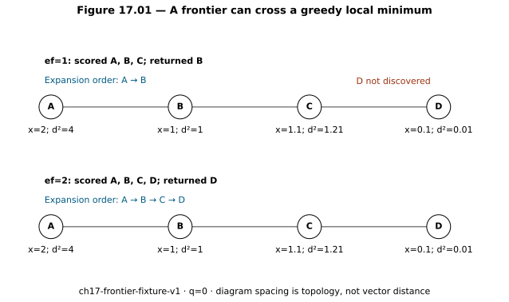
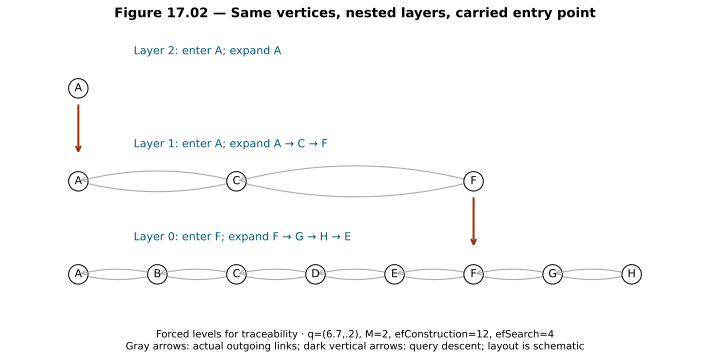
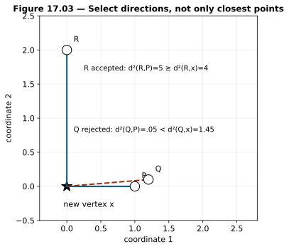
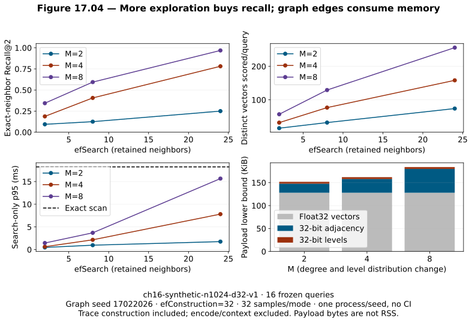

# Chapter 17 — Proximity graphs, NSW, and HNSW [ADVANCED]

The last two chapters bought cheaper candidate search by restricting where we looked or shortening what we compared. Chapter 15's KD tree remained exact, but its bounds stopped saving useful work on the higher-dimensional synthetic data. LSH sometimes lost the desired bucket. Chapter 16 separated an unprobed IVF list from a PQ distance error and a refinement shortlist error. Keeping more probes or originals could repair some losses, at a cost. The exact dense route remained our oracle.

There is another way to avoid a full scan: **use vectors already visited to choose which vectors to visit next**. Store a graph of useful connections between passages. Start somewhere, compare its neighbors with the query, and move through the graph toward promising regions. This chapter develops that idea from a graph walk to hierarchical navigable small world search, or **HNSW**. We will construct the bounded search mechanism ourselves, then inspect insertion, hierarchy and an experiment that includes both successes and persistent misses.

The prerequisites are Chapters [10](chapter-10-vectors-distance-and-exact-similarity.md), [15](chapter-15-exact-knn-to-trees-and-hashing.md) and [16](chapter-16-ivf-quantization-and-compressed-vectors.md), with [Chapter 13's checked snapshot](chapter-13-dense-candidate-retrieval-in-practice.md) supplying the running project's vectors and judged questions. You already know distance, normalization, top-*k*, heaps, exact-neighbor recall and the distinction between a similarity result and relevant evidence. Graph vocabulary and random levels are taught below before code depends on them.

**Construction gate:** Read Sections 1–7, predict the hand trace, and attempt [lab A0](../labs/chapter-17/LAB.md#a0-construct-the-bounded-mechanisms). Keep the supplied engine and [separate solutions](../solutions/chapter-17-solutions.md) closed until your first attempt. Running an ANN implementation does not satisfy this chapter's construction objective.

**Workloads:** `ch17-frontier-fixture-v1` is the four-vertex hand trace. `ch16-synthetic-n256-d8-v1` and `ch16-synthetic-n1024-d32-v1` reuse the preceding chapter's exact generated vectors and questions. `ch13-stress-probes-v1` reuses fourteen inspected, content-bound support questions. Their meanings and valid comparisons are in the [workload registry](../evaluation/WORKLOAD_REGISTRY.md). No metric across different workloads is presented as a sequence of improvements. No generator runs in this chapter.

## 1. A graph stores possible next comparisons

A **vertex**, also called a node, identifies a stored item. In our index it has a passage ID and a vector. An **edge** connects one vertex to another. An **adjacency list** stores the IDs reachable by one outgoing edge. The **degree** here means the number of outgoing entries. A **path** is a sequence of vertices connected by edges; its **hops** are edge traversals. A vertex is **reachable** from an entry if some outgoing path connects them. Reciprocal edges permit travel both ways, but an implementation that prunes individual adjacency lists can leave asymmetric links.

These edges encode similarity navigation. They do not say that one passage supports another, that their sources agree, or that a person is authorized to read either one. An HNSW graph is not a knowledge graph. Its job is to choose expensive distance comparisons; later stages must still establish relevance, evidence support, context suitability and answer quality.

Suppose an index has a million vectors. A full scan evaluates a million query–vector distances. If a graph walk finds useful candidates after a few hundred comparisons, its adjacency storage and construction work may be justified. If the corpus has twelve vectors, managing heaps and graph links may cost more than twelve direct comparisons. The workload must decide.

The first possible walk is **greedy descent**. Compare the current vertex and its neighbors with the query. Move to a neighbor only when it improves the distance. Stop when no neighbor improves it. This uses local information. A **local minimum** is a vertex closer than its immediate neighbors even though another vertex elsewhere is closer still. No graph rule has certified the unvisited region as worse.

The difference from Chapter 15's exact KD pruning is fundamental. A KD box bound can prove that a region cannot beat the heap threshold. A graph walk generally has no comparable lower bound for everything behind an unexpanded neighbor. “The next vertex looks worse” is a search policy, not an exactness proof.

## 2. Teach the frontier before adding hierarchy

Let squared Euclidean distance be

`d²(q,x) = Σⱼ (qⱼ−xⱼ)²`.

Smaller is better. Squaring avoids square roots and preserves ordinary Euclidean distance order. Squared distance itself does not obey the triangle inequality; we will not use it to prove a triangle bound. For unit query and document vectors, expand the square:

`||q−x||² = ||q||² + ||x||² − 2q·x = 2−2q·x`.

Thus minimizing this distance and maximizing cosine give the same order for exact unit coordinates. The hand fixtures below are intentionally unnormalized; their oracle is squared L2. In the running experiment, vectors come from the existing normalized snapshot, and every observed ordered exact top two is checked against the cosine oracle. Float32 storage and floating-point arithmetic still require a tolerance/ordering check rather than a promise of identical score bits.

Order candidates by the pair `(squared_distance, item_id)`. Smaller IDs break equal-distance ties. A **priority queue** supports removing the best pending pair without sorting the whole collection every time. Our search maintains three distinct structures:

| State | Meaning | Ordering or constraint |
|---|---|---|
| `visited` | Vertices whose distance has already been considered in this layer | Set; prevents repeated work around cycles |
| `C`, the frontier | Discovered vertices whose neighborhoods may still be expanded | Nearest-first min-heap |
| `W`, retained neighbors | Best discovered vertices retained as the current result pool | Worst-first max-heap; at most `ef` vertices |

**Discovering** a vertex means encountering it through an entry or edge. **Scoring** means evaluating its distance after eligibility permits it. **Admitting** it means putting it in the frontier and retained pool. **Expanding** it means examining its outgoing neighbors. A scored vertex can be rejected without expansion. A retained vertex can be evicted when a better one arrives. An evicted vertex can still have a pending frontier entry. None of these words means “verified evidence.”

Initialize the frontier and retained pool from the entry vertices, marking them visited. Pop the nearest pending vertex `c`. If `W` is full and `c` is worse than its worst retained pair, stop. Otherwise inspect each previously unvisited eligible neighbor. Compute its distance. Admit it if `W` has room or it improves `W`'s worst pair. If admission makes `W` too large, remove its worst pair. Continue until the frontier is empty or the stopping condition fires.

```text
SEARCH_LAYER(q, entries, ef, layer):
    visited = entries
    C = nearest-first queue of scored entries
    W = at most ef best scored entries, worst first
    while C is not empty:
        c = pop nearest from C
        if W is full and pair(c) > worst_pair(W): stop
        for each neighbor e of c:
            if e is blocked or already visited: continue
            mark e visited; compute d²(q,e)
            if W has room or pair(e) < worst_pair(W):
                push e into C and W
                if size(W) > ef: remove worst from W
    return W ordered nearest first
```

The stopping test bounds the current search pool. It does **not** bound the distances of undiscovered vertices. A discarded vertex may lead to the true nearest neighbor. The algorithm is approximate for precisely this reason.

The parameter `ef` bounds retained neighbors, not visits. If a vertex has eight neighbors and `ef=2`, we can score all eight while retaining only two. The frontier can also contain more than `ef` pending entries because evicted entries can remain queued. A real time, hop or distance budget must be specified separately; truncating the loop changes its contract and can reduce recall.

## 3. A hand trace that fails before it succeeds

Take query `q=(0,0)` and four vectors:

| ID | Vector | Squared distance to query | Outgoing neighbors |
|---|---|---:|---|
| A | `(2,0)` | 4 | B |
| B | `(1,0)` | 1 | A, C |
| C | `(1.1,0)` | 1.21 | B, D |
| D | `(.1,0)` | .01 | C |

Enter at A. The exact nearest vertex is D, but B is a greedy local minimum. Reaching D through this graph requires first expanding C, which is slightly farther from the query than B.

**Figure 17.01 — A frontier can cross a greedy local minimum.** On `ch17-frontier-fixture-v1`, changing retained width from one to two changes the returned nearest vertex from B to D. The graph drawing represents adjacency; its spacing does not represent vector distance. [Editable source](../visuals/chapter-17/plot-17-01-03-graph-mechanics.py); [fixture](../projects/V4/graph_fixture_ch17.json).



*Alt text:* Two walks through A–B–C–D. With ef=1, C is scored but rejected and D is undiscovered. With ef=2, C remains pending and exposes D.

With `ef=1`, initialization gives `C=[A:4]`, `W=[A:4]`. Expanding A admits B:1 and evicts A. Expanding B scores C:1.21, which cannot improve the full one-item pool `[B:1]`. C is not admitted. The frontier empties. D was never discovered. Every evaluated distance was exact; the error came from selective exploration.

With `ef=2`, the post-expansion states are:

| Expanded vertex | Newly scored and decision | Pending `C`, nearest first | Retained `W`, nearest first |
|---|---|---|---|
| A | B:1 admitted | B:1 | B:1, A:4 |
| B | C:1.21 admitted; A evicted | C:1.21 | B:1, C:1.21 |
| C | D:.01 admitted; C evicted | D:.01 | D:.01, B:1 |
| D | No unseen neighbor | empty | D:.01, B:1 |

Four vertices were scored even though `ef=2`. Top one returns D; top two would return D,B. The narrow-search failure remains in the [checked record](../projects/V4/chapter-17-experiment.json). It is not hidden behind an exact fallback.

Now remove the C→D edge. Increasing `ef` to one hundred cannot discover D from A. **Exploration width cannot create a missing route.** This distinction will matter when construction pruning or deletion damages connectivity. A graph can be connected if directions are ignored yet still fail an outgoing traversal from the chosen entry.

## 4. From NSW to nested proximity graphs

A single-layer **navigable small world graph (NSW)** combines local connections with links useful for longer travel. One construction idea inserts items sequentially, searches the existing graph for nearby items, and adds reciprocal links to a bounded number of them. An early edge can become long relative to later, denser neighborhoods. Such links can connect regions that an exclusively local graph would struggle to cross. “Small world” describes a navigation idea; it does not guarantee that every query has a short successful path.

A single graph also mixes navigation scales. Entering at an arbitrary vertex can require many local hops before reaching a useful region. A hierarchy provides a sparse navigation layer before searching the dense base. The original [HNSW paper](https://arxiv.org/abs/1603.09320) defines nested proximity graphs, random maximum levels, greedy upper-layer routing and wider base-layer search. We implement these mechanisms with explicit policy choices below; the paper's benchmark results are not measurements of our index.

Assign each vertex a maximum level `L≥0`. It appears in every layer from zero through `L`. Layer zero contains every indexed vertex. Layer one contains a smaller subset; layer two is a subset of layer one. A vertex retains the same ID and coordinates at every level, but each layer has its own adjacency list. An upper edge is not required to be a base-layer edge. There is no separate upper-layer centroid or summary vector.

### Random levels, including the math

Draw `U` uniformly from `(0,1]`. For `M>1`, use

`L = floor(−ln(U)/ln(M))`.

The natural logarithm `ln` is the inverse of the exponential: `ln(exp(t))=t`. `floor` takes the greatest integer no larger than its input. `−ln(U)` is nonnegative because `U≤1`. To understand this code, derive its tail probability for an integer layer `l≥0`:

`L≥l ⇔ −ln(U)≥l·ln(M) ⇔ U≤M^(−l)`.

A uniform draw lands in that interval with probability `M^(−l)`. Consequently the expected population at layer `l` is `N/M^l`, and the expected number of upper memberships per vertex is

`Σ(l≥1) M^(−l) = 1/(M−1)`.

The last expression is a geometric series. Its successive terms have constant ratio `1/M`; the finite sum tends to that value because the ratio is less than one. For `M=4`, expected populations descend approximately `N,N/4,N/16,…`. A layer near `log_M(N)` has an expected population near one. This explains sparse upper levels; it does not prove a universal logarithmic search time.

Our Python draw uses `1−rng.random()` to stay in `(0,1]`. Seed and insertion order make the levels reproducible. Changing `M` also changes this distribution in our implementation. An `M` sweep therefore changes both link capacity and hierarchy density. To isolate degree alone, an additional experiment would need fixed levels across settings. We do not make that isolation claim here.

### Entry and descent

The **entry point** is a vertex at the highest occupied level. Search begins there. At each upper layer, run the bounded search with `ef=1`, carry the nearest found vertex as the next entry, and descend one layer. At layer zero, use `efSearch≥k`, then return the nearest `k` retained vertices. A sparse layer is intended to find a promising base entry cheaply. It need not return the final nearest item.

**Figure 17.02 — Same vertices, nested layers, carried entry point.** The eight-vertex example uses forced levels so every step can be traced. The query `(6.7,.2)` enters A at layer two, follows A→C→F at layer one and enters F at the base. Gray arrows show actual outgoing links; vertical arrows mean descent, not a new similarity edge. [Editable source](../visuals/chapter-17/plot-17-01-03-graph-mechanics.py); [coordinates, adjacency and trace](../visuals/chapter-17/hierarchy-example.json). This explanatory construction is not a benchmark.



*Alt text:* Actual nested graph with A alone at layer two, A,C,F at layer one, all eight vertices at layer zero, and the query carrying entry A then F downward.

At the base, F `(5,0)` has squared query distance `2.93`, G `(6,0)` has `.53`, H `(7,0)` has `.13`, and E `(4,1)` has `7.93`. With width four, the actual expansion order is F,G,H,E. Returning H,G is consistent with their distances. E can still be expanded because the retained pool has room: the route is not strictly descending at every expansion. This is a useful check against drawing every base traversal as one greedy path.

## 5. Construction needs useful neighbors, not just many neighbors

HNSW builds the graph incrementally. The new vector is a temporary query over previously inserted vectors. This is index construction, not supervised retriever learning. No relevance label, gradient or language model changes an embedding here.

For a new vertex `x` with assigned level `Lx`:

1. Begin at the old entry and highest occupied layer.
2. Above `Lx`, use greedy width-one search to find the next entry.
3. From `min(Lx, old_top)` down to zero, search with `efConstruction` to form a pool of possible connections.
4. Select up to `M` neighbors from that pool. Add x→neighbor and neighbor→x entries.
5. If an existing neighbor's outgoing list exceeds its capacity, select a smaller list for that neighbor.
6. Carry the found pool downward for the next layer. If x introduces a higher occupied layer, make it the new entry.

The first insertion has no edges. A new highest-level vertex may initially stand alone in its newly created upper layers while connecting to the old graph below. It is still present in every lower layer. Repeated insertions can alter old adjacency lists as they are pruned; storing only the new vertex's selected links would omit important construction behavior.

### The diversity heuristic

Choosing the `M` closest candidates can spend every edge on nearly identical directions. Suppose the new vertex is `x=(0,0)`, and its candidate pool is P `(1,0)`, Q `(1.2,.1)` and R `(0,2)`. Distances from x are `1,1.45,4`. With two slots, nearest-only selection chooses P,Q.

The diversity rule visits candidates in distance/ID order. Accept candidate c only if no already selected neighbor s is closer to c than x is:

`accept c iff d²(c,s) ≥ d²(c,x) for every selected s`.

P is accepted first. For Q, `d²(Q,P)=.2²+.1²=.05`, less than `d²(Q,x)=1.45`; reject Q as redundant. For R, `d²(R,P)=1²+2²=5`, at least `d²(R,x)=4`; accept R. We select P,R. This does not label R relevant; it reserves a different navigation direction.

**Figure 17.03 — Select directions, not only closest points.** The diversity rule changes a two-edge selection from P,Q to P,R on these coordinates. Solid lines are accepted links; the dashed line is rejected. Exact arithmetic, not a stylized cluster image, determines the result. [Editable source](../visuals/chapter-17/plot-17-01-03-graph-mechanics.py).



*Alt text:* Neighbor-selection geometry: P and Q point in a similar direction; P is accepted and Q rejected by the .05 versus 1.45 comparison, while R is accepted with 5 versus 4.

The heuristic does not guarantee connectivity for a finite approximate construction pool. It also need not fill every slot. Our default does not extend the candidate pool through neighbors and does not refill pruned candidates. `keep_pruned=True` is an explicit alternative that fills available slots from rejected candidates; the measured experiment keeps it false. A library may make different choices, so identify the selection policy as well as `M`.

### Capacity and reciprocal links

Our new vertex chooses up to `M` links per layer. Existing outgoing lists are capped at `M` on upper layers and `2M` at layer zero. The extra base capacity accommodates reciprocal insertions. `M=4` does not mean every node has exactly four edges, nor that every base node has eight.

Adding both directions and later pruning one vertex's list can leave an edge present in only one direction. The reference implementation preserves that behavior rather than silently enforcing symmetry after pruning. A debugging tool must inspect outgoing reachability. Undirected connectivity is an insufficient guarantee for this search code.

`efConstruction` controls the retained pool during insertion. A broad pool gives neighbor selection more choices and usually costs more build work. It cannot select an undiscovered candidate. A weak graph can remain weak even with a large query width; repairing it may require a rebuild with better construction settings, order or selection policy. Changing `efSearch` after build does not change any edge.

## 6. Read the three knobs as different budgets

| Parameter | Used when | What changes | What remains unpromised |
|---|---|---|---|
| `M` | Construction | New neighbor limit, outgoing capacity, and here random-level distribution | Exact recall, fixed actual degree or less latency |
| `efConstruction` | Construction | Width of the pool searched for possible links | Discovery of every useful connection or supervised relevance improvement |
| `efSearch` | Query | Base retained width; must be at least requested `k` | A visit limit, calibrated confidence, or complete outgoing reachability |

Tune query width on a fixed graph first so its effect is interpretable. If adequate recall needs excessive work, compare graph constructions. Repeat under several seeds/orders and representative query slices before choosing a real index. Intrinsic structure, dimension, clustering, duplicated vectors, updates and eligibility constraints affect the outcome. A large default copied from a tutorial is not a workload-specific decision.

Top-*k* and `efSearch` serve different purposes. Increasing `k` exposes more returned candidates to later ranking/context stages; increasing `efSearch` broadens navigation before choosing the same `k`. A query-dependent width or dynamic top-*k* needs its own policy and calibrated evaluation. A small nearest distance or a large gap between two scores is not, by itself, proof that no relevant item was missed. Retriever confidence and answer confidence remain separate.

## 7. Cost, including costs that a hop count hides

Let `S` be distinct vectors whose distances are computed, `A` outgoing adjacency entries examined, and `d` coordinate count. Distance work is roughly `O(Sd)`. Maintaining two heaps adds frontier operations up to `O(S log S)` and retained-pool operations up to `O(S log ef)`; inspecting edges costs `O(A)`. The teaching code sorts each small neighbor list for deterministic order, adding list-ordering work. Its per-query cache reuses a vector's distance across layers. A vertex can therefore be considered in several layers without adding another coordinate calculation. The record distinguishes distinct scored vectors from layer considerations.

These are **work-dependent bounds**, not `O(log N)` promises. A difficult query may visit much of the graph. On a fixed graph, distances can approach `N`, edge inspections can approach its edge count, and queue work can approach full-search scale. Disconnection can simultaneously produce low work and bad recall. Report both.

Build cost includes a search per inserted item and candidate-to-selected-neighbor comparisons. If a selection pool has size `efConstruction`, comparing each candidate with up to `M` selected vectors can add order `efConstruction·M·d` coordinate work per selection. Pruning existing lists adds further comparisons. Our construction counter counts query-to-existing distance evaluations only; it omits diversity comparisons. Build wall time includes them. Do not infer total construction arithmetic from that partial counter.

### Memory accounting

Full float32 vectors require `4Nd` payload bytes. For four-byte internal neighbor IDs, actual adjacency entries require `4E` bytes, where `E` counts directed entries across every layer. This chapter also accounts for a four-byte maximum level per vertex. These are payload lower bounds; string IDs, offsets, reserved capacity, scopes, allocators, Python dictionaries/tuples, replicas and trace buffers add storage. Our Python floats are not packed float32, so the formulas are not measured resident memory.

With the geometric level rule and capacities above, an expected adjacency-capacity bound is

`N·(2M + M/(M−1)) entries`.

The base contributes at most `2MN`; the expected upper memberships contribute `MN/(M−1)`. Actual lists can use fewer entries, and a sampled hierarchy can differ from its expectation. This bound is not a byte count for every production HNSW implementation.

On `ch16-synthetic-n1024-d32-v1`, the measured `M=4,efConstruction=32` graph has 7,658 directed entries. Its theoretical adjacency payload is `7,658·4=30,632` bytes. Vectors require `1,024·32·4=131,072` bytes, and levels add `4,096`. The three-component lower bound is **165,800 bytes, about 161.9 KiB**. At `M=8`, adjacency alone rises to 53,156 bytes. HNSW retains original coordinates here; it does not inherit Chapter 16's two-byte PQ representation. Hybrid compressed graph designs would need their own score-error and refinement analysis.

Random neighbor access also affects cache locality and memory bandwidth. Fewer coordinate comparisons can still lose to a contiguous, optimized matrix scan. Temporary visited sets, frontier heaps and trace buffers affect concurrent request memory. Full queue snapshots after every expansion are useful for a four-vertex explanation but expensive at scale. We retain initial states plus exact admission/eviction deltas in the measured traces; they reconstruct the queues without saving every unchanged member repeatedly.

## 8. Construct first; then inspect the reference implementation

At this point you have the mathematics and invariants required by [lab A0](../labs/chapter-17/LAB.md#a0-construct-the-bounded-mechanisms). Implement one-layer search and diversity selection in the unsolved starter. The checker uses fresh names/coordinates, cycles, a tie and a disconnected target. Predict the narrow-search miss before running it. Submit your code, hand states, checker feedback and diagnosis. Use a heap or a sorted bounded list, but describe its cost and preserve the stated decisions.

After that first attempt, open [the independent bounded answer](../solutions/code/chapter_17_mechanisms.py). It uses a min-heap and a sorted retained list to make the invariant visible. Then inspect [the complete teaching engine](../projects/V4/hnsw_ch17.py). It uses a nearest-first heap and a worst-first heap, with reversed ID order for stable worst-pair eviction. Its public construction/search path is:

```python
graph = HNSW(eligible_rows, scope="support-team",
             M=4, ef_construction=32, seed=17022026,
             source_version=checked_index_version)
ranked, work = graph.search(query_vector, scope="support-team",
                            k=2, ef_search=24)
```

The returned candidate score is **negative squared L2**, so larger is better for downstream sorting. It is not a cosine value or calibrated relevance probability. `work` includes all scored IDs/scores, layer-retained pools, the base pool before final top-*k*, entry points, frontier mutations and stop reasons. This is actual execution evidence, not a trace reconstructed from the two winners.

`add` returns the new level, searched connection pools, selected neighbors and pruned adjacency. `validate_structure` checks nested membership, valid edges and degree capacities. `delete` blocks a vertex from scoring and traversal. `save/load` preserve a checksummed, versioned query snapshot; the caller must supply the expected digest and source version. A checksum detects an accidental change relative to that trusted digest; it does not authenticate a malicious file that also supplies its own checksum. The restored teaching snapshot is query-only because RNG continuation and durable mutation are not implemented.

The [tests](../projects/V4/test_ch17.py) check graph invariants, deterministic construction, hand-search failure/recovery, large-width exactness on a connected fixture, diversity, eligibility, deletion, snapshot corruption, redacted errors, learner feedback and recorded frontier replay. A passing connected-fixture test is deliberately narrower than “large width makes every HNSW graph exact.”

### Production abstraction after mechanism

The maintained [hnswlib parameter documentation](https://github.com/nmslib/hnswlib/blob/master/ALGO_PARAMS.md) uses `M`, `ef_construction` and query `ef`; the [API documentation](https://github.com/nmslib/hnswlib/blob/master/README.md) describes insertions, marked deletions, persistence and thread restrictions. Map its `ef` to our `efSearch`. Verify the exact library version, metric, ID mapping, deletion/filter behavior and post-load settings before comparing it. This chapter has not installed or benchmarked that library. Its native performance cannot be inferred from our Python run.

## 9. Experiment: keep the oracle and change navigation

The [runner](../projects/V4/experiment_ch17.py) asks whether bounded graph exploration can recover exact neighbors while reducing distance work, and what construction quality costs. The hypothesis is conditional: increasing query width often recovers neighbors at additional cost; larger `M` or construction width changes graph quality. A null result or plateau is acceptable.

Four graphs are built per corpus: `M=2,4,8` with `efConstruction=32`, plus `M=4,efConstruction=8`. The first three each use `efSearch=2,8,24`; the construction ablation is queried at width 24. Seed `17022026`, insertion order, metric, top two and source rows remain fixed within each construction comparison. The `M=4` construction ablation has identical levels; the broader `M` comparison includes its level-distribution change.

The baseline is exhaustive squared L2 over the same eligible vectors. We verify every ordered top two against exact cosine and retain the preceding chapter's exact oracle IDs. Fresh one-probe and all-probe IVF-Flat controls run on the same questions. Their coarse centroids are rebuilt with this chapter's seed; they are **not** the previous chapter's trained IVF index. Historical IVF numbers and timings are preserved separately.

### Freeze the workloads precisely

The two synthetic workloads reuse `N=256,d=8` and `N=1024,d=32`, corpus seeds `16012290` and `16013082`, and sixteen fixed queries each. They have 32 top-two oracle memberships each and **zero human relevance judgments**. Inspection of the existing generator reveals an important distribution detail: for each query coordinate it independently chooses a stored row, takes that row's coordinate and adds Gaussian noise with standard deviation `.08`; it then normalizes the assembled query. It does not choose one whole stored vector and perturb it. The legacy query-set label `planted-16-v1` is preserved as an identity, while this record describes the actual coordinate-wise construction. No historical source, vectors or results are changed.

`ch13-stress-probes-v1` contains fourteen questions, twelve eligible support segments, and 168 reviewed query–segment pairs under the existing 0/1/2 rubric. Twelve questions have positives; two have no eligible evidence. Its seven slices include acronyms, identifiers, negation, numerical constraints, unusual wording, exploratory Spanish and no-evidence needs. The content-bound loader verifies the evidence manifest before metrics. These questions have already been inspected; there is no train/dev/test selection, unseen-family claim or multilingual generalization claim.

Each method receives a quality/warm call, then two timed calls per query in seeded randomized mode order. There are 32 timed samples per synthetic mode and 28 per judged mode. Search timing includes distance work, heaps and in-operation trace allocation. It excludes model load, query encoding, context construction and envelope/file serialization. Query encoding is separately correlated by query ID. There are no confidence intervals: repeats on the same questions and one machine do not create independent workloads. The record retains all samples; p95 is a descriptive small-sample percentile.

### Results on the larger synthetic workload

Every value in the next table belongs to **`ch16-synthetic-n1024-d32-v1`**, at `k=2`. The timings are the checked local Python run, not a service benchmark.

| Route | Exact-neighbor Recall@2 | Mean distinct vectors scored | Search p50 / p95, ms |
|---|---:|---:|---:|
| Exhaustive oracle | 1.000 | 1,024.0 | 8.318 / 18.241 |
| Fresh IVF-Flat, one probe | 0.219 | 68.9 | 0.746 / 4.265 |
| Fresh IVF-Flat, all 16 probes | 1.000 | 1,024.0 | 9.461 / 20.950 |
| HNSW `M=2,c=32,e=24` | 0.250 | 74.0 | 0.986 / 1.761 |
| HNSW `M=4,c=32,e=24` | 0.781 | 158.3 | 1.925 / 7.822 |
| HNSW `M=8,c=32,e=24` | 0.969 | 256.0 | 2.911 / 15.663 |
| HNSW `M=4,c=8,e=24` | 0.625 | 150.6 | 1.785 / 11.381 |

Here `c` abbreviates `efConstruction` and `e` abbreviates `efSearch`, solely to keep the table narrow. The higher-quality graph reduces distance work while recovering almost all exact top-two memberships. It does not reach one. One-probe IVF and low-degree HNSW save more work by losing far more neighbors. Full-probe Flat is an exactness control rather than an attractive speed choice.

For the construction ablation on this same workload, `M=4,c=8` builds in approximately 1,750 ms, versus 3,353 ms at `c=32`. Recall at `e=24` changes from `.625` to `.781`; directed adjacency entries change from 7,237 to 7,658. Build times are single measurements, not statistically estimated expectations. The two graphs have the same level populations; additional construction search changes available connections. A more expensive build bought useful recall in this case, but it still did not reach the oracle.

**Figure 17.04 — More exploration buys recall; graph edges consume memory.** All panels use `ch16-synthetic-n1024-d32-v1`, sixteen fixed queries, graph seed `17022026` and construction width 32. Timing has 32 samples per mode, includes trace construction and excludes encoding/context. Memory bars are float32-vector, uint32-edge and uint32-level payload lower bounds, not RSS. Lines connect measured settings, not a fitted performance law; no confidence interval or production claim is made. [Editable plot](../visuals/chapter-17/plot-17-04-quality-cost.py); [checked data](../projects/V4/chapter-17-experiment.json).



*Alt text:* Measured curves for efSearch 2,8,24 at M 2,4,8: recall and scored vectors rise, p95 increases, and vector-plus-edge payload increases with M.

On the separate **`ch16-synthetic-n256-d8-v1`** workload, `M=4,c=32,e=24` reaches exact-neighbor Recall@2 `1.000` while scoring 86.2 vectors/query on average. This is a different corpus/dimension/query population. It shows workload dependence, not an improvement from the 1,024-vector case.

### Judged retrieval and the tiny-corpus negative decision

Every value below belongs to **`ch13-stress-probes-v1`**. Geometric recall averages all fourteen questions; judged recall averages only the twelve positive questions. The denominator difference is explicit.

| Route | Exact-neighbor Recall@2 | Macro judged Recall@2 | Search p50, ms |
|---|---:|---:|---:|
| Exhaustive oracle | 1.000 | 0.792 | 0.903 |
| HNSW `M=2,c=32,e=2` | 0.750 | 0.708 | 0.808 |
| HNSW `M=2,c=32,e=24` | 0.750 | 0.708 | 0.867 |
| HNSW `M=4,c=32,e=2` | 0.929 | 0.792 | 0.823 |
| HNSW `M=4,c=32,e=24` | 1.000 | 0.792 | 1.007 |

At `M=2`, a wider query pool does not repair the recall loss. The saved graph adjacency permits investigation of outgoing reachability rather than speculation from the final winners. At `M=4`, the narrow query matches aggregate judged recall despite geometric misses; that agreement is not proof of identical candidates or evidence. Full-width geometric parity leaves judged recall at the exact representation's `.792` and adds local search overhead.

The separately recorded query-encoding median is about **18.557 ms** on this workload. These fourteen encoding calls include a first-call effect; they are not a warmed tail-latency benchmark. An ANN change to a sub-millisecond twelve-vector scan cannot remove encoding cost. Nor can adding an exact-oracle-perfect index resolve representation errors. Keep the exact dense path and BM25; this run does not justify replacing either. Answer correctness, faithfulness, citation support and abstention remain explicitly null because no generation stage runs.

## 10. Follow the first losing stage

Start a diagnosis by asking whether the required item is absent from the **exact** vector top-*k*. If it is, changing graph width cannot repair the representation's chosen ordering at the same cutoff. If exact finds it and ANN does not, follow actual discovery, scoring, admission, retention and output. Do not infer that it was “almost found” because its source is related to a returned source.

On **`ch16-synthetic-n1024-d32-v1`**, query `synth-07` has exact IDs `s00001,s00352`. `M=8,c=32,e=24` returns `s00001,s00931`, giving geometric Recall@2 `.5`. Its trace distinguishes an undiscovered exact neighbor from a scored-and-rejected vertex. The record preserves a request ID joining the result to all layer entries and frontier decisions. This is one reason `.969` mean recall is not “exact enough” without a workload-specific loss budget.

On **`ch13-stress-probes-v1`**:

| Question | Observed failure | Diagnostic boundary |
|---|---|---|
| `code-sev` | Exact returns `D8:§3:0,D1:§3:0`; low-degree narrow HNSW returns `D1:§3:0,D3:FAQ-7:0`, losing the direct D8 item | Graph navigation loss after a compatible query vector |
| `code-segment` | Exact itself returns `D4:step-4:1,D4:step-4:2`, missing the directly judged metadata identifier target | Searchable-input/representation route, before ANN tuning |
| `acronym-sla` | Exact and parity-preserving graph candidates omit the directly governing signed clause | Similarity order is not authority or complete evidence |
| `none-private` | Eligible but irrelevant candidates return; legal-only D10 never enters the graph | Authorization succeeds; no-result/answerability inference is still unsolved |
| `none-orion` | Candidates return despite zero positive qrels | A nearest neighbor always exists in a nonempty eligible population; it need not answer |

A high distance, low distance, frontier stop or empty graph is not an answer-confidence estimate. Thresholds require calibration on representative positives and no-evidence questions under the same model, metric and workload. A similarity threshold selected for cosine cannot be copied numerically into negative squared L2. Negative, contradicted or draft evidence also remains eligible candidate data; later authority/version and context rules must decide how to use it. Never promote a graph edge to a support relation.

## 11. Observe the search that actually ran

The experiment continues the [common sample envelope](../observability/SAMPLE_ENVELOPE.md). Every measured search has request ID, query ID, mode, trial, workload ID, corpus/query/qrel/index/model versions, timestamp, status/reason and search timing. Candidate IDs and scores are separated into:

1. **Raw scored pool:** every eligible vector actually distance-scored, including rejected candidates.
2. **Intermediate pools:** retained results at each layer and the base retained pool before final cutoff.
3. **Final candidates:** the top two passed downstream.
4. **Context IDs:** selected by the existing context builder in the judged route. Synthetic contexts and all verified-evidence outputs are null when their stages do not run.

The extension records layer number, actual entry, initial frontier/retained state, each expanded or stopping vertex, newly scored neighbor distance, admission decision, evicted ID and stop reason. Replaying these deltas reconstructs the queues. [Tests](../projects/V4/test_ch17.py) replay them against each saved retained pool, so intermediate traces cannot quietly be reconstructed from final winners. Adjacency and levels are saved with the graph identity; row/query digests and insertion-order identity make rebuilds checkable.

`status=ok` means a valid search completed. It does not mean relevant evidence was found. `frontier_bound` means the nearest pending pair lost to the retained bound; `frontier_exhausted` means no pending expansion remained. Invalid input emits a redacted correlated error before raising. There is no exception-text or raw query/source text in the sample.

For a production graph, useful aggregate measures would include distinct distance work, expanded vertices, frontier/retained sizes, layer count, underfilled results, tombstone fraction, build/update lag and sampled oracle recall by workload slice. Keep request/query/item IDs out of high-cardinality metric labels; put protected IDs in access-controlled sampled traces. Record trace sampling and overhead explicitly. Silent loss of the intermediate pool would make a more sophisticated project less diagnosable.

## 12. Eligibility, updates and serving limits

The V0 graph is built from the **twelve already eligible support-team vectors**. D10 is removed before graph membership, neighbor selection and query scoring. The scope string is a fixture label, not authenticated user identity. A query requesting a different scope is rejected rather than reusing this graph under a fabricated policy.

This choice exposes a real tension. Removing forbidden vertices before traversal can remove bridges and harm recall. Scoring or traversing forbidden vectors to restore connectivity would violate this book's eligibility boundary. A production design needs trusted eligible partitions, policy-compatible routing/index construction, or an independently validated eligible search path. Final-result filtering alone does not establish that guarantee. Chapter 21 will develop the full ACL lifecycle; this chapter measures a static roster.

Our tombstone excludes a deleted vertex from both scoring and traversal. Its vector and adjacency remain physically stored, so deletion can break paths and does not satisfy a physical-erasure obligation. Deleting the entry requires selecting a surviving highest-level entry; that teaching fallback scans the roster and is separately a potential cost. Rebuilds need a new index identity, unchanged-or-new evidence identity as appropriate, and regression checks. A live update must not let an old vector point to new source text under the same supposedly judged evidence identity.

The snapshot demonstrates serialization compatibility, not durable transactions. Real mutations require synchronization, crash recovery and an atomic serving cutover. A query must not see half an insertion or an adjacency list being shortened underneath it. Snapshot readers, locks or another validated concurrency strategy can establish a consistency boundary; parallel insertion order can alter the graph and reproducibility. Record library/thread settings, source versions, index build identity and update order along with the seed. Seed alone is insufficient.

Derived vectors, graph links, snapshots and diagnostic IDs inherit source privacy, licensing and retention obligations. A tenant-safe cache must include tenant/eligibility version and compatible model/index identity. A cached candidate list from another scope is unsafe even if no source text was cached. Semantic-cache false matches need their own tests; approximate neighborhood agreement is not an entitlement or an answer-support guarantee.

## 13. Debugging probes and common mistakes

| Observation | Probe | Plausible mechanism and next action |
|---|---|---|
| High work, low geometric recall | Compare exact IDs with scored, admitted and retained pools; check metric and graph identity first | Exploration/construction failure or incompatible vectors; do not immediately blame the encoder |
| Low work, recall plateaus as width grows | Inspect outgoing reachability, entry and tombstones | Missing route; rebuild/repair, then retest under the same workload |
| Every exact neighbor found, judged recall still poor | Inspect qrels and exact rankings at the requested depth | Input/model/authority/cutoff limitation; use an appropriate query or ranking route |
| Search slower after increasing M | Compare edges, unique distances, heap work, cache behavior and trace allocation | More work and larger adjacency; choose by measured quality/cost gate |
| Results differ after reload | Check source/model/metric/digest, IDs, deletion state and query width | Snapshot/configuration mismatch; reject incompatible state |
| Protected ID in any frontier or context | Stop and inspect trusted eligibility before scoring | Security boundary failure, not a relevance regression |
| Good p50, occasional slow query | Inspect per-query width, layer walks, cold pages and actual request distribution | Aggregate hides variable exploration; later serving experiments must include tails/load |

Do not confuse the `M` in HNSW with Chapter 16's PQ subspace count. Do not treat `efSearch=k` as a promise of only `k` comparisons. Do not describe a sparse upper layer as a better embedding. Do not claim that a full query width makes disconnected or policy-fragmented graphs exact. Do not infer production latency from these local, instrumented Python loops.

## 14. Practice and running-project update

Complete the [lab](../labs/chapter-17/LAB.md), which separates construction, paper traversal, reproducible measurement, trace-led debugging and a deployment decision. Its [solutions](../solutions/chapter-17-solutions.md) provide reasons and a rubric as well as expected values.

**Worked reasoning exercise.** A colleague proposes `M=8,c=32,e=24` because its synthetic recall is `.969`. First identify the workload and denominator: 31 of 32 exact-neighbor memberships on sixteen synthetic queries. Then inspect the `synth-07` miss and graph/cost evidence. Finally ask for representative judged evidence and service latency/memory under eligibility. The small geometric result supports further evaluation; it does not establish answer quality or approve a deployment.

**Design/interview question.** Your graph is faster than a scan on a large public corpus, but authorization removes a few bridge vertices for one tenant. What must the oracle contain, which trace proves the miss, and why is a final postfilter insufficient? Give a trusted eligible design, a quality/latency gate and a rebuild/fallback policy. An exact eligible scan can be an explicit fallback, but label and measure it; never hide it inside the ANN result.

V4 now adds bounded graph construction/query, a hierarchy, diversity selection, graph snapshots, registered matched experiments and correlated frontier traces. It preserves the V3 dense snapshot, V2 BM25 route, content-bound qrels, exact baselines and all historical result files. The graph is an experimental candidate executor. Its strongest V0 configuration reaches geometric parity without improving judged recall and is slower locally. The [project record](../projects/V4/README.md) therefore retains the exact route. This chapter does not claim a new generator, full core RAG harness, live ACL service or production vector database.

### Active recall

Close the chapter and explain:

1. Why B can be a greedy local minimum while D is the nearest vertex.
2. What `C`, `W` and `visited` contain, and why `ef=2` can score four vertices.
3. How `P(L≥l)=M^(−l)` follows from the uniform draw.
4. What remains the same when the entry descends a layer.
5. Why P,R can be a more useful connection pair than nearer P,Q.
6. What changes at build time versus query time for each parameter.
7. Why a graph can have exact evaluated scores and inexact final neighbors.
8. What separates an ANN miss from a representation/evidence failure.
9. Which deleted/forbidden IDs must be absent from raw scoring as well as output.
10. Why one seed and two repeated timings cannot establish a production tail-latency claim.

### You understand this chapter if you can…

Independently implement bounded one-layer search and diversity selection; hand-trace insertion and hierarchy; explain reciprocal insertion versus later directed pruning; calculate level probabilities and payload bounds; compare `M`, construction width and query width under frozen workloads; replay a frontier trace to locate a miss; separate geometric recall, judged relevance, context and absent answer measures; and defend a negative index-selection result using measured evidence.

Chapter 17 is not the end of Part IV, so the cumulative Part assessment belongs at the Part's later boundary. The next prerequisite will be understanding how index algorithms differ from libraries and storage services. That material is left for Chapter 18.

## 15. Further reading

After the construction exercise, read [Malkov and Yashunin's HNSW paper](https://arxiv.org/abs/1603.09320), especially its insertion, layer-search, neighbor-selection and query algorithms. Compare every state variable with your trace. Identify optional selection policies and separate the paper's empirical scaling from a worst-case guarantee. Then read the maintained [hnswlib parameters](https://github.com/nmslib/hnswlib/blob/master/ALGO_PARAMS.md) and [API](https://github.com/nmslib/hnswlib/blob/master/README.md) to map the mechanism to an implementation boundary. These primary sources were checked on **2026-10-02**. The [reference register](../REFERENCES.md) records their scope, and [paper track E](../PAPER_READING_PATH.md) places HNSW after exact/vector prerequisites.
